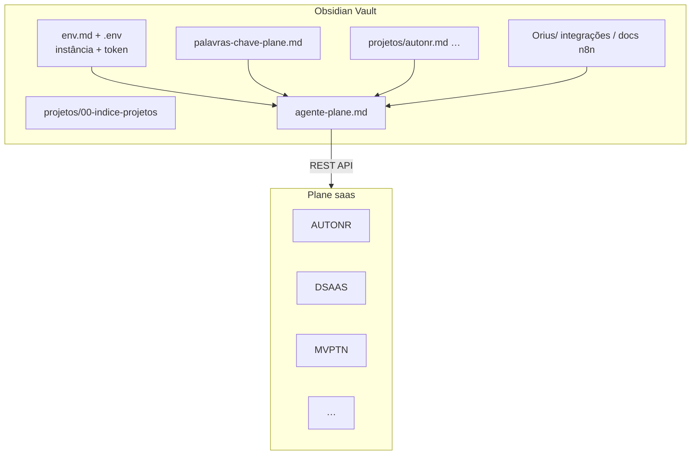

# Plane — gestão multi-projeto

O Plane organiza **demandas por software/initiativa**. O Obsidian guarda **conhecimento técnico**; o agente Cursor liga os dois via API.

## Arquitetura

| Camada | Onde | Conteúdo |
|--------|------|----------|
| **Instância** | [[env]], [[.env]] | URL, workspace, API key, projeto padrão |
| **Catálogo** | [[projetos/00-indice-projetos]] | Lista de projetos + links |
| **Projeto** | [[projetos/_template-projeto]] · `projetos/<slug>.md` | UUID, identificador, estados, docs relacionados |
| **Roteamento** | [[palavras-chave-plane]] | Palavra na conversa → slug do projeto |
| **Playbook agente** | [[agente-plane]] | Como criar/listar/sync cards automaticamente |
| **API how-to** | [[instancia]] | curl, PowerShell, endpoints |

## Projetos no workspace `saas` (2026-05-29)

| Identificador | Slug vault | Foco |
|---------------|------------|------|
| `DSAAS` | [[projetos/dsaas]] | Demandas gerais / software |
| `MVPTN` | [[projetos/mvptn]] | MVP Tabelionato de Notas (web) |
| `AUTONR` | [[projetos/autonr]] | Automações n8n + WSOficio ONR |
| `DIGITALIZA` | [[projetos/digitaliza]] | Digitalizador de documentos |
| `ASSINATURA` | [[projetos/assinatura]] | Assinatura digital A3 |
| `PROTESTO` | [[projetos/protesto]] | SAAS Protesto (web) |
| `PBOTP` | [[projetos/pbotp]] | PBO Protesto (legado) |
| `PBORTD` | [[projetos/pbortd]] | PBO RTD |
| `BACKUP` | [[projetos/backup]] | Backup |

## Fluxos comuns

| Você quer… | O agente faz… |
|------------|----------------|
| Nova automação n8n ONR | Card em `AUTONR` + doc em `onr/webservice-wsoficio/automacao/` |
| Demanda de tela web Notas | Card em `MVPTN` ou `DSAAS` + doc em `Orius/empresa/produtos/` |
| Demanda de tela web Protesto | Card em `PROTESTO` + doc em `tabelionato-protesto` / `banco-de-dados/produtos/protesto/` |
| Listar pendências | `GET work-items` usando projeto resolvido por palavra-chave |
| Colar doc markdown no card | `PATCH description_html` (conversão MD→HTML) |

## Scripts

Instalação: `cd Meta/integracoes/plane/scripts && npm install` — ver [[scripts/README]].

| Script | Função |
|--------|--------|
| [[scripts/README\|scripts/README]] | Documentação completa |
| `scripts/md-to-html.js` | Markdown Obsidian → HTML (Plane) |
| `scripts/sync-plane-descriptions.js` | Sync `--project` + `--md-dir` → cards |
| `scripts/load-plane-env.ps1` | Carrega `.env` + projeto no PowerShell |

## Relacionado

- [[Meta/skills/skill_plane]]
- [[Meta/integracoes/plane-ambiente]] — redireciona para este índice (legado)
