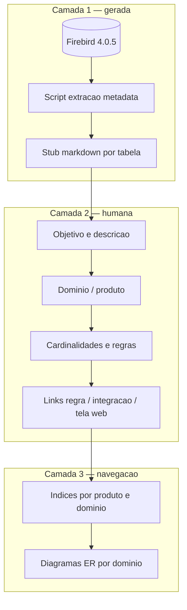
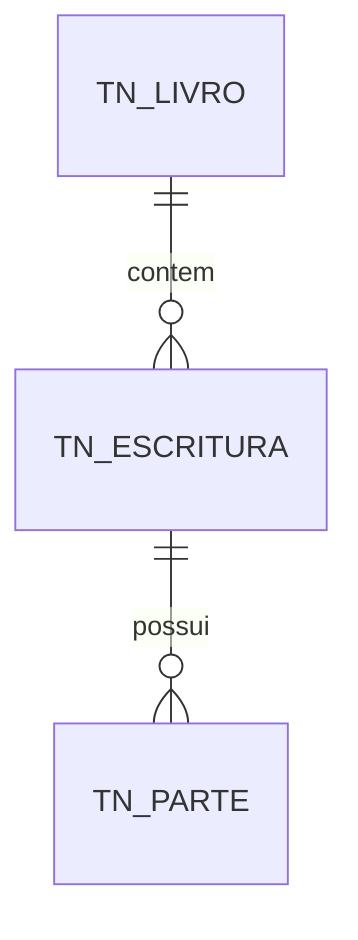
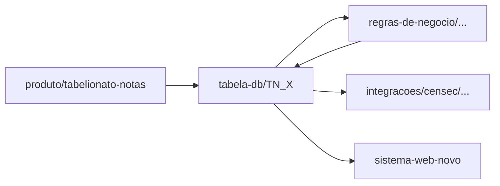

# Briefing — documentação do banco Firebird (Orius)

> Plano para documentar **~504 tabelas** do banco **Firebird 4.0.5**, organizadas por **produto** cartorário, no Obsidian (base Jarvis).

## 1. Contexto

| Aspecto | Descrição |
|---------|-----------|
| **SGBD** | Firebird **4.0.5** |
| **Charset** | `ISO8859_1` (banco) · Delphi legado `ANSI_CHARSET` — ver [[Orius/desenvolvimento/banco-de-dados/visao-geral-firebird]] |
| **Escala** | ~**504 tabelas** |
| **Organização funcional** | Por **produto Orius** (Notas, Imóveis, Civil, Protesto, RTD, Caixa, NF, compartilhado) |
| **Consumidor da doc** | Time web (migração Delphi → web), IA (Cursor), integrações |
| **Legado** | Delphi 10 — tabelas muitas vezes já refletem telas/units antigas |

### O que queremos responder por tabela

1. **O que é** (objetivo / papel no domínio cartorário)
2. **Schema** (colunas, tipos, PK, FK, índices, nullability)
3. **Descrição** (regras de preenchimento, ciclo de vida)
4. **Relacionamentos** (com quem liga, **cardinalidade**)
5. **Onde aparece** (produto, tela web alvo, integração externa)

---

## 2. Princípios (igual integrações ONR/CENSEC)

1. **Obsidian = conhecimento** — objetivo, relações de negócio, links para produto/regra/integração.
2. **Metadados técnicos = gerados** — colunas/FK extraídas do Firebird; não digitar 504 schemas à mão.
3. **Uma nota canônica por tabela** — nome do arquivo = nome físico da tabela.
4. **“Schema” lógico ≠ schema SQL** — Firebird usa um schema por database; no vault, **domínio/módulo** agrupa tabelas (ex.: `escrituras`, `protocolo`, `caixa`).
5. **Cardinalidade explícita** — sempre `1:1`, `1:N`, `N:M` (+ tabela associativa se houver).
6. **Bidirecionalidade** — da tabela → produto/regra; da regra → tabelas envolvidas.
7. **Status de documentação** — `gerado` (só metadata) → `rascunho` → `revisado`.
8. **Não duplicar DDL gigante no vault** — opcional: link para export `.sql` ou pasta local de scripts.

---

## 3. Árvore proposta no vault

```
Orius/desenvolvimento/
├── scripts/                                  ← scripts auxiliares (PS1, Python, JS) + doc
│   ├── 00-indice-scripts.md
│   └── firebird/
│       ├── export-protesto-p.ps1
│       └── export-protesto-p.md
└── banco-de-dados/
    ├── metadata/                             ← JSON/CSV gerados
    ├── 00-briefing-documentacao-firebird.md  ← este arquivo
    ├── 00-indice-banco-dados.md
    ├── visao-geral-firebird.md
    ├── convencoes-nomenclatura.md
    ├── extracao-metadados.md
    ├── templates/
    │   └── _template-tabela.md
    ├── diagramas/
    ├── compartilhado/
    └── produtos/
        ├── notas/
        ├── imoveis/
        ├── civil/
        ├── protesto/
        └── ...
```

**Regra de path:** `produtos/<produto>/tabelas/<NOME_TABELA>.md`

Tabela usada por **vários produtos** → `compartilhado/tabelas/` + frontmatter `produtos: [notas, imoveis]`.

---

## 4. Camadas de documentação



| Camada | Conteúdo | Quem preenche |
|--------|----------|---------------|
| **1 — Schema** | Colunas, tipos, PK, FK, índices, generators | Script (IBExpert / Python / `isql`) |
| **2 — Semântica** | Objetivo, descrição, cardinalidades, regras | Dev + negócio |
| **3 — Navegação** | Índices, ERD, links cruzados | Dev (incremental) |

---

## 5. Template de nota por tabela

Arquivo: [[Orius/desenvolvimento/banco-de-dados/templates/_template-tabela]]

### Frontmatter (para IA / busca)

```yaml
tipo: tabela-db
area: orius
produto: notas          # ou imoveis, compartilhado…
dominio: escrituras     # agrupamento lógico
tabela: TN_ESCRITURA
tags: [orius, db, firebird, notas, escrituras]
status: gerado          # gerado | rascunho | revisado
tem_legado_delphi: true
```

### Seções fixas na nota

| Seção | Conteúdo |
|-------|----------|
| **Objetivo** | Uma frase: para que a tabela existe no negócio cartorário |
| **Descrição** | Ciclo de vida, quem cria/atualiza, relação com atos/livros |
| **Schema** | Tabela markdown colunas (nome, tipo FB, null, default, PK/FK) |
| **Chaves e índices** | PK, UK, índices relevantes |
| **Relacionamentos** | Tabela: tabela destino · FK · cardinalidade · observação |
| **Cardinalidade (resumo)** | Bullet list `1:N` com papel (pai/filho) |
| **Regras de negócio** | Wikilinks para `regras-de-negocio/` |
| **Legado Delphi** | Unit/tela se souber |
| **Web (novo)** | Entidade/API alvo na migração |
| **Integrações** | Se a tabela alimenta CENSEC, ONR, etc. |

### Exemplo de relacionamentos

| Tabela relacionada | Via (FK / lógica) | Cardinalidade | Notas |
|--------------------|-------------------|---------------|-------|
| `TN_LIVRO` | `ID_LIVRO` | N:1 | Cada escritura pertence a um livro |
| `TN_PARTE` | `ID_ESCRITURA` (inversa) | 1:N | Partes do ato |
| `TN_ESCRITURA_BEM` | tabela associativa | N:M | Escritura ↔ bens |

### Diagrama local (opcional)



---

## 6. “Schema lógico” (domínios)

Como **504 tabelas** não se leem de uma vez, agrupar por **domínio de negócio** dentro de cada produto:

| Produto | Exemplos de domínios (a validar no banco) |
|---------|---------------------------------------------|
| **Notas** | escrituras, procurações, reconhecimento, selo, protocolo, pessoas/CCN |
| **Imóveis** | matrícula, registro, averbação, protocolo, CNIB/ONR |
| **Civil** | nascimento, casamento, óbito, livro E |
| **Protesto** | título, apontamento, sustação, CRA |
| **RTD** | registro título, averbação |
| **Caixa** | movimento, forma pagamento, conciliação |
| **Compartilhado** | pessoa, endereço, usuário, parâmetro, auditoria |

Cada domínio tem:

- `dominios/<nome>.md` — objetivo do agrupamento + ERD + lista de tabelas
- Link para índice alfabético de tabelas do produto

---

## 7. Extração de metadados (Firebird 4)

Fonte da verdade: **banco conectado** ou dump DDL versionado (Git local, **não** necessariamente no vault).

### Consultas úteis (system tables)

| Metadado | Origem Firebird |
|----------|-----------------|
| Tabelas | `RDB$RELATIONS` |
| Colunas | `RDB$RELATION_FIELDS` + `RDB$FIELDS` |
| PK / UK | `RDB$INDICES`, `RDB$INDEX_SEGMENTS` |
| FK | `RDB$REF_CONSTRAINTS`, `RDB$RELATION_CONSTRAINTS` |
| Generators | `RDB$GENERATORS` |
| Triggers / SP | `RDB$TRIGGERS`, `RDB$PROCEDURES` _(doc separada, fase 2)_ |

### Pipeline sugerido

1. Script (Python + `fdb` ou export IBExpert) → `metadata/tabelas.json`
2. Gerador → 504 stubs em `produtos/*/tabelas/*.md` (schema preenchido, objetivo vazio)
3. Classificador por **prefixo/nome** → sugere `produto` + `dominio` no frontmatter
4. Revisão humana por domínio prioritário (migração web)

Detalhes operacionais: [[Orius/desenvolvimento/banco-de-dados/extracao-metadados]] _(criar na Fase 1)_.

---

## 8. Cardinalidades — convenção

| Notação | Significado | Exemplo |
|---------|-------------|---------|
| **1:1** | Um registro em A ↔ no máximo um em B | Usuário ↔ preferências |
| **1:N** | Um pai, vários filhos | Livro → folhas/atos |
| **N:1** | Vários filhos, um pai | (visão inversa de 1:N) |
| **N:M** | Associativa ou duas FKs | Ato ↔ tags via `*_TAG` |

Sempre documentar **lado pai e filho** e a **coluna FK**. Se a FK não existir no banco (legado), marcar como `relacao_logica: true` e explicar.

---

## 9. Relacionamento com o resto do vault



| De | Para |
|----|------|
| Nota de **produto** | Seção “Modelo de dados” → índice DB do produto |
| Nota de **regra de negócio** | Campo `tabelas:` no frontmatter ou seção “Tabelas envolvidas” |
| Nota de **integração** | Tabelas de staging/export (ex.: fila CENSEC) |
| **Legado Delphi** | Unit que faz `SELECT`/`INSERT` na tabela |

---

## 10. Plano de migração (fases)

| Fase | Entrega | Esforço |
|------|---------|---------|
| **0** | Este briefing + [[Orius/desenvolvimento/banco-de-dados/00-indice-banco-dados]] + template | ✅ |
| **1** | `visao-geral-firebird.md`, `convencoes-nomenclatura.md`, script de export (fora do vault) | Baixo |
| **2** | Gerar **504 stubs** (schema only) + classificação produto/domínio | Médio (automático) |
| **3** | Índices por produto + **compartilhado** + 5–10 domínios prioritários com ERD | Médio |
| **4** | Enriquecer tabelas **critical path** migração web (20–50 tabelas) | Alto (contínuo) |
| **5** | Link bidirecional regras ↔ tabelas; integrações ↔ tabelas | Contínuo |
| **6** | Triggers, views, procedures (opcional) | Baixa prioridade |

### Priorização sugerida (critical path)

1. Tabelas das **integrações já documentadas** (CENSEC, ONR, CCN…)
2. Tabelas das **primeiras telas web** em desenvolvimento
3. **Caixa / pessoa / parâmetros** (compartilhado)
4. Restante por produto

---

## 11. O que **não** colocar no vault

- Senhas de banco, connection strings de produção
- Dump completo `.fbk` / `.gdb`
- Dados pessoais de cartório real (LGPD)
- 504 ERDs gigantes numa única nota — preferir **por domínio**

---

## 12. Palavras-chave (skill / busca)

`firebird`, `fdb`, `tabela-db`, `schema`, `FK`, `PK`, `ERD`, `dominio`, `TN_`, `RI_`, `migracao`, `delphi`, `504 tabelas`

---

## Próximos passos

- [ ] Validar **prefixos** reais das tabelas por produto (nomenclatura no banco)
- [x] Scripts de export no vault — [[Orius/desenvolvimento/scripts/00-indice-scripts]]
- [ ] Rodar Fase 2 (stubs) quando houver acesso ao `.fdb` ou DDL
- [ ] Escolher **primeiro domínio** a enriquecer (sugestão: Notas + CENSEC ou Imóveis + protocolo)

Índice: [[Orius/desenvolvimento/banco-de-dados/00-indice-banco-dados]]
