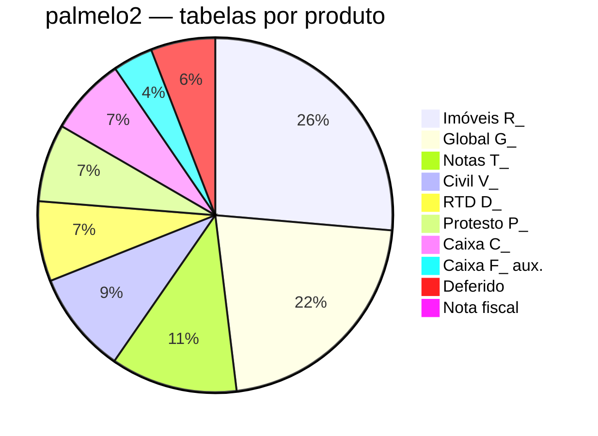

# Convenções de nomenclatura — tabelas Firebird (Orius)

Classificação oficial dos **prefixos** no banco `palmelo2`, validada pelo time (2026-05-29).

> **Inventário:** [[Orius/desenvolvimento/banco-de-dados/inventario/palmelo2-lista-tabelas]]  
> **Briefing:** [[Orius/desenvolvimento/banco-de-dados/00-briefing-documentacao-firebird]]

## Mapa prefixo → produto

| Prefixo | Produto Orius | Papel | Tabelas (palmelo2) | Índice |
|---------|---------------|-------|-------------------|--------|
| **`T_`** | [[Orius/empresa/produtos/tabelionato-notas\|Tabelionato de Notas]] | Atos, pessoas, CENSEC, serviços de notas | 57 | [[Orius/desenvolvimento/banco-de-dados/inventario/palmelo2/notas-tabelas]] |
| **`R_`** | [[Orius/empresa/produtos/registro-imoveis\|Registro de Imóveis]] | Matrícula, protocolo, ONR, DOI, LRI | 130 | [[Orius/desenvolvimento/banco-de-dados/inventario/palmelo2/imoveis-tabelas]] |
| **`V_`** | [[Orius/empresa/produtos/registro-civil\|Registro Civil]] | Nascimento, casamento, óbito, Livro E | 46 | [[Orius/desenvolvimento/banco-de-dados/inventario/palmelo2/civil-tabelas]] |
| **`D_`** | [[Orius/empresa/produtos/registro-titulos-documentos\|RTD]] | Registro de títulos e documentos | 36 | [[Orius/desenvolvimento/banco-de-dados/inventario/palmelo2/rtd-tabelas]] |
| **`G_`** | **Global** (compartilhado) | Config, usuário, selo, emolumento, tabelas auxiliares multi-produto | 106 | [[Orius/desenvolvimento/banco-de-dados/inventario/palmelo2/global-tabelas]] |
| **`P_`** | [[Orius/empresa/produtos/tabelionato-protesto\|Protesto]] | Títulos, apontamento, CENPROT | 35 | [[Orius/desenvolvimento/banco-de-dados/inventario/palmelo2/protesto-tabelas]] |
| **`C_`** | [[Orius/empresa/produtos/caixa\|Caixa]] | Gestão financeira, serviços, selos eletrônicos, recibos | 35 | [[Orius/desenvolvimento/banco-de-dados/inventario/palmelo2/caixa-tabelas]] |
| **`F_`** | [[Orius/empresa/produtos/caixa\|Caixa]] (auxiliar) | Plano de contas, movimentação, boletas, orçamento — **sem uso imediato** | 18 | [[Orius/desenvolvimento/banco-de-dados/inventario/palmelo2/caixa-auxiliar-tabelas]] |

### Caixa como produto embutido

O **Caixa** (`C_`) é tratado como produto próprio no vault: software central de **gestão financeira** do cartório, serviços realizados e **selos eletrônicos** — mesmo quando acoplado a outros módulos na operação.

As tabelas **`F_`** são **auxiliares do Caixa** (contabilidade/financeiro complementar). Difícil utilizá-las no momento; ficam documentadas para eventos futuros.

---

## Tabelas sem prefixo `X_`

| Tabela | Produto / uso | Documentar? |
|--------|---------------|-------------|
| `ARQUIVOS_SERVIDOR` | [[Orius/empresa/produtos/nota-fiscal\|Nota fiscal]] — mídia/arquivos NF | Sim (baixa prioridade) |
| `CIDADE` | **Global** — cadastro de cidades | Sim |
| `CONVERSAO_RI` | Imóveis — finalidade incerta | **Fora de escopo** por enquanto |
| `LOG_ERROS_NFSE` | Nota fiscal — log de erros | Sim |
| `NFSE` | Nota fiscal — dados principais | Sim |
| `PARAMETROS` | Nota fiscal — parâmetros | Sim |

Índice NF: [[Orius/desenvolvimento/banco-de-dados/inventario/palmelo2/nota-fiscal-tabelas]] (+ `CIDADE` em [[global-tabelas]])

---

## Fora de escopo (por enquanto)

Prefixos **sem uso previsto** na migração web atual:

| Prefixo | Qtd. | Nota |
|---------|------|------|
| `PW_` | 14 | Provável portal/web legado |
| `GED_` | 2 | GED / protocolo eletrônico |
| `S_` | 2 | Finalidade a confirmar |
| `ECF_` | 10 | ECF / fiscal legado |

Índice: [[Orius/desenvolvimento/banco-de-dados/inventario/palmelo2/deferido-tabelas]]

Também deferido: `CONVERSAO_RI` → [[Orius/desenvolvimento/banco-de-dados/inventario/palmelo2/imoveis-deferido-tabelas]]

---

## Resumo por produto (497 tabelas)

| Grupo | Total |
|-------|-------|
| Imóveis (`R_`) | 130 |
| Global (`G_` + `CIDADE`) | 107 |
| Notas (`T_`) | 57 |
| Civil (`V_`) | 46 |
| RTD (`D_`) | 36 |
| Protesto (`P_`) | 35 |
| Caixa principal (`C_`) | 35 |
| Caixa auxiliar (`F_`) | 18 |
| Nota fiscal (sem prefixo NF*) | 4 |
| Deferido (PW/GED/S/ECF + CONVERSAO_RI) | 29 |

---

## Path no vault (documentação futura)

Alinhado ao [[Orius/desenvolvimento/banco-de-dados/00-briefing-documentacao-firebird#Árvore proposta no vault]]:

| Produto | Pasta futura `produtos/.../tabelas/` |
|---------|--------------------------------------|
| Notas | `notas/` |
| Imóveis | `imoveis/` |
| Civil | `civil/` |
| RTD | `rtd/` |
| Protesto | `protesto/` |
| Caixa | `caixa/` |
| Nota fiscal | `nota-fiscal/` |
| Global | `compartilhado/` |

## Integrações × prefixo (referência rápida)

| Integração documentada | Prefixos / tabelas típicas |
|------------------------|----------------------------|
| CENSEC | `T_CENSEC*` |
| CCN | `T_CCNREGISTROS`, `T_PESSOA*` |
| ONR / WSOficio | `R_ONR*` |
| DOI | `R_DOI*` |
| TABINF | _(confirmar em `G_` / produto)_ |

Voltar: [[Orius/desenvolvimento/banco-de-dados/00-indice-banco-dados]]
