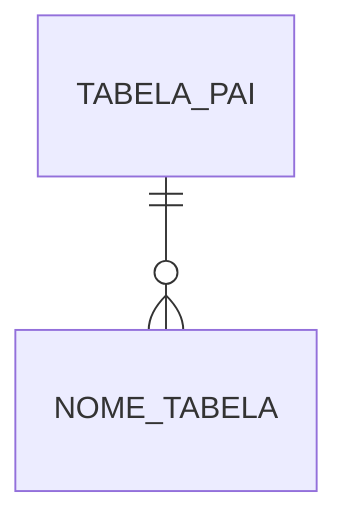

# Template — nota de tabela Firebird

Copiar para `produtos/<produto>/tabelas/<NOME_TABELA>.md` ou `compartilhado/tabelas/`.

```yaml
---
tipo: tabela-db
area: orius
produto: notas              # notas | imoveis | civil | protesto | rtd | caixa | nota-fiscal | compartilhado
dominio:                      # ex.: escrituras, protocolo, matricula
tabela: NOME_TABELA
tags: [orius, db, firebird]
status: rascunho              # gerado | rascunho | revisado
tem_legado_delphi: true
relaciona_integracao: []      # ex.: censec, onr, ccn
---

> **Produto:** [[Orius/empresa/produtos/...]] · **Domínio:** [[.../dominios/...]] · **Índice DB:** [[.../00-indice-...-db]]

# `NOME_TABELA`

## Objetivo

_(Uma frase: qual papel desta tabela no negócio cartorário?)_

## Descrição

_(Como os registros nascem, são alterados e encerrados; relação com livro/folha/ato/protocolo.)_

## Schema

| Coluna | Tipo (Firebird) | Null | Default | PK | FK → | Descrição |
|--------|-----------------|------|---------|----|------|-----------|
| ID | INTEGER | N | — | ✓ | — | |
| | | | | | | |

## Chaves e índices

| Nome | Tipo | Colunas |
|------|------|---------|
| PK_... | PRIMARY KEY | |
| FK_... | FOREIGN KEY | → `OUTRA_TABELA(COL)` |
| IX_... | INDEX | |

## Relacionamentos

| Tabela | Coluna / via | Cardinalidade | Papel | Observação |
|--------|--------------|---------------|-------|------------|
| `TABELA_PAI` | `ID_PAI` | N:1 | Filho desta tabela | |
| `TABELA_FILHA` | `ID_ESTA` | 1:N | Pai desta tabela | |

### Diagrama (opcional)



## Regras de negócio

- [[Orius/desenvolvimento/regras-de-negocio/...]]

## Legado (Delphi)

| Item | Referência |
|------|------------|
| Unit / datamodule | |
| Telas | |

## Web (novo)

| Item | Referência |
|------|------------|
| Entidade / API | |
| Migração | [[Orius/desenvolvimento/refatoracao/migracao-delphi-para-web]] |

## Integrações

_(Se esta tabela alimenta ou recebe dados de central externa.)_

- 

## Metadados

| Campo | Valor |
|-------|-------|
| Generator | |
| Triggers | _(link fase 2)_ |
| Última revisão schema | YYYY-MM-DD |
| Fonte export | script / IBExpert |
```
