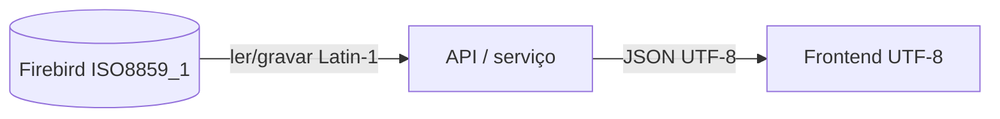

# Visão geral — Firebird 4.0.5 (Orius)

Propriedades físicas e de **encoding** do banco legado. Essencial para consultas, exportação, integrações e migração web (Delphi → UTF-8).

> **Briefing:** [[Orius/desenvolvimento/banco-de-dados/00-briefing-documentacao-firebird]]  
> **Convenções de tabelas:** [[Orius/desenvolvimento/banco-de-dados/convencoes-nomenclatura]]

## Motor e instância

| Propriedade | Valor |
|-------------|-------|
| **SGBD** | Firebird **4.0.5** |
| **Banco de referência** | `palmelo2` |
| **Conexão** | `192.168.1.100/3050:palmelo2` |
| **Dialect** | SQL dialect 3 _(padrão Firebird 3+)_ |

---

## Charset e character set

| Camada | Valor | Confirmado |
|--------|-------|------------|
| **Charset padrão do banco** | `ISO8859_1` | Sim — `RDB$DATABASE` (`palmelo2`, 2026-05-29) |
| **Colunas texto** | `ISO8859_1` (1 byte/caractere) | Ex.: `CIDADE.DESCRICAO`, `CIDADE.UF` |
| **Cliente legado (Delphi 10)** | `ANSI_CHARSET` | Informado pelo time — ver abaixo |

### O que isso significa

**Sim, você está correto:** charset e character set importam para **consultas**, **comparação de strings**, **export/import** e **formatação na migração web**.

- **`ISO8859_1`** (Latin-1): encoding de **1 byte** por caractere na maioria dos campos texto. Cobre acentuação portuguesa comum (`ç`, `ã`, `é`, `ô`, etc.).
- **`ANSI_CHARSET` no Delphi (Windows, PT-BR):** na prática corresponde ao code page **Windows-1252** (`CP1252`). É **muito próximo** de ISO8859_1, mas **não idêntico** na faixa `0x80–0x9F` (símbolos tipográficos). Para texto cartorário típico (nomes, endereços, observações) costuma funcionar sem surpresas; problemas aparecem mais em **caracteres especiais**, **cópia entre sistemas** ou **dados já corrompidos** no legado.

### Por que documentar (impacto no desenvolvimento)

| Área | Risco se ignorar charset |
|------|--------------------------|
| **API / web (UTF-8)** | `João` vira `João` se não converter na borda |
| **`LIKE`, `CONTAINING`, `=`** | Busca falha se cliente manda UTF-8 e coluna é ISO8859_1 |
| **`UPPER` / `LOWER`** | Comportamento depende do charset da conexão |
| **JSON / integrações** | Payload UTF-8 vs banco Latin-1 exige transcoding explícito |
| **Scripts (`isql`, ETL)** | Terminal/arquivo em UTF-8 sem `-charset` exibe caracteres errados |
| **Relatórios / PDF** | Fonte ANSI no Delphi vs UTF-8 na web — alinhar na exportação |

---

## Regras práticas para novos desenvolvimentos

### 1. Conexão com o Firebird

Sempre informar charset na conexão, alinhado ao banco:

```bash
# isql — charset da conexão
isql -charset ISO8859_1 "192.168.1.100/3050:palmelo2" -user SYSDBA -password ***
```

Drivers (Node `node-firebird`, Python `fdb`, etc.): usar **`ISO8859_1`** (ou `WIN1252` se o driver mapear equivalente) na string de conexão / `charset` option.

### 2. Camada web (recomendado)



- **Banco:** permanece `ISO8859_1` enquanto o legado existir.
- **API:** converte **ISO8859_1 ↔ UTF-8** na fronteira (entrada e saída).
- **Frontend:** sempre **UTF-8** (HTML, JSON, React, etc.).

### 3. Consultas e comparação

- Parâmetros de busca devem estar no **mesmo encoding da conexão** antes do `WHERE`.
- Evitar assumir que `trim()` / normalização Unicode no JS resolve acentos no SQL — normalizar na camada certa ou usar collation compatível.
- Campos numéricos/data **não** têm charset (`RDB$CHARACTER_SET_NAME` nulo) — só colunas texto.

### 4. Migração futura para UTF-8 no banco

Se um dia migrar o database para `UTF8`:

- Exige **projeto de migração** (backup, `CREATE DATABASE` UTF8, reload ou conversão campo a campo).
- Revisar **tamanho de colunas** (`VARCHAR(n)` em UTF-8 pode precisar de mais bytes para mesma *grapheme* em alguns casos).
- **Não alterar** charset de produção sem plano — quebra cliente Delphi legado.

---

## Verificação no banco (referência)

Charset padrão:

```sql
SELECT TRIM(RDB$CHARACTER_SET_NAME) AS DB_CHARSET
FROM RDB$DATABASE;
-- palmelo2 → ISO8859_1
```

Charset por coluna (exemplo):

```sql
SELECT TRIM(RF.RDB$FIELD_NAME) AS CAMPO,
       TRIM(CS.RDB$CHARACTER_SET_NAME) AS CHARSET
FROM RDB$RELATION_FIELDS RF
JOIN RDB$FIELDS F ON F.RDB$FIELD_NAME = RF.RDB$FIELD_SOURCE
LEFT JOIN RDB$CHARACTER_SETS CS ON CS.RDB$CHARACTER_SET_ID = F.RDB$CHARACTER_SET_ID
WHERE RF.RDB$RELATION_NAME = 'CIDADE';
```

---

## Resumo para o time

| Pergunta | Resposta |
|----------|----------|
| Charset do `palmelo2`? | **`ISO8859_1`** |
| Delphi legado? | **`ANSI_CHARSET`** (Windows-1252) |
| Web/API deve usar? | **UTF-8**, com conversão na API |
| Precisa documentar? | **Sim** — evita bugs silenciosos em busca, integração e migração |

Voltar: [[Orius/desenvolvimento/banco-de-dados/00-indice-banco-dados]]
