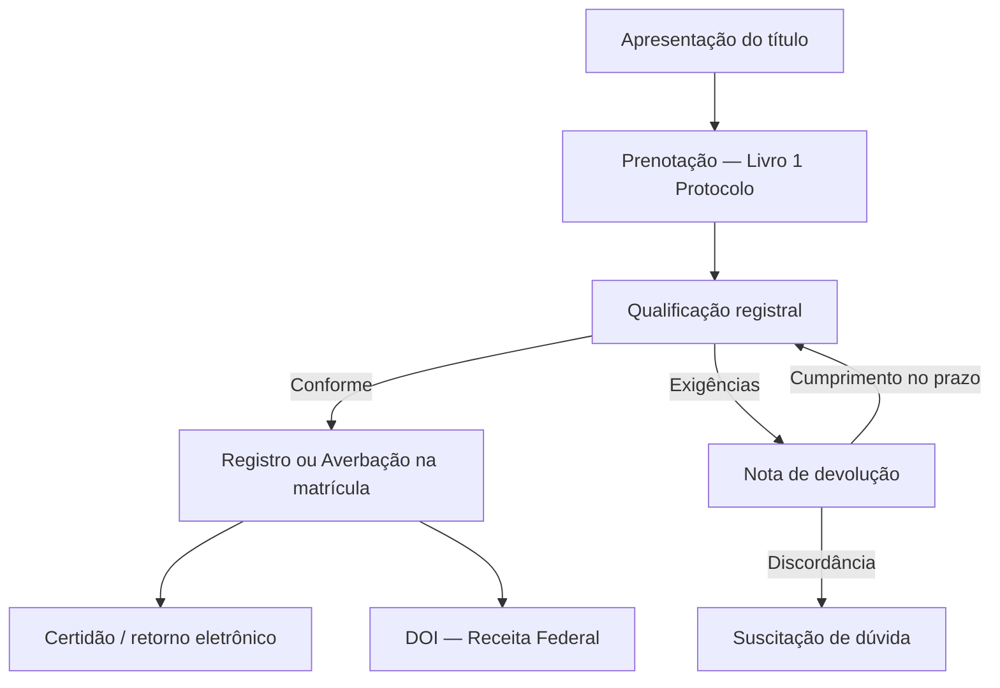

# Fluxo operacional — Registro de Imóveis

Do balcão (ou protocolo eletrônico) até a **certidão** e obrigações acessórias (DOI).

## 1. Apresentação

Interessado apresenta **título** (escritura, contrato com força de escritura, mandado judicial, etc.) no cartório da **circunscrição** do imóvel.

- Adiantamento de **emolumentos e taxas**
- Pode ser presencial ou via **RI Digital** / protocolo ONR

**No software:** pedido/protocolo (`R_PEDIDO`, `R_PROTOCOLO`), vínculo ao imóvel, checklist, distribuição.

## 2. Prenotação (protocolo — Livro n.º 1)

O título é anotado no **Livro de Protocolo** com **número de ordem sequencial**.

| Efeito | Importância |
|--------|-------------|
| **Prioridade** | Quem protocolou primeiro tem preferência em conflito |
| **Prenotação** | “Trava” a fila por 30 dias (regra geral) |
| **Retroação** | Registro efetivado retroage à **data do protocolo** |

### Prazo de 30 dias

Dentro de 30 dias o cartório deve **registrar**, **devolver com exigências** ou o protocolo **caduca** (perde efeito de prioridade).

Ciclo típico: protocolo → exigência → cumprimento → registro com efeito do dia 1.

**No software:** controle de prazo, andamentos (`R_ANDAMENTO`), log de protocolo (`R_LOG_PROTOCOLO`), alertas de caducidade.

## 3. Qualificação registral

Oficial verifica **requisitos legais** e **continuidade** com a matrícula (proprietário atual, ônus, especialidade da descrição).

### 3.1 Título apto

Pratica-se **Registro** (transmissão/constituição de direito real) ou **Averbação** (alteração acessória) na **matrícula** (`Livro n.º 2`).

### 3.2 Título com problemas

Emite-se **Nota de Devolução** (exigências **de uma só vez** — não “fatiar”).

Prazo para o apresentante cumprir: dentro da validade do protocolo.

### 3.3 Discordância

Apresentante pode requerer **Suscitação de Dúvida** → decisão do juiz corregedor permanente.

## 4. Resultado — matrícula e certidão

- **Matrícula atualizada** (histórico imutável em sequência)
- **Certidão** (ex.: inteiro teor) — prova oficial para terceiros
- Validade usual da certidão para **nova escritura**: 30 dias

## 5. Obrigações acessórias

- **DOI** à Receita Federal em operações de alienação/aquisição — [[doi-operacoes-imobiliarias]]
- **Selo** digital, taxas estaduais conforme UF
- Integrações **ONR** / **CNIB** conforme o ato

## Relacionado

- [[livros-oficiais-registro-imoveis]]
- [[tipos-de-atos-registrais]]
- [[mapa-dominio-software-imoveis]]
