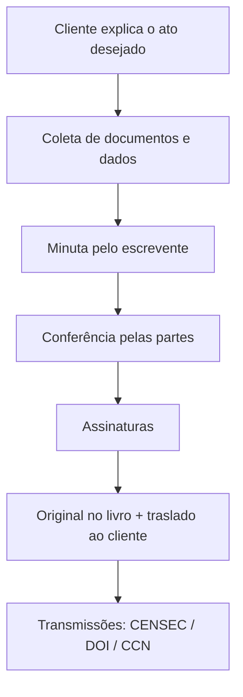

# Fluxo — nascimento de um ato notarial

Do pedido do cliente ao documento definitivo (presencial ou eletrônico).

## Etapas presenciais (balcão)

1. Cliente explica o objetivo (CV, procuração, ata…).
2. Cartório coleta documentos e qualifica partes.
3. Escrevente redige **minuta** (`T_MINUTA`, `T_ATO`).
4. Partes conferem texto e valores.
5. Assinaturas no livro / termo.
6. **Original** arquivado; cliente recebe **traslado**.
7. Obrigações acessórias (selo, DOI se imóvel, envio CENSEC).

## Etapas eletrônicas (e-Notariado)

Mesma lógica de negócio, com canal digital:

1. Minuta no sistema do cartório
2. Envio ao **e-Notariado**
3. **Identificação** (certificado ICP ou certificado notarizado)
4. **Videoconferência** com tabelião (equivalente à presença física)
5. Assinaturas eletrônicas em ordem (partes → cônjuge → tabelião)
6. Fechamento do documento com validade jurídica

Documentação técnica do fluxo de assinaturas: [[Orius/integracoes/tabelionato-notas/fluxo-assinaturas]] · visão negócio: [[integracoes-centrais-notas#e-Notariado]].

## Andamento interno

**No software:** `T_ATO`, `T_ATO_ANDAMENTO`, `T_ATO_HISTORICO`, `T_ATENDIMENTO`, vínculos de partes e imóveis (`T_ATO_VINCULOPARTE`, `T_ATO_PARTEIMOVEL`).

## Relacionado

- [[atos-protocolares]]
- [[mapa-dominio-software-notas]]
