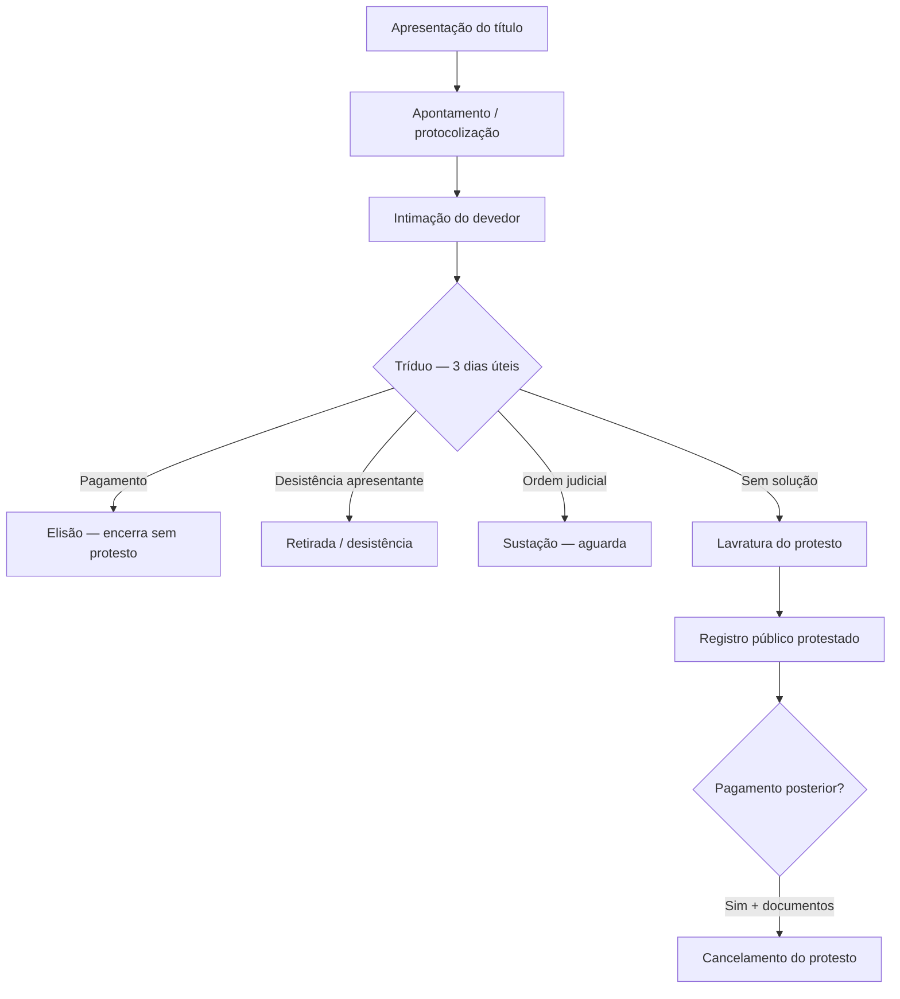

# Fluxo operacional do protesto de títulos

Visão do **rito cartorário** do início ao cancelamento. Use junto com [[mapa-dominio-software]] para implementar telas, APIs e integrações.

## 1. Apresentação

O **apresentante** (credor ou mandatário) entrega o título ao cartório com:

- Identificação do **devedor** (nome, CPF/CNPJ, endereço)
- Valor e dados do título
- Espécie do título

Se houver **mais de um cartório** na comarca, pode existir **distribuição** automática do título ao tabelionato competente.

**No software:** cadastro do título, apresentante, devedor(es) vinculados (`P_TITULO`, `P_PESSOA`, `P_PESSOA_VINCULO`), banco apresentante (`P_BANCO`), espécie (`P_ESPECIE`).

## 2. Apontamento (protocolização)

Ao receber o documento, o cartório:

- Atribui **número de protocolo** / apontamento
- Registra **data e hora** da entrada
- Emite **recibo** ao apresentante

A dívida passa a constar **oficialmente** no sistema do cartório.

**No software:** número de apontamento, situação inicial do título, livro de andamento quando aplicável (`P_ANDAMENTO`, `P_LIVRO_ANDAMENTO`, `P_LIVRO_NATUREZA`, ocorrências em `P_OCORRENCIAS` / `P_OCORRENCIA_ANDAMENTO`).

## 3. Intimação

O cartório comunica ao devedor que existe dívida em aberto e que ele deve **comparecer em até 3 dias úteis** para pagar, sob pena de **protesto**.

Meios comuns:

- Carta com AR
- Intimação por oficial/funcionário
- **Edital** (devedor não localizado)

**No software:** controle de intimação, andamentos, histórico (`P_HISTORICO`), layouts de comunicação (`P_TEMPLATE`), eventual integração com arquivos CRA/CENPROT.

## 4. Tríduo (3 dias úteis)

Período legal após a intimação. Desfechos possíveis:

### 4.1 Pagamento (elisão)

Devedor paga no cartório:

- Principal da dívida
- **Emolumentos / custas** cartorárias

O cartório **repassa** ao apresentante (conforme regra), **encerra** o procedimento e **não lavra protesto** — nome permanece sem registro de protesto.

**Status típico em retorno CRA:** *Pago (Elidido)*.

### 4.2 Desistência do apresentante

Apresentante solicita **retirada** do título antes do protesto. Procedimento encerrado sem lavratura.

**Status típico:** *Desistido*.

### 4.3 Sustação judicial

Devedor obtém **ordem judicial** suspendendo o protesto. Cartório **aguarda** — não protesta até liberar ou decidir conforme mandado.

**Status típico:** *Sustado*.

### 4.4 Inércia do devedor — lavratura do protesto

Transcorrido o tríduo sem pagamento nem impedimento:

- Cartório **lavra o protesto** (*protestar o título*)
- Registro de que a dívida existia, o devedor foi intimado e **não pagou**
- Informação passa a ser **consultável publicamente** (centrais, certidões, birôs conforme integração)

**Status típico:** *Protestado*.

## 5. Depois do protesto — cancelamento

Se o devedor **quitar** após o protesto:

1. Pagamento ao credor (ou acordo)
2. Credor fornece **declaração / instrumento** de quitação
3. Devedor (ou credor) solicita **cancelamento** no cartório
4. Cartório **cancela** o registro ativo de protesto (histórico permanece)

**No software:** motivos de cancelamento (`P_MOTIVOS_CANCELAMENTO`), certidões (`P_CERTIDAO`), custas de cancelamento (`P_CUSTAS_CANCELAMENTO`).

## Distribuição eletrônica (CRA)

Apresentantes corporativos enviam **lotes de títulos** por arquivo. O cartório **importa**, processa cada item no fluxo acima e devolve **arquivo de retorno** com status por título. Ver [[Orius/integracoes/centrais/cra]].

## Consultas e serviços nacionais (CENPROT)

Camada que integra cartórios para **consulta nacional**, envio eletrônico, certidões e cancelamentos padronizados. Ver [[Orius/integracoes/centrais/cenprot]].

## Relacionado

- [[conceito-protesto-de-titulos]]
- [[glossario-protesto]]
- [[mapa-dominio-software]]
- [[00-indice-protesto-negocio]]
