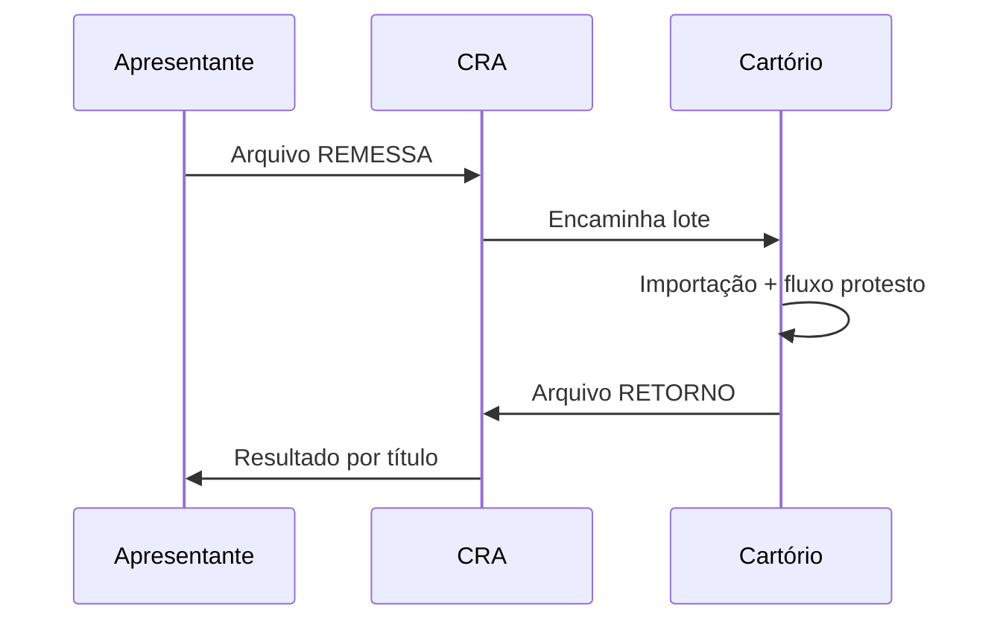

# CRA — Central de Remessa de Arquivos

Módulo da **Central de Serviços Eletrônicos** para **envio e recebimento eletrônico** de títulos e documentos de dívida entre **apresentantes** (credores/bancos) e **Tabelionatos de Protesto**.

## Papel

A CRA **não pratica atos de protesto**. Ela **intermedia e padroniza** a comunicação digital.

| Faz | Não faz |
|-----|---------|
| Receber lotes eletrônicos do apresentante | Intimar devedor |
| Encaminhar ao cartório competente | Lavrar protesto |
| Devolver confirmação e retorno | Substituir o sistema interno do cartório |

## Finalidade

- Envio **massivo** de títulos por meio eletrônico
- **Distribuição** automática ao cartório competente
- **Padronização** da troca de informações
- **Rastreabilidade** e segurança na tramitação

## Fluxo resumido

1. Apresentante envia **arquivo de remessa** com os títulos.
2. CRA identifica o cartório e encaminha.
3. Cartório **importa**, protocoliza, intima, protesta etc. (ver [[Orius/empresa/produtos/protesto/fluxo-operacional-protesto]]).
4. Cartório envia **retorno** com status de cada título.

## Tipos de arquivo

| Arquivo | Analogia | Conteúdo |
|---------|----------|----------|
| **Remessa** | Pedido | Títulos a protestar |
| **Confirmação** | Recebi | Aceite da remessa pela CRA/cartório |
| **Retorno** | Resultado | Status individual por título |

### Status típicos no retorno (por título)

Protocolizado · Intimado · Pago (Elidido) · Protestado · Sustado · Desistido · Cancelado · Rejeitado

Glossário: [[Orius/empresa/produtos/protesto/glossario-protesto]].

## No sistema Orius (legado / SaaS)

Tabelas Febraban e layout: `P_FEBRABAN*`, `P_LAYOUT*`, `P_ARQUIVO_TITULO` — ver [[Orius/desenvolvimento/banco-de-dados/produtos/protesto/00-indice-protesto-db]] e [[Orius/empresa/produtos/protesto/mapa-dominio-software]].

## Domínio de negócio

- [[Orius/empresa/produtos/protesto/conceito-protesto-de-titulos]]
- [[Orius/empresa/produtos/protesto/00-indice-protesto-negocio]]

## Produto

[[Orius/empresa/produtos/tabelionato-protesto]]
