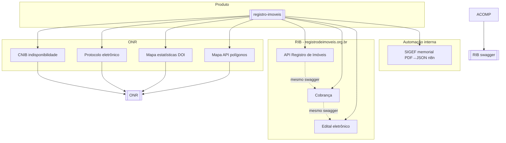

# Integrações — Registro de Imóveis

**Domínio de negócio (o que é RI):** [[Orius/empresa/produtos/imoveis/00-indice-imoveis-negocio]] · Produto: [[Orius/empresa/produtos/registro-imoveis]]

Documentação técnica migrada de `Desktop/integracoes/registro-imoveis`.

## Mapa

## ONR — WebService SOAP (WSOficio)

**Hub:** [[Orius/integracoes/registro-imoveis/onr/00-indice-onr|ONR — índice completo]]

| Doc | Link |
|-----|------|
| Visão geral + Hash | [[Orius/integracoes/registro-imoveis/onr/webservice-wsoficio/visao-geral]] |
| 81 métodos SOAP | [[Orius/integracoes/registro-imoveis/onr/webservice-wsoficio/00-indice-wsoficio]] |

Código/scripts: `C:\Users\kenio\soap-ui test`

## Por integração (REST)

| Integração | Palavras-chave | Documentação | Central / portal |
|------------|----------------|--------------|------------------|
| **CNIB** | CNIB, indisponibilidade, IA, IE | [[Orius/integracoes/registro-imoveis/cnib]] · [[Orius/integracoes/registro-imoveis/api-cnib-serventias/00-indice]] | [[Orius/integracoes/centrais/cnib]] |
| **Protocolo ONR** | protocolo, exame e cálculo, registro eletrônico | [[Orius/integracoes/registro-imoveis/onr-protocolo]] | [[Orius/integracoes/centrais/onr]] |
| **DOI / DOI-Web** | DOI, DOIWEB, Receita Federal, declaração imóvel, transmissão | [[Orius/integracoes/tabelionato-notas/doi/00-indice-doi]] · negócio: [[Orius/empresa/produtos/imoveis/doi-operacoes-imobiliarias]] | Receita Federal |
| **Mapa / estatísticas ONR** | mapa ONR, estatísticas, extrato, hash | [[Orius/integracoes/registro-imoveis/onr-mapa-estatisticas]] · [[Orius/integracoes/registro-imoveis/onr-mapa-estatisticas-guia\|guia]] | [[Orius/integracoes/centrais/onr]] |
| **Mapa / API polígonos (SIG-RI)** | polígono, shapefile, SIG-RI, SIGEF, IERI-e, georreferenciamento | [[Orius/integracoes/registro-imoveis/onr-mapa-api-poligonos]] | [[Orius/integracoes/centrais/onr]] |
| **API Registro de Imóveis (RIB)** | protocolo, acompanhamento, exigência, PIX, RFP, RFC, RAE | [[Orius/integracoes/registro-imoveis/api-registro-imoveis/00-indice]] · [[Orius/integracoes/registro-imoveis/api-registro-imoveis/visao-geral|visão geral]] · [Swagger](https://www.registrodeimoveis.org.br/swagger/index.html) | api.registrodeimoveis.org.br |
| **Cobrança RIB** (mesma API) | cobrança, pagamento, hash, RFC | [[Orius/integracoes/registro-imoveis/api-registro-imoveis/00-indice#Cobrança e pagamentos|RFC-01…07]] · [[Orius/integracoes/registro-imoveis/rib-cobranca|legado]] | mesmo Swagger |
| **Edital RIB** | edital, diário registral, JWT | [[Orius/integracoes/registro-imoveis/rib-edital]] | api.registrodeimoveis.org.br |
| **Memorial SIGEF PDF→JSON** | memorial descritivo, SIGEF, INCRA, parser, vértices, WKT, n8n | [[Orius/integracoes/registro-imoveis/memorial-sigef-pdf-json-n8n]] | n8n (`drRULxhBQUk10wbw`) |

## Automação interna (n8n)

| Integração | Doc |
|------------|-----|
| Memorial descritivo SIGEF → JSON | [[Orius/integracoes/registro-imoveis/memorial-sigef-pdf-json-n8n]] |

## URLs de referência

| Serviço | Base / Swagger |
|---------|----------------|
| CNIB 2.0 | https://serventia-api.onr.org.br/swagger |
| Mapa ONR — estatísticas | https://mapa.onr.org.br/api-estatisticas |
| Mapa ONR — polígonos | https://www.mapa.onr.org.br/sistemas/api/v1/poligonos/ |
| RIB (cobrança + edital) | https://www.registrodeimoveis.org.br/swagger |
| n8n — Parse Memorial SIGEF | `https://api-n8n.gbrqne.easypanel.host/webhook/sigef/memorial/parse` (produção, workflow ativo) |

## Relacionado

- Produto: [[Orius/empresa/produtos/registro-imoveis]]
- Palavras-chave: [[Orius/integracoes/palavras-chave-orius]]
- Notas (compartilha ONR): [[Orius/integracoes/tabelionato-notas/00-indice]]

Voltar: [[Orius/integracoes/00-indice-integracoes]] · [[Orius/00-indice]]
