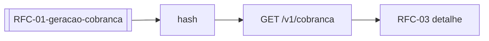

> **Índice:** [[Orius/integracoes/registro-imoveis/acompanhamento-registral/00-indice]]
> **Autenticação:** [[RFG-01-autenticacao]]
> **Gerar cobrança:** [[RFC-01-geracao-cobranca]] · **Detalhe:** RFC-03 (pendente)
> **Nota legada:** [[Orius/integracoes/registro-imoveis/rib-cobranca]]

# [RFC-02] — Listagem das cobranças

**Uma frase:** consultar **todas as cobranças** do cartório com **paginação e filtros**, retornando dados **resumidos** — detalhamento completo em **RFC-03** (`GET /v1/cobranca/{hash}`).

---

## Pré-requisitos

- [x] Token JWT — [[RFG-01-autenticacao]]
- [ ] Módulo de pagamentos ativo na intranet ([manual-modulo-pagamentos](https://www.registrodeimoveis.org.br/manual-modulo-pagamentos))

---

## Endpoint

| Método | Caminho | Descrição |
|--------|---------|-----------|
| `GET` | `/v1/cobranca` | Listagem paginada |

**Produção:** `https://api.registrodeimoveis.org.br/v1/cobranca`  
**Homologação:** `https://testes-api.registrodeimoveis.org.br/v1/cobranca`

---

## Request

### Headers

| Campo | Obrigatório |
|-------|-------------|
| `Authorization` | Sim — `Bearer {access_token}` |

### Query (todos opcionais)

| Parâmetro | Tipo | Tam. | Descrição |
|-----------|------|------|-----------|
| `registrosPorPagina` | int | 3 | Padrão **50**, máximo **100** |
| `numeroPagina` | int | — | Página |
| `tipoCobranca` | string | 10 | `PIX` ou `BOLETO` |
| `status` | int | — | [[dominio/TBD-01-status-cobranca|StatusCobranca]] |
| `pagadorDocumento` | string | — | CPF/CNPJ do pagador |
| `pagadorEmail` | string | — | E-mail do pagador |
| `dataInicialGeracao` | date | 10 | Início da geração |
| `dataFinalGeracao` | date | 10 | Fim da geração |
| `dataInicialStatus` | date | 10 | Início da situação — **só com** `status` |
| `dataFinalStatus` | date | 10 | Fim da situação — **só com** `status` |
| `dataInicialPagamento` | date | 10 | Início do pagamento |
| `dataFinalPagamento` | date | 10 | Fim do pagamento |

> Texto introdutório do manual: “máximo 50 por página”; query permite até **100** — validar em homologação.

**Exemplo:**

```http
GET /v1/cobranca?registrosPorPagina=50&numeroPagina=1&status=0&tipoCobranca=PIX
Authorization: Bearer …
```

---

## Response

### Sucesso

```json
{
  "totalRegistros": 0,
  "totalPaginas": 0,
  "paginaAtual": 0,
  "cobrancas": [
    {
      "hash": "3fa85f64-5717-4562-b3fc-2c963f66afa6",
      "status": 0,
      "dataStatus": "2024-08-04",
      "url": "https://…",
      "valorTotal": 100000,
      "pagamentoVinculado": {
        "hash": "uuid-vinculado",
        "status": 1,
        "dataStatus": "2024-08-10",
        "url": "https://…",
        "valorTotal": 100000,
        "valorDevolucao": 0
      }
    }
  ]
}
```

### Raiz

| Campo | Obrig. | Descrição |
|-------|--------|-----------|
| `totalRegistros` | Sim | Total encontrado |
| `totalPaginas` | Sim | Total de páginas |
| `paginaAtual` | Sim | Página retornada |
| `cobrancas` | Sim | Lista resumida |

### Item `cobrancas[]`

| Campo | Tam. | Descrição |
|-------|------|-----------|
| `hash` | 36 | UUID — detalhe em RFC-03 |
| `status` | 11 | [[dominio/TBD-01-status-cobranca]] |
| `dataStatus` | 10 | Data da situação |
| `url` | — | Link de acesso |
| `valorTotal` | — | Valor inteiro (ex.: R$ 100,00 → `100000`) |
| `pagamentoVinculado` | object | Não | Cobrança vinculada (ex.: devolução/estorno — manual v1.4+) |

### Objeto `pagamentoVinculado`

| Campo | Descrição |
|-------|-----------|
| `hash` | UUID da cobrança vinculada |
| `status` | StatusCobranca |
| `dataStatus` | Data da situação |
| `url` | URL de acesso |
| `valorTotal` | Valor total (formato inteiro) |
| `valorDevolucao` | Total devolvido (formato inteiro) |

### Erro

Padrão RIB: `codigo`, `descricao`, `campos`.

---

## Fluxo



---

## Regras de negócio

| Regra | Detalhe |
|-------|---------|
| **Somente resumo** | Sem `dadosPagador` completo nem `servicos[]` — RFC-03 |
| **Filtro de status + data** | `dataInicialStatus` / `dataFinalStatus` exigem `status` na query |
| **Mesmo path do POST** | `GET` e `POST` em `/v1/cobranca` — métodos diferentes |
| **Protocolo** | `hash` pode vir também de [[RFP-06-detalhe-protocolo-v1|`hashCobranca`]] |

---

## Relacionado

| Código | Relação |
|--------|---------|
| [[RFC-01-geracao-cobranca]] | Criação |
| RFC-03 | `GET /v1/cobranca/{hash}` (pendente) |
| RFC-04 | Cancelamento (pendente) |
| RFC-06 | Devolução PIX (pendente) |

**Manual bruto:** `[RFC-02]` (págs. 69–70 do PDF v2.2)

---

## Histórico desta nota

| Data | Alteração |
|------|-----------|
| 2026-06-01 | Extraído do manual v2.2 |
