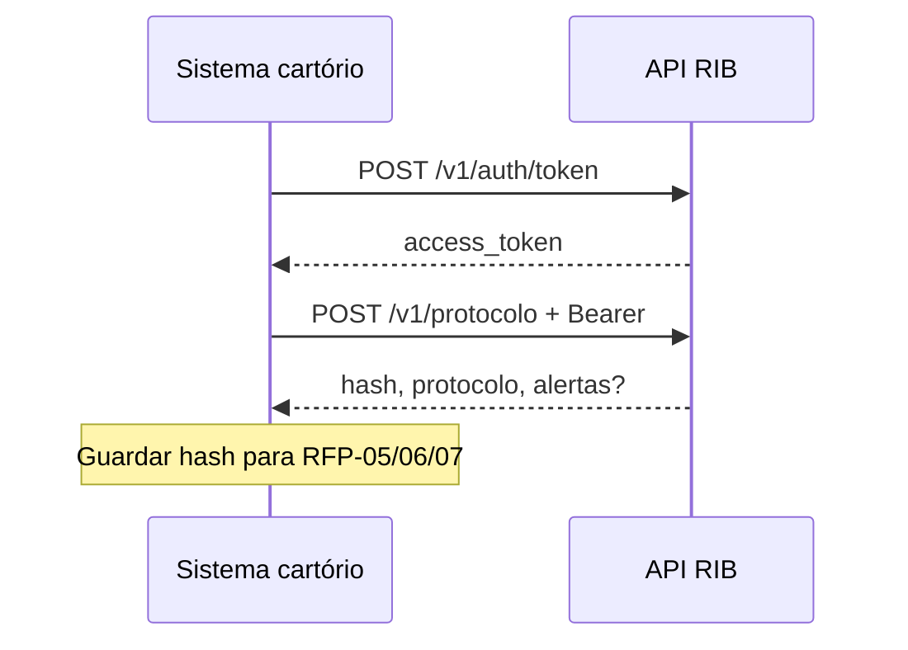

> **Índice:** [[Orius/integracoes/registro-imoveis/acompanhamento-registral/00-indice]]
> **Visão geral:** [[Orius/integracoes/registro-imoveis/acompanhamento-registral/visao-geral]]
> **Autenticação:** [[Orius/integracoes/registro-imoveis/acompanhamento-registral/RFG-01-autenticacao]]

# [RFP-01] — Envio do protocolo online

**Uma frase:** cadastrar **na hora** um acompanhamento registral (protocolo) na plataforma RIB, com validação imediata — **sem anexos** (anexos exigem [[Orius/integracoes/registro-imoveis/acompanhamento-registral/RFP-02-envio-lote|RFP-02 — lote]]).

No cadastro o RIB valida os campos; problemas não fatais aparecem em **`alertas`** na resposta de sucesso. Erros que impedem o cadastro retornam o JSON padrão de erro (`codigo`, `descricao`, `campos`).

---

## Endpoint

| Método | Caminho | Descrição |
|--------|---------|-----------|
| `POST` | `/v1/protocolo` | Cadastramento do protocolo online |

**Produção:** `https://api.registrodeimoveis.org.br/v1/protocolo`  
**Homologação:** `https://testes-api.registrodeimoveis.org.br/v1/protocolo`

---

## Pré-requisitos

- [x] Token JWT — [[Orius/integracoes/registro-imoveis/acompanhamento-registral/RFG-01-autenticacao|RFG-01]]
- [ ] `protocolo` e `tipoSolicitacao` definidos pelo cartório
- [ ] `apresentante.documento` (CPF/CNPJ, só números)
- [ ] Se enviar `cobranca`: PIX ou BOLETO + pagador + `servicos` + vencimento
- [ ] Domínios: [[dominio/TBD-02-actipo-solicitacao|TBD-02]], [[dominio/TBD-03-accodigo-status|TBD-03]], [[dominio/TBD-06-actipo-descricao|TBD-06]]

---

## Request

### Headers

| Campo | Obrigatório | Descrição |
|-------|-------------|-----------|
| `Authorization` | Sim | `Bearer {access_token}` |
| `Content-Type` | Sim | `application/json` |

### Body — campos raiz

| Campo | Tipo | Tam. | Obrig. | Descrição |
|-------|------|------|--------|-----------|
| `protocolo` | string | 30 | Sim | Número do protocolo no cartório |
| `codigoSecundario` | string | 50 | Não | Código auxiliar ao protocolo (v2.1+) |
| `senha` | string | 20 | Não | Senha/código verificador para consulta pública |
| `tipoSolicitacao` | int | 1 | Sim | [[dominio/TBD-02-actipo-solicitacao|ACTipoSolicitacao]] |
| `datas` | object | — | Não | Datas do título |
| `valores` | object | — | Não | Valores financeiros |
| `apresentante` | object | — | Sim | Quem apresenta o título |
| `interessado` | object | — | Não | Parte interessada (mesma estrutura do apresentante) |
| `status` | object | — | Não | Situação inicial do andamento |
| `cobranca` | object | — | Não | Gera cobrança junto com o protocolo (PIX/BOLETO) |

### Objeto `datas`

| Campo | Tipo | Tam. | Obrig. | Descrição |
|-------|------|------|--------|-----------|
| `protocolo` | date | 10 | Não | Data do protocolo (`YYYY-MM-DD`) |
| `previsaoEntrega` | date | 10 | Não | Previsão de entrega |

### Objeto `valores`

| Campo | Tipo | Tam. | Obrig. | Descrição |
|-------|------|------|--------|-----------|
| `deposito` | decimal | 20,2 | Não | Valor do depósito |
| `emolumentos` | decimal | 20,2 | Não | Valor dos emolumentos |

### Objetos `apresentante` e `interessado`

| Campo | Tipo | Tam. | Obrig. | Apresentante | Interessado |
|-------|------|------|--------|--------------|-------------|
| `nome` | string | 220 | Não | — | — |
| `documento` | string | 14 | **Sim** | CPF/CNPJ | Não |
| `email` | string | 220 | Não | — | — |
| `telefone` | object | — | Não | — | — |

**`telefone`:** `ddd` (number, 3), `numero` (number, 10).

### Objeto `status`

| Campo | Tipo | Tam. | Obrig. | Descrição |
|-------|------|------|--------|-----------|
| `status` | int | 11 | Não | [[dominio/TBD-03-accodigo-status|ACCodigoStatus]] |
| `data` | datetime | 19 | Não | Data da situação (`YYYY-MM-DD HH:mm:ss`) |
| `descricao` | string | — | Não | Texto da situação |
| `tipoDescricao` | string | 20 | Não | [[dominio/TBD-06-actipo-descricao|ACTipoDescricao]] |

### Objeto `cobranca` (opcional no raiz; se enviado, preencher obrigatórios)

| Campo | Tipo | Tam. | Obrig. | Descrição |
|-------|------|------|--------|-----------|
| `tipoCobranca` | string | 10 | Sim | `PIX` ou `BOLETO` |
| `dataVencimento` | date | 10 | Sim | Vencimento da cobrança |
| `observacao` | string | 30 | Não | Texto na cobrança |
| `dadosPagador` | object | — | Sim | Pagador |
| `servicos` | array | — | Sim | Itens cobrados |
| `webhook` | object | — | Não | Callback de status de pagamento |

**`dadosPagador`:**

| Campo | Tipo | Tam. | Obrig. |
|-------|------|------|--------|
| `nome` | string | 60 | Sim |
| `documento` | string | 14 | Sim (CPF/CNPJ, só números) |
| `email` | string | 150 | Sim |
| `telefone` | object | — | Não |
| `endereco` | object | — | Sim |

**`dadosPagador.endereco`:**

| Campo | Tam. | Obrig. |
|-------|------|--------|
| `cep` | 8 | Sim |
| `tipoLogradouro` | 16 | Sim |
| `logradouro` | 150 | Sim |
| `numero` | 10 | Não |
| `bairro` | 100 | Sim |
| `cidade` | 100 | Sim |
| `estado` | 2 | Sim (UF) |

**`servicos[]` (cada item):**

| Campo | Tipo | Descrição |
|-------|------|-----------|
| `codigo` | int | Código do serviço na tabela RIB |
| `valor` | number | Valor do item (ex.: centavos no exemplo do manual) |

**`webhook`:**

| Campo | Tam. | Obrig. | Descrição |
|-------|------|--------|-----------|
| `url` | — | Sim | URL de callback |
| `metodo` | 10 | Sim | `GET` ou `POST` |
| `token` | — | Não | Token enviado ao chamar o webhook |
| `tipoToken` | 10 | Não | `Bearer` ou `Basic` |

### Exemplo de body (com cobrança)

```json
{
  "protocolo": "2024/123456",
  "codigoSecundario": "REF-INTERNA-01",
  "senha": "verificador",
  "tipoSolicitacao": 1,
  "datas": {
    "protocolo": "2024-08-04",
    "previsaoEntrega": "2024-08-20"
  },
  "valores": {
    "deposito": 0,
    "emolumentos": 1500.50
  },
  "apresentante": {
    "nome": "Maria Apresentante",
    "documento": "12345678901",
    "email": "maria@exemplo.com",
    "telefone": { "ddd": 11, "numero": 987654321 }
  },
  "interessado": {
    "nome": "João Interessado",
    "documento": "98765432100",
    "email": "joao@exemplo.com"
  },
  "status": {
    "status": 4,
    "data": "2024-08-04 10:00:00",
    "descricao": "Título prenotado",
    "tipoDescricao": "texto"
  },
  "cobranca": {
    "tipoCobranca": "PIX",
    "dataVencimento": "2024-08-15",
    "observacao": "Emolumentos registro",
    "dadosPagador": {
      "nome": "João Interessado",
      "documento": "98765432100",
      "email": "joao@exemplo.com",
      "endereco": {
        "cep": "01310100",
        "tipoLogradouro": "Avenida",
        "logradouro": "Paulista",
        "numero": "1000",
        "bairro": "Bela Vista",
        "cidade": "São Paulo",
        "estado": "SP"
      }
    },
    "servicos": [
      { "codigo": 1, "valor": 10000 }
    ],
    "webhook": {
      "url": "https://cartorio.exemplo.com/rib/webhook-pagamento",
      "metodo": "POST",
      "token": "segredo-webhook",
      "tipoToken": "Bearer"
    }
  }
}
```

**Exemplo mínimo (sem cobrança nem status):**

```json
{
  "protocolo": "2024/123456",
  "tipoSolicitacao": 1,
  "apresentante": {
    "documento": "12345678901"
  }
}
```

---

## Response

### Sucesso (`200`)

```json
{
  "hash": "3fa85f64-5717-4562-b3fc-2c963f66afa6",
  "protocolo": "2024/123456",
  "dataCadastro": "2024-08-04 10:00:00",
  "alertas": [
    {
      "campo": "string",
      "mensagem": "string"
    }
  ]
}
```

| Campo | Tipo | Tam. | Obrig. | Descrição |
|-------|------|------|--------|-----------|
| `hash` | string | 36 | Sim | Identificador UUID do protocolo no RIB (usar em consultas RFP-05/06/07) |
| `protocolo` | string | 30 | Sim | Mesmo protocolo enviado |
| `dataCadastro` | datetime | 19 | Sim | Data/hora do cadastro no RIB |
| `alertas` | array | — | Não | Avisos de validação (cadastro pode ter sido aceito) |

**Item de `alertas`:**

| Campo | Obrig. | Descrição |
|-------|--------|-----------|
| `campo` | Sim | Nome do campo com aviso |
| `mensagem` | Sim | Descrição do aviso |

### Erro

```json
{
  "codigo": 0,
  "descricao": "string",
  "campos": {}
}
```

Ver [[Orius/integracoes/registro-imoveis/acompanhamento-registral/visao-geral#Formato das respostas]].

---

## Regras de negócio

| Regra | Detalhe |
|-------|---------|
| **Sem anexo** | Arquivos PDF/imagem etc. → [[RFP-02-envio-lote|RFP-02]] (fila em background) |
| **Cobrança no mesmo POST** | Objeto `cobranca` opcional; se presente, todos os subcampos obrigatórios da cobrança devem ser enviados |
| **Alertas ≠ erro HTTP** | `alertas` preenchido indica inconsistências leves; tratar no sistema e exibir ao operador |
| **Cobrança automática dedicada** | Fluxo alternativo: [[RFP-03-cobranca-automatizada|RFP-03]] (após protocolo já existir) |
| **Consulta posterior** | [[RFP-05-listagem-protocolos]] · [[RFP-07-detalhe-protocolo-v2]] |

---

## Tabelas de domínio (neste endpoint)

| Campo | Tabela |
|-------|--------|
| `tipoSolicitacao` | [[dominio/TBD-02-actipo-solicitacao]] |
| `status.status` | [[dominio/TBD-03-accodigo-status]] |
| `status.tipoDescricao` | [[dominio/TBD-06-actipo-descricao]] |
| Status da cobrança gerada | [[dominio/TBD-01-status-cobranca]] |

Índice completo: [[dominio/00-indice-dominio]].

---

## Fluxo



Fluxo completo de envio/processamento: **FFP-01**, **FFP-02** (pendente no índice).

---

## Relacionado

| Código | Relação |
|--------|---------|
| [[Orius/integracoes/registro-imoveis/acompanhamento-registral/RFG-01-autenticacao]] | Token obrigatório |
| [[RFP-02-envio-lote]] | Protocolo com anexos e fila |
| [[RFP-03-cobranca-automatizada]] | Cobrança após cadastro (lote) |
| [[RFP-04-exclusao-protocolo]] | Exclusão do protocolo no RIB |
| [[RFP-05-listagem-protocolos]] / [[RFP-07-detalhe-protocolo-v2]] | Listar e detalhar |
| [[Orius/integracoes/registro-imoveis/rib-cobranca]] | Nota legada sobre `/v1/cobranca` |

**Manual bruto (repo):** `api-registro-imoveis/manual-api-acompanhamento-registral-pagamentos-v2.2.md` — seção `[RFP-01]` (págs. 11–16 do PDF v2.2)

---

## Histórico desta nota

| Data | Alteração |
|------|-----------|
| 2026-06-01 | Extraído do manual v2.2 |
