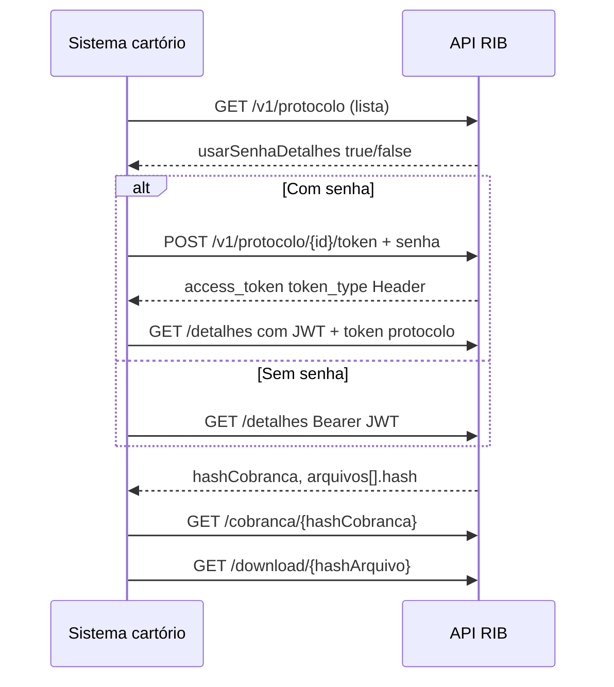

> **Índice:** [[Orius/integracoes/registro-imoveis/acompanhamento-registral/00-indice]]
> **Listagem:** [[RFP-05-listagem-protocolos]]
> **Versão mais nova:** RFP-07 (pendente) — pode exigir CPF/CNPJ do apresentante além da senha
> **Autenticação API:** [[RFG-01-autenticacao]]

# [RFP-06] — Detalhamento do protocolo (V1)

**Uma frase:** obter **todos os dados** de um protocolo integrado, incluindo `hashCobranca` e `hash` dos anexos, com fluxo extra de **token por senha** quando o protocolo foi cadastrado com proteção de visualização.

---

## Endpoints

| Método | Caminho | Descrição |
|--------|---------|-----------|
| `POST` | `/v1/protocolo/{numeroProtocolo}/token` | Token para detalhe/download (quando há senha) |
| `GET` | `/v1/protocolo/{numeroProtocolo}/detalhes` | Detalhamento completo |
| `GET` | `/v1/protocolo/{numeroProtocolo}/token/validacao` | Valida token de visualização |
| `GET` | `/v1/protocolo/{numeroProtocolo}/download/{hashArquivo}` | Download do anexo |
| `GET` | `/v1/cobranca/{hashCobranca}` | Detalhe da cobrança (hash vindo do detalhe) |

**Base:** `https://api.registrodeimoveis.org.br`

### Identificador no path `{numeroProtocolo}`

O manual alterna **número do protocolo** (tam. 30) e **hash** (tam. 40) conforme o endpoint:

| Endpoint | Tam. no manual | Texto do manual |
|----------|----------------|-----------------|
| `POST .../token` | 30 | “Hash do protocolo” (provável erro — body usa `senha` do cadastro) |
| `GET .../detalhes` | 40 | “Hash do protocolo” |
| `GET .../token/validacao` | 40 | “Hash do protocolo” |
| `GET .../download/...` | 40 | “Hash do protocolo” |

**Prática sugerida:** usar o valor retornado em [[RFP-05-listagem-protocolos]] (`protocolo`) ou o `hash` UUID do cadastro (RFP-01/02). **Confirmar em homologação** o identificador aceito em cada rota.

---

## Fluxo de autenticação



1. Listar ([[RFP-05-listagem-protocolos]]) e verificar `usarSenhaDetalhes` / `usarSenhaArquivos`.
2. Se necessário: `POST .../token` com `senha` cadastrada no envio do protocolo.
3. `GET .../detalhes` com JWT global ([[RFG-01-autenticacao]]) **e** token de protocolo conforme `token_type` (**Header** no manual — não é `Bearer` do OAuth principal).
4. Cobrança: `GET /v1/cobranca/{hashCobranca}`.
5. Anexo: `GET .../download/{hashArquivo}`.

---

## 1. POST `/v1/protocolo/{numeroProtocolo}/token`

### Headers

| Campo | Obrigatório |
|-------|-------------|
| `Authorization` | Sim — `Bearer` JWT RFG-01 |

### Body

```json
{
  "senha": "string",
  "tipoSolicitacao": 1
}
```

| Campo | Obrig. | Descrição |
|-------|--------|-----------|
| `senha` | Sim | Senha definida no cadastro (`senha` do RFP-01/02) |
| `tipoSolicitacao` | Sim | `1` Registro · `2` Exame e cálculo ([[dominio/TBD-02-actipo-solicitacao]]) |

### Resposta de sucesso

```json
{
  "access_token": "string",
  "expires_in": 0,
  "token_type": "Header"
}
```

| Campo | Descrição |
|-------|-----------|
| `access_token` | Token para visualização/download |
| `expires_in` | Expiração (segundos) |
| `token_type` | **`Header`** — enviar conforme Swagger/homologação (não confundir com `Bearer` do RFG-01) |

---

## 2. GET `/v1/protocolo/{numeroProtocolo}/detalhes`

### Headers

| Campo | Obrigatório |
|-------|-------------|
| `Authorization` | Sim — JWT RFG-01 (+ token de protocolo se aplicável) |

### Resposta de sucesso (estrutura)

```json
{
  "hash": "uuid-protocolo-rib",
  "protocolo": "2024/123456",
  "codigoSecundario": "string",
  "senha": "string",
  "tipoSolicitacao": 1,
  "dataCadastro": "2024-08-04 10:00:00",
  "dataAtualizacao": "2024-08-04 11:00:00",
  "datas": {
    "protocolo": "2024-08-04",
    "previsaoEntrega": "2024-08-20"
  },
  "valores": { "deposito": 0, "emolumentos": 1500.50 },
  "apresentante": { "nome": "…", "documento": "…", "email": "…", "telefone": { "ddd": 11, "numero": 0 } },
  "interessado": { },
  "status": {
    "status": 4,
    "data": "2024-08-04 10:00:00",
    "descricao": "string",
    "tipoDescricao": "texto"
  },
  "hashCobranca": "uuid-cobranca",
  "arquivos": [
    { "hash": "uuid-arquivo", "nome": "peticao.pdf" }
  ],
  "dataUltimaAtualizacaoSistema": "2024-08-04 10:00:00"
}
```

### Campos principais

| Campo | Obrig. | Descrição |
|-------|--------|-----------|
| `hash` | Sim | UUID do protocolo no RIB |
| `protocolo` | Sim | Número no cartório |
| `codigoSecundario` | Não | Código auxiliar |
| `senha` | Sim* | Verificador (*presente na resposta quando cadastrado) |
| `tipoSolicitacao` | Sim | [[dominio/TBD-02-actipo-solicitacao]] |
| `dataCadastro` / `dataAtualizacao` | Sim | Timestamps RIB |
| `datas`, `valores` | Sim | Mesma semântica do [[RFP-01-envio-online]] |
| `apresentante`, `interessado` | Sim | Dados completos |
| `status` | Sim | `status` ([[dominio/TBD-03-accodigo-status]]), `data`, `descricao`, `tipoDescricao` (TBD-06 pendente) |
| `hashCobranca` | Sim | UUID para `GET /v1/cobranca/{hashCobranca}` |
| `arquivos` | Sim | `hash` + `nome` de cada anexo |
| `dataUltimaAtualizacaoSistema` | Sim | Última atualização recebida **do cartório** (independente do protocolo — v2.2) |

---

## 3. GET `/v1/protocolo/{numeroProtocolo}/token/validacao`

Valida se o token de visualização do protocolo ainda é aceito.

| Item | Detalhe |
|------|---------|
| Headers | `Authorization` JWT RFG-01 |
| Sucesso | **HTTP 200** sem body documentado |
| Erro | `codigo`, `descricao`, `campos` |

---

## 4. GET `/v1/protocolo/{numeroProtocolo}/download/{hashArquivo}`

| Path | Obrig. | Descrição |
|------|--------|-----------|
| `numeroProtocolo` | Sim | Identificador do protocolo (tam. 40 no manual) |
| `hashArquivo` | Sim | `hash` do item em `arquivos[]` do detalhe |

| Sucesso | **HTTP 200** — corpo binário do arquivo |
| Erro | JSON padrão |

Requer JWT + token de protocolo se `usarSenhaArquivos` era `true` na listagem.

---

## 5. GET `/v1/cobranca/{hashCobranca}` (acoplado ao detalhe V1)

Consulta cobrança a partir do `hashCobranca` retornado no detalhe.

### Resposta (resumo)

```json
{
  "hash": "uuid",
  "status": 0,
  "dataStatus": "2024-08-04",
  "dataGeracao": "2024-08-04",
  "url": "string",
  "valorTotal": 100000,
  "tipoCobranca": "PIX",
  "dataVencimento": "2024-08-15",
  "observacao": "string",
  "dadosPagador": { },
  "servicos": [{ "codigo": 0, "valor": 100000 }]
}
```

| Campo | Nota |
|-------|------|
| `status` | [[dominio/TBD-01-status-cobranca]] |
| `valorTotal` / `servicos[].valor` | Formato numérico inteiro — ex.: R$ 100,00 → `100000` (conforme manual) |
| `url` | Link de pagamento PIX/boleto |

Documentação dedicada: **RFC-03** (pendente) · [[RFC-01-geracao-cobranca]] · [[RFC-02-listagem-cobrancas]] · [[rib-cobranca|legado]].

---

## RFP-06 vs RFP-07

| | V1 (esta nota) | V2 (pendente) |
|--|----------------|---------------|
| Detalhe | `GET /v1/protocolo/.../detalhes` | `GET /v2/protocolo/.../detalhes` |
| Token | Senha do protocolo | Senha **ou** documento do apresentante |
| Quando usar | Integrações legadas | Preferir V2 em projetos novos (manual v1.5+) |

---

## Relacionado

| Código | Relação |
|--------|---------|
| [[RFP-05-listagem-protocolos]] | Origem dos filtros e flags de senha |
| [[RFP-01-envio-online]] / [[RFP-02-envio-lote]] | Cadastro e `senha` |
| [[dominio/TBD-01-status-cobranca]] | Status em `/v1/cobranca/{hash}` |

**Manual bruto:** `[RFP-06]` (págs. 41–50 do PDF v2.2)

---

## Histórico desta nota

| Data | Alteração |
|------|-----------|
| 2026-06-01 | Extraído do manual v2.2 |
