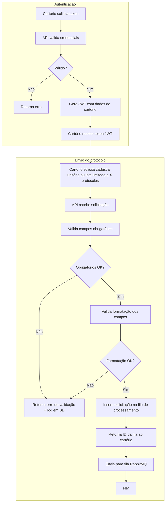

> **Índice:** [[Orius/integracoes/registro-imoveis/api-registro-imoveis/00-indice]]
> **Visão geral:** [[visao-geral]]
> **Processamento assíncrono (plataforma):** [[FFP-02-fluxo-processamento-protocolo]]

# [FFP-01] — Fluxo do envio do protocolo

**Uma frase:** do ponto de vista da integração, como o cartório **autentica**, **envia** título e status (unitário ou em lote) e recebe de volta **token JWT** e **identificador da fila** para acompanhamento — conforme diagrama oficial do manual v2.2 (pág. 63).

> O PDF traz este trecho como **fluxograma** (sem texto além do título). O conteúdo abaixo foi extraído do diagrama e cruzado com [[RFG-01-autenticacao]], [[RFP-01-envio-online]] e [[RFP-02-envio-lote]].

---

## Atores

| Ator | Papel |
|------|--------|
| **Cartório** | Sistema interno que chama a API REST |
| **API RIB** | Valida, enfileira e responde |
| **RabbitMQ** | Fila interna de processamento (lado plataforma) |

---

## Diagrama (manual)

---

## Fase 1 — Autenticação

| Passo (diagrama) | API / nota |
|------------------|------------|
| Solicita token | `POST /v1/auth/token` — [[RFG-01-autenticacao]] |
| Valida credenciais | `client_credentials` ou `password` |
| Inválido | JSON erro: `codigo`, `descricao`, `campos` |
| Válido | `access_token` (JWT), `expires_in`, `token_type: Bearer` |
| Cartório armazena token | Renovar antes de expirar; opcional `GET /v1/auth/validacao` |

---

## Fase 2 — Envio (título + status)

| Passo (diagrama) | API / nota |
|------------------|------------|
| Cadastro unitário ou em lote | Ver tabela abaixo |
| Valida obrigatórios | Ex.: `protocolo`, `tipoSolicitacao`, `apresentante.documento` |
| Valida formatação | CPF/CNPJ, datas, domínios TBD |
| Erro de validação | HTTP erro **ou** `alertas` (lote não bloqueia enfileiramento — ver [[RFP-02-envio-lote]]) |
| Insere na fila + ID da fila | Principalmente **lote**; ver [[FFP-02-fluxo-processamento-protocolo]] |
| RabbitMQ | Processamento assíncrono na plataforma (cartório não chama RabbitMQ) |

### Caminhos REST (integração cartório)

| Modo | Endpoint | Resposta típica | Anexos |
|------|----------|-----------------|--------|
| **Online** | `POST /v1/protocolo` — [[RFP-01-envio-online]] | `hash` do protocolo + `alertas?` | **Não** |
| **Lote** | `POST /v1/protocolo/lote` — [[RFP-02-envio-lote]] | `hash` da **fila** + `alertas?` | Sim (`arquivos[].url`) |

> O diagrama unifica os dois modos até “fila + RabbitMQ”. Na prática, o **online** devolve o resultado da validação na mesma requisição HTTP; o **lote** exige polling em `GET /v1/fila/processamento/protocolo/{hashFila}` até [[dominio/TBD-04-acfila-situacao|situação final]].

---

## Cobrança no envio (opcional)

Se o body incluir `cobranca` (PIX/BOLETO), a geração pode ser disparada após o cadastro — detalhado no processamento ([[FFP-02-fluxo-processamento-protocolo]]) e em [[RFP-03-cobranca-automatizada]].

---

## Regras de negócio / observações Orius

| Tema | Detalhe |
|------|---------|
| Lote limitado a **X** | Limite operacional da plataforma — confirmar com RIB/homologação se houver teto de itens por POST |
| Logs na base | Erros de validação são registrados pelo RIB (cartório só vê resposta HTTP) |
| Próximo passo | Após envio com sucesso: [[FFP-02-fluxo-processamento-protocolo]] (lote) ou [[RFP-05-listagem-protocolos]] / detalhe (online) |
| Exigências | Fluxo separado: [[RAE-01-listagem-resposta-exigencia]] … [[RAE-03-cadastro-interacao]] |

---

## Relacionado

| Código | Relação |
|--------|---------|
| [[RFG-01-autenticacao]] | Fase 1 |
| [[RFP-01-envio-online]] · [[RFP-02-envio-lote]] | Fase 2 (APIs) |
| [[FFP-02-fluxo-processamento-protocolo]] | O que a plataforma faz após a fila |
| [[dominio/TBD-02-actipo-solicitacao]] · [[dominio/TBD-03-accodigo-status]] | Campos de envio |

**Fonte:** `api-registro-imoveis/manual-api-acompanhamento-registral-pagamentos-v2.2.md` — `[FFP-01]` + PDF pág. 63 (diagrama).

---

## Histórico desta nota

| Data | Alteração |
|------|-----------|
| 2026-06-01 | Diagrama extraído do PDF v2.2; mapeamento para RFG/RFP |
