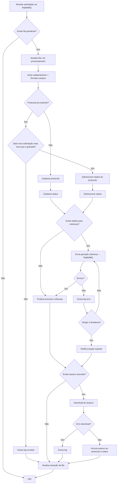
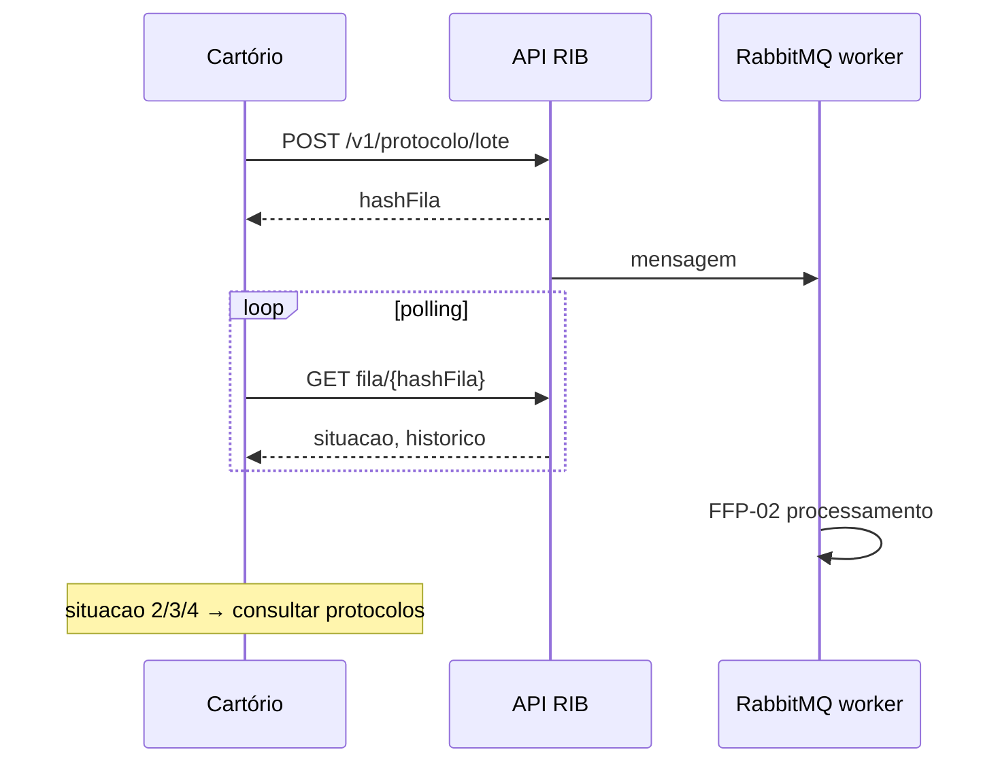

> **Índice:** [[Orius/integracoes/registro-imoveis/api-registro-imoveis/00-indice]]
> **Envio:** [[FFP-01-fluxo-envio-protocolo]]
> **Polling da fila (cartório):** [[RFP-02-envio-lote]]

# [FFP-02] — Fluxo de processamento do protocolo

**Uma frase:** o que a plataforma RIB executa **em background** (RabbitMQ) após o envio em lote — cadastro ou atualização do protocolo/status, cobrança opcional e download de anexos — e como o cartório acompanha via **situação da fila** ([[dominio/TBD-04-acfila-situacao]]).

> Diagrama oficial manual v2.2, pág. 64 (“Função processamento do acompanhamento / RabbitMQ”). O cartório **não** consome RabbitMQ; usa `GET /v1/fila/processamento/protocolo/{hashFila}`.

---

## Atores

| Ator | Papel |
|------|--------|
| **Worker RIB** | Consome mensagens RabbitMQ |
| **API / BD** | Persiste protocolo, status, logs, fila |
| **Cartório** | Consulta `situacao` da fila até finalizar |

---

## Diagrama (manual)

---

## Passos — lado plataforma

| Etapa | Comportamento |
|-------|----------------|
| Entrada | Mensagem na fila RabbitMQ (após [[FFP-01-fluxo-envio-protocolo]]) |
| Sem fila pendente | Encerra (`FIM`) |
| Em processamento | `situacao` = **1** ([[dominio/TBD-04-acfila-situacao]]) |
| Protocolo novo | Cadastra protocolo + status |
| Protocolo existente | Só atualiza se a **data da nova solicitação for mais recente**; senão apenas log |
| Atualização | Sobrescreve dados do protocolo e do status |
| Cobrança | Se houver dados: enfileira geração; até **3 tentativas**; falha persistente → suporte RIB |
| Anexo | Download da `url` enviada no lote; vincula ao protocolo/status; erro → log |
| Fim | Atualiza situação da fila: **2** sucesso, **3** alertas ou **4** erros |

---

## Passos — lado cartório (acompanhamento)

| `situacao` (TBD-04) | Ação |
|---------------------|------|
| 0 Pendente / 1 Em processamento | `GET /v1/fila/processamento/protocolo/{hashFila}` em intervalo (polling) |
| 2 Processado com sucesso | [[RFP-05-listagem-protocolos]] → [[RFP-06-detalhe-protocolo-v1]] ou [[RFP-07-detalhe-protocolo-v2]] |
| 3 Processado com alertas | Revisar `alertas` do POST + `historico` da fila |
| 4 Processado com erros | Tratar operacionalmente; possível reenvio de lote |

---

## Mapeamento para APIs documentadas

| Trecho do diagrama | Nota / endpoint |
|------------------|-----------------|
| Geração de cobrança | [[RFC-01-geracao-cobranca]], objeto `cobranca` no lote ([[RFP-01-envio-online#Objeto cobranca]]), [[RFP-03-cobranca-automatizada]] |
| Download anexo | `arquivos[].url` em [[RFP-02-envio-lote]] |
| Situação do protocolo após sucesso | [[dominio/TBD-03-accodigo-status]] em `status` |
| Atualizar protocolo depois | Novos POSTs (regra de data) ou consulta RFP-05/06/07 |
| Excluir | [[RFP-04-exclusao-protocolo]] |
| Exigência (parte) | [[RAE-01-listagem-resposta-exigencia]] … (fora deste worker, mas no ciclo de vida do título) |

---

## Regras de negócio / observações Orius

| Tema | Detalhe |
|------|---------|
| **Idempotência / ordem** | Solicitações antigas (data menor) não sobrescrevem registro mais novo — apenas log |
| **3 tentativas cobrança** | Paralelo ao webhook RFC (3 tentativas de notificação ao cartório) — conceitos diferentes |
| **Envio online (RFP-01)** | Não passa por este diagrama de fila da mesma forma; processamento é imediato na resposta HTTP |
| **Homologação** | Validar tempos de fila e códigos `situacao` com lote real |

---

## Relacionado

- Anterior: [[FFP-01-fluxo-envio-protocolo]]
- [[dominio/TBD-04-acfila-situacao]]
- Manual: `[FFP-02]` — PDF pág. 64

---

## Histórico desta nota

| Data | Alteração |
|------|-----------|
| 2026-06-01 | Diagrama extraído do PDF v2.2; mapeamento RFP/RFC/RAE |
