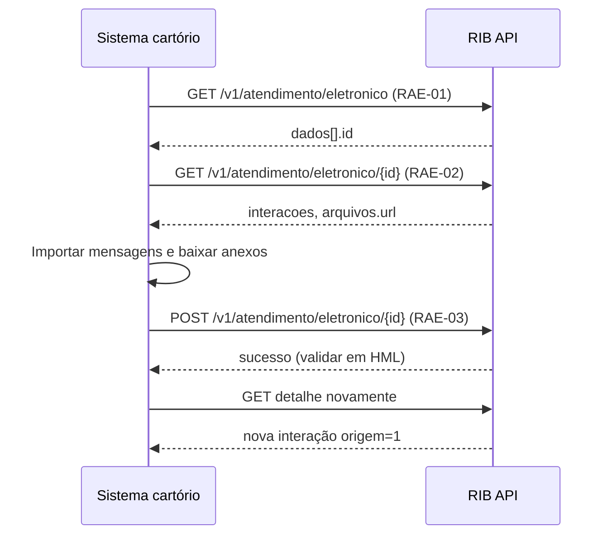

> **Índice:** [[Orius/integracoes/registro-imoveis/api-registro-imoveis/00-indice]]
> **Autenticação:** [[RFG-01-autenticacao]]
> **Listagem:** [[RAE-01-listagem-resposta-exigencia]] · **Detalhe:** [[RAE-02-detalhes-resposta-exigencia]]

# [RAE-03] — Cadastramento de interação

**Uma frase:** o cartório **registra uma nova interação** no atendimento eletrônico — por exemplo informando que a exigência foi **recebida e está em análise** — com mensagem opcional e anexos em Base64.

---

## Pré-requisitos

- [x] Token JWT — [[RFG-01-autenticacao]]
- [x] `id` do atendimento ([[RAE-01-listagem-resposta-exigencia]] / [[RAE-02-detalhes-resposta-exigencia]])
- [ ] Domínios do body: [[dominio/TBD-13-aeacao]], [[dominio/TBD-10-aeforma-atendimento]], [[dominio/TBD-14-aeextensoes-arquivos]]

---

## Endpoint

| Método | Caminho | Descrição |
|--------|---------|-----------|
| `POST` | `/v1/atendimento/eletronico/{id}` | Cadastro de interação |

**Produção:** `https://api.registrodeimoveis.org.br/v1/atendimento/eletronico/{id}`  
**Homologação:** `https://testes-api.registrodeimoveis.org.br/v1/atendimento/eletronico/{id}`

---

## Request

### Headers

| Campo | Obrigatório |
|-------|-------------|
| `Authorization` | Sim — `Bearer {access_token}` |
| `Content-Type` | Sim — `application/json` |

### Path

| Parâmetro | Tipo | Tam. | Obrigatório | Descrição |
|-----------|------|------|-------------|-----------|
| `id` | int | 11 | Sim | Atendimento a atualizar |

### Body

| Campo | Tipo | Tam. | Obrigatório | Descrição |
|-------|------|------|-------------|-----------|
| `acao` | int | 2 | **Sim** | [[dominio/TBD-13-aeacao]] |
| `mensagem` | string | 65535 | **Sim** | Texto da interação |
| `formaAtendimento` | int | 2 | Não | [[dominio/TBD-10-aeforma-atendimento]] |
| `arquivos` | array | — | Não | Anexos — ver abaixo |

#### Objeto `arquivos[]` (se enviado)

| Campo | Tam. | Obrigatório | Descrição |
|-------|------|-------------|-----------|
| `nome` | 250 | Sim | Nome **com extensão** (ex.: `parecer.pdf`) |
| `tipo` | 6 | Sim | Slug [[dominio/TBD-14-aeextensoes-arquivos]] (`pdf`, `zip`, …) |
| `base64` | — | Sim | Conteúdo do arquivo em Base64 |

**Exemplo (recebimento em análise):**

```json
{
  "acao": 0,
  "mensagem": "Exigência recebida pelo cartório e em análise.",
  "formaAtendimento": 2,
  "arquivos": [
    {
      "nome": "comprovante.pdf",
      "tipo": "pdf",
      "base64": "JVBERi0xLjQK…"
    }
  ]
}
```

> O manual ilustra `acao` e `formaAtendimento` como strings descritivas; enviar **inteiros** (`0`, `1`, `2`).

**Cenário típico Orius:** `acao: 0` (informativo/mensagem), conforme descrição funcional do manual para “recebida e está sendo analisada”.

---

## Response

### Sucesso

O manual v2.2 **não documenta** o JSON de sucesso desta operação — apenas o modelo de **erro**. Em homologação, validar se a API retorna `200`/`201` com corpo vazio ou confirmação mínima; em seguida conferir o histórico via [[RAE-02-detalhes-resposta-exigencia]] (`interacoes` com `origem` = cartório, [[dominio/TBD-12-aeorigem]] código `1`).

### Erros

```json
{
  "codigo": "0",
  "descricao": "string",
  "campos": {}
}
```

| Campo | Obrig. | Descrição |
|-------|--------|-----------|
| `codigo` | Não | Código interno |
| `descricao` | Sim | Mensagem |
| `campos` | Não | Campos inválidos |

---

## Regras de negócio / observações Orius

| `acao` | Quando usar |
|--------|-------------|
| `0` | Mensagem informativa — **padrão** para “em análise” |
| `1` | Confirmação de contato |
| `2` | Cancelamento |
| `3` | Finalização |
| `4` | Reabertura |

- Não confundir com atualização de **protocolo** RFP ou **cobrança** RFC — esta rota é só **atendimento eletrônico**.
- Alinhar `nome` e `tipo` do anexo (`documento.pdf` + `"tipo": "pdf"`).
- Payload Base64 pode ser grande; evitar lotes massivos na mesma requisição.
- Após POST bem-sucedido, `status` global pode mudar ([[dominio/TBD-08-aesituacao]]) — reconsultar detalhe.

---

## Fluxo sugerido



---

## Relacionado

- [[dominio/TBD-13-aeacao]] · [[dominio/TBD-14-aeextensoes-arquivos]]
- Protocolo (outro módulo): [[RFP-05-listagem-protocolos]]
- Manual bruto: `[RAE-03]` (PDF v2.2, pág. 90)

---

## Histórico desta nota

| Data | Alteração |
|------|-----------|
| 2026-06-01 | Criação a partir do manual v2.2 |
