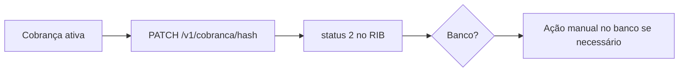

> **Índice:** [[Orius/integracoes/registro-imoveis/api-registro-imoveis/00-indice]]
> **Autenticação:** [[RFG-01-autenticacao]]
> **Detalhe antes/depois:** [[RFC-03-detalhe-cobranca]] · [[RFC-02-listagem-cobrancas]]

# [RFC-04] — Cancelamento da cobrança

**Uma frase:** cancelar uma cobrança no **portal RIB** via API (`status` cancelado), **sem** cancelamento automático junto ao **banco** — o cartório pode precisar tratar o título/PIX no banco separadamente.

---

## Pré-requisitos

- [x] Token JWT — [[RFG-01-autenticacao]]
- [ ] `hash` da cobrança a cancelar
- [ ] Módulo de pagamentos ativo — [manual-modulo-pagamentos](https://www.registrodeimoveis.org.br/manual-modulo-pagamentos)

---

## Endpoint

| Método | Caminho | Descrição |
|--------|---------|-----------|
| `PATCH` | `/v1/cobranca/{hashCobranca}` | Cancelamento da cobrança |

**Produção:** `https://api.registrodeimoveis.org.br/v1/cobranca/{hashCobranca}`  
**Homologação:** `https://testes-api.registrodeimoveis.org.br/v1/cobranca/{hashCobranca}`

### Path

| Parâmetro | Tipo | Tam. | Obrig. | Descrição |
|-----------|------|------|--------|-----------|
| `hashCobranca` | string | 40 | Sim | UUID da cobrança |

### Headers

| Campo | Obrigatório |
|-------|-------------|
| `Authorization` | Sim — `Bearer {access_token}` |

O manual **não** documenta body no PATCH — apenas path + header. Validar no Swagger se é necessário enviar payload vazio ou motivo de cancelamento.

---

## Response de sucesso

```json
{
  "hash": "3fa85f64-5717-4562-b3fc-2c963f66afa6",
  "status": 2,
  "dataStatus": "2024-08-04",
  "url": "https://…",
  "valorTotal": 100000
}
```

| Campo | Tam. | Obrig. | Descrição |
|-------|------|--------|-----------|
| `hash` | 36 | Sim | UUID da cobrança |
| `status` | 11 | Sim | [[dominio/TBD-01-status-cobranca]] — esperado **`2`** (Pagamento cancelado) após sucesso |
| `dataStatus` | 10 | Sim | Data da situação |
| `url` | — | Sim | URL de acesso (pode permanecer informativa) |
| `valorTotal` | — | Sim | Valor total (formato inteiro) |

Resposta **mais enxuta** que [[RFC-03-detalhe-cobranca]] (sem pagador/serviços).

### Erro

Padrão: `codigo`, `descricao`, `campos`.

---

## Regras de negócio

| Regra | Detalhe |
|-------|---------|
| **Só no RIB** | Cancela no Registro de Imóveis do Brasil; **não** cancela automaticamente no banco |
| **Protocolo excluído** | [[RFP-04-exclusao-protocolo]] **não** cancela cobrança — usar este RFC explicitamente |
| **Webhook** | Se havia webhook na criação, pode receber notificação de cancelamento (3 tentativas) |
| **Após cancelar** | Confirmar com `GET` [[RFC-03-detalhe-cobranca]] ou listagem `status=2` |



---

## Relacionado

| Código | Relação |
|--------|---------|
| [[RFC-01-geracao-cobranca]] | Origem da cobrança |
| [[RFC-03-detalhe-cobranca]] | Consulta completa antes/depois |
| [[RFP-04-exclusao-protocolo]] | Excluir protocolo ≠ cancelar cobrança |
| [[RFC-06-devolucao-pix]] | Devolução PIX (pagamento confirmado) |
| [[RFC-07-atualizacao-protocolo-pagamento]] | Vincular protocolo (outro PATCH) |

**Manual bruto:** `[RFC-04]` (pág. 78 do PDF v2.2)

---

## Histórico desta nota

| Data | Alteração |
|------|-----------|
| 2026-06-01 | Extraído do manual v2.2 |
