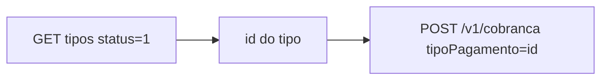

> **Índice:** [[Orius/integracoes/registro-imoveis/api-registro-imoveis/00-indice]]
> **Autenticação:** [[RFG-01-autenticacao]]
> **Uso do `id`:** [[RFC-01-geracao-cobranca]] — campo `tipoPagamento`

# [RFC-05] — Listagem dos tipos de pagamento

**Uma frase:** listar os **tipos de pagamento** cadastrados pelo cartório na intranet RIB, para obter o **`id`** usado em `tipoPagamento` ao gerar cobranças ([[RFC-01-geracao-cobranca]]).

Cadastro/edição dos tipos: **intranet** (módulo pagamentos), não por esta API.

---

## Pré-requisitos

- [x] Token JWT — [[RFG-01-autenticacao]]
- [ ] Módulo de pagamentos ativo — [manual-modulo-pagamentos](https://www.registrodeimoveis.org.br/manual-modulo-pagamentos)

---

## Endpoint

| Método | Caminho | Descrição |
|--------|---------|-----------|
| `GET` | `/v1/cobranca/tipo/pagamento` | Listagem paginada dos tipos |

**Produção:** `https://api.registrodeimoveis.org.br/v1/cobranca/tipo/pagamento`  
**Homologação:** `https://testes-api.registrodeimoveis.org.br/v1/cobranca/tipo/pagamento`

---

## Request

### Headers

| Campo | Obrigatório |
|-------|-------------|
| `Authorization` | Sim — `Bearer {access_token}` |

### Query (opcionais)

| Parâmetro | Tipo | Tam. | Descrição |
|-----------|------|------|-----------|
| `registrosPorPagina` | int | 3 | Padrão **50**, máximo **100** |
| `numeroPagina` | int | — | Página |
| `status` | int | 1 | [[dominio/TBD-05-status-tipo-pagamento]] (`0` inativo, `1` ativo) |
| `descricao` | string | — | Filtro por descrição (contém) |

**Exemplo — só tipos ativos:**

```http
GET /v1/cobranca/tipo/pagamento?status=1&registrosPorPagina=50
Authorization: Bearer …
```

---

## Response de sucesso

O JSON de exemplo do manual usa a chave **`cobrancas`**; a tabela de campos nomeia o array como **`dados`**. Validar em homologação qual chave a API retorna.

```json
{
  "totalRegistros": 2,
  "totalPaginas": 1,
  "paginaAtual": 1,
  "dados": [
    {
      "id": 1,
      "descricao": "Registro de contrato",
      "dataCadastro": "2023-03-06 16:40:03",
      "dataAtualizacao": "2023-04-04 15:58:54",
      "status": 1
    }
  ]
}
```

### Raiz

| Campo | Obrig. | Descrição |
|-------|--------|-----------|
| `totalRegistros` | Sim | Total encontrado |
| `totalPaginas` | Sim | Total de páginas |
| `paginaAtual` | Sim | Página atual |
| `dados` | Sim | Lista de tipos (*ou `cobrancas` no exemplo PDF*) |

### Item do array (`dados[]`)

| Campo | Tam. | Obrig. | Descrição |
|-------|------|--------|-----------|
| `id` | 11 | Sim | Valor para `tipoPagamento` em [[RFC-01-geracao-cobranca]] |
| `descricao` | 250 | Sim | Texto exibido ao usuário |
| `dataCadastro` | 10 | Sim | Cadastro (`DateTime`) |
| `dataAtualizacao` | — | Não | Última atualização |
| `status` | 1 | Sim | [[dominio/TBD-05-status-tipo-pagamento]] |

### Erro

Padrão: `codigo`, `descricao`, `campos`.

---

## Fluxo



---

## Regras de negócio

| Regra | Detalhe |
|-------|---------|
| **Somente consulta** | CRUD de tipos na intranet RIB |
| **Ativo para cobrança** | Filtrar `status=1` antes de usar o `id` |
| **≠ status da cobrança** | TBD-05 é do **tipo**; [[dominio/TBD-01-status-cobranca]] é da **cobrança** |

**Manual bruto:** `[RFC-05]` (págs. 79–81 do PDF v2.2)

---

## Histórico desta nota

| Data | Alteração |
|------|-----------|
| 2026-06-01 | Extraído do manual v2.2 |
