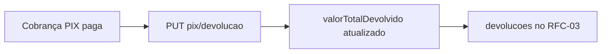

> **Índice:** [[Orius/integracoes/registro-imoveis/api-registro-imoveis/00-indice]]
> **Autenticação:** [[RFG-01-autenticacao]]
> **Cobrança:** [[RFC-03-detalhe-cobranca]] (`devolucoes[]`) · **Cancelar:** [[RFC-04-cancelamento-cobranca]]

# [RFC-06] — Devolução de valores pagos no PIX

**Uma frase:** solicitar **devolução total ou parcial** de um pagamento **PIX** já confirmado, para uma cobrança identificada pelo `hash`.

> A tabela de endpoints no PDF copia erroneamente o cancelamento (`PATCH`); o endpoint correto é **`PUT .../pix/devolucao`** (seção seguinte no manual).

---

## Pré-requisitos

- [x] Token JWT — [[RFG-01-autenticacao]]
- [ ] Cobrança **PIX** com pagamento confirmado ([[dominio/TBD-01-status-cobranca]] código `1`)
- [ ] `hash` da cobrança
- [ ] Módulo de pagamentos ativo — [manual-modulo-pagamentos](https://www.registrodeimoveis.org.br/manual-modulo-pagamentos)

---

## Endpoint

| Método | Caminho | Descrição |
|--------|---------|-----------|
| `PUT` | `/v1/cobranca/{hashCobranca}/pix/devolucao` | Devolução PIX (total ou parcial) |

**Produção:** `https://api.registrodeimoveis.org.br/v1/cobranca/{hash}/pix/devolucao`  
**Homologação:** `https://testes-api.registrodeimoveis.org.br/v1/cobranca/{hash}/pix/devolucao`

### Path

| Parâmetro | Tam. | Obrig. | Descrição |
|-----------|------|--------|-----------|
| `hashCobranca` | 40 | Sim | UUID da cobrança |

### Headers

| Campo | Obrigatório |
|-------|-------------|
| `Authorization` | Sim — `Bearer` |
| `Content-Type` | Sim — `application/json` |

---

## Request body

```json
{
  "valor": 100000
}
```

| Campo | Tipo | Obrig. | Descrição |
|-------|------|--------|-----------|
| `valor` | number | Sim | Valor a devolver (formato inteiro; R$ 100,00 → `100000`) |

**Limite:** valor ≤ saldo devolvível da cobrança (total pago menos devoluções já feitas). Consultar [[RFC-03-detalhe-cobranca]] → `devolucoes[]` e totais.

---

## Response de sucesso

```json
{
  "hash": "3fa85f64-5717-4562-b3fc-2c963f66afa6",
  "status": 1,
  "dataStatus": "2024-08-10",
  "valorTotal": 100000,
  "valorTotalDevolvido": 50000
}
```

| Campo | Obrig. | Descrição |
|-------|--------|-----------|
| `hash` | Sim | UUID da cobrança |
| `status` | Sim | [[dominio/TBD-01-status-cobranca]] após devolução |
| `dataStatus` | Sim | Data da situação |
| `valorTotal` | Sim | Valor total da cobrança (inteiro) |
| `valorTotalDevolvido` | Sim | Soma já devolvida (inteiro) |

Cada operação também aparece em `devolucoes[]` no detalhe ([[RFC-03-detalhe-cobranca]]): `hash`, `status`, `valor`, `dataCadastro`, `dataAtualizacao`.

### Erro

Padrão: `codigo`, `descricao`, `campos`.

---

## Regras de negócio

| Regra | Detalhe |
|-------|---------|
| **Só PIX** | Boleto não usa este endpoint |
| **Parcial ou total** | Várias devoluções até o limite do valor pago |
| **≠ RFC-04** | Cancelamento (`PATCH`) é outro fluxo — não confundir com devolução PIX |
| **Acompanhar** | `GET` [[RFC-03-detalhe-cobranca]] após PUT para ver `valorTotalDevolvido` |



---

## Relacionado

| Código | Relação |
|--------|---------|
| [[RFC-03-detalhe-cobranca]] | Lista `devolucoes[]` |
| [[RFC-04-cancelamento-cobranca]] | Cancelar cobrança (sem devolver PIX) |

**Manual bruto:** `[RFC-06]` (pág. 81 do PDF v2.2) · histórico v1.4 (devolução PIX)

---

## Histórico desta nota

| Data | Alteração |
|------|-----------|
| 2026-06-01 | Extraído do manual v2.2 |
