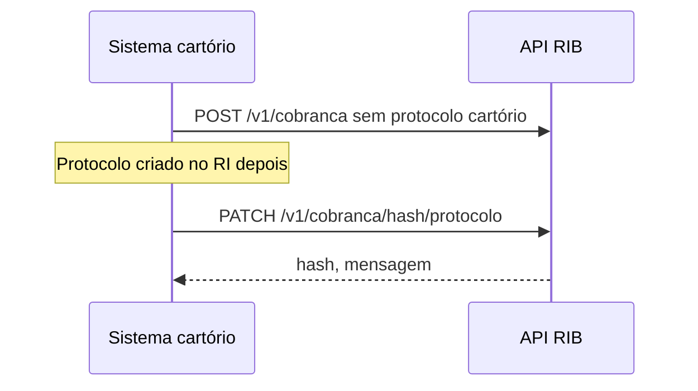

> **Índice:** [[Orius/integracoes/registro-imoveis/api-registro-imoveis/00-indice]]
> **Autenticação:** [[RFG-01-autenticacao]]
> **Cobrança:** [[RFC-03-detalhe-cobranca]]

# [RFC-07] — Atualização do protocolo vinculado ao pagamento

**Uma frase:** associar ou **atualizar o número de protocolo** do cartório em uma **cobrança já existente** — se já houver protocolo(s) vinculado(s), um **novo** vínculo é cadastrado (não substitui o histórico no RIB).

Útil quando a cobrança foi gerada antes do protocolo definitivo no sistema interno, ou para corrigir o número vinculado.

---

## Pré-requisitos

- [x] Token JWT — [[RFG-01-autenticacao]]
- [ ] `hash` da cobrança
- [ ] Novo número de protocolo (até 50 caracteres)
- [ ] Módulo de pagamentos ativo — [manual-modulo-pagamentos](https://www.registrodeimoveis.org.br/manual-modulo-pagamentos)

---

## Endpoint

| Método | Caminho | Descrição |
|--------|---------|-----------|
| `PATCH` | `/v1/cobranca/{hashCobranca}/protocolo` | Atualiza / adiciona vínculo de protocolo |

**Produção:** `https://api.registrodeimoveis.org.br/v1/cobranca/{hash}/protocolo`  
**Homologação:** `https://testes-api.registrodeimoveis.org.br/v1/cobranca/{hash}/protocolo`

> **Não confundir** com `PATCH /v1/cobranca/{hash}` ([[RFC-04-cancelamento-cobranca]] — cancelamento da cobrança).

### Path

| Parâmetro | Tam. | Obrig. | Descrição |
|-----------|------|--------|-----------|
| `hashCobranca` | 40 | Sim | UUID da cobrança |

### Headers

| Campo | Obrigatório |
|-------|-------------|
| `Authorization` | Sim — `Bearer` |
| `Content-Type` | Sim — `application/json` |

---

## Request body

```json
{
  "protocolo": "2024/987654"
}
```

| Campo | Tipo | Tam. | Obrig. | Descrição |
|-------|------|------|--------|-----------|
| `protocolo` | string | 50 | Sim | Novo número do protocolo no cartório |

---

## Response de sucesso

```json
{
  "hash": "3fa85f64-5717-4562-b3fc-2c963f66afa6",
  "mensagem": "string"
}
```

| Campo | Tam. | Obrig. | Descrição |
|-------|------|--------|-----------|
| `hash` | 36 | Sim | UUID da cobrança |
| `mensagem` | — | Sim | Mensagem de confirmação da atualização |

### Erro

Padrão: `codigo`, `descricao`, `campos`.

---

## Regras de negócio

| Regra | Detalhe |
|-------|---------|
| **Vínculo aditivo** | Se já existir protocolo(s) na cobrança, **cadastra mais um** — não apaga os anteriores (texto do manual) |
| **Cobrança sem protocolo na origem** | [[RFC-01-geracao-cobranca]] pode usar só `identificadorCliente`; este RFC liga o protocolo formal depois |
| **Protocolo no RIB** | Não substitui cadastro em [[RFP-01-envio-online]] — apenas o vínculo pagamento ↔ protocolo no módulo financeiro |
| **Confirmar** | [[RFC-03-detalhe-cobranca]] ou conciliação no sistema interno |



---

## Relacionado

| Código | Relação |
|--------|---------|
| [[RFC-01-geracao-cobranca]] | `identificadorCliente` vs `protocolo` |
| [[RFP-01-envio-online]] | Protocolo no acompanhamento registral (outro módulo) |
| [[RFC-04-cancelamento-cobranca]] | Outro `PATCH` na mesma base `/v1/cobranca/{hash}` |

**Manual bruto:** `[RFC-07]` (pág. 83 do PDF v2.2) · histórico v1.9

---

## Histórico desta nota

| Data | Alteração |
|------|-----------|
| 2026-06-01 | Extraído do manual v2.2 |
