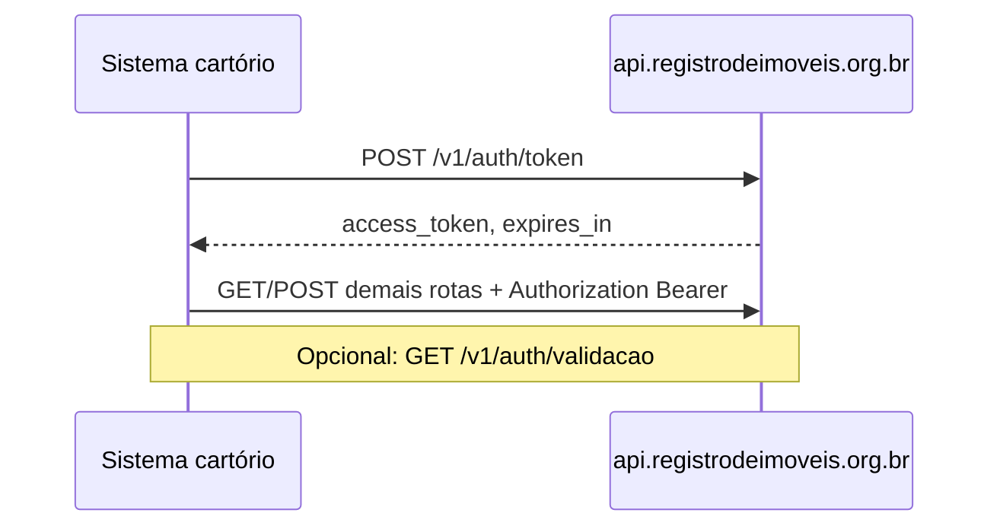

> **Índice:** [[Orius/integracoes/registro-imoveis/api-registro-imoveis/00-indice]]
> **Visão geral:** [[Orius/integracoes/registro-imoveis/api-registro-imoveis/visao-geral]]

# [RFG-01] — Autenticação

**Uma frase:** obter e validar o **token JWT Bearer** necessário para chamar as demais APIs de acompanhamento registral, cobrança e atendimento eletrônico no RIB.

Antes de qualquer `POST /v1/protocolo`, `GET /v1/cobranca`, etc., o sistema deve autenticar-se e enviar `Authorization: Bearer {access_token}`.

---

## Endpoints

| Método | Caminho | Descrição |
|--------|---------|-----------|
| `POST` | `/v1/auth/token` | Geração do token de autenticação |
| `GET` | `/v1/auth/validacao` | Validação do token (header Bearer) |

**Produção:** `https://api.registrodeimoveis.org.br/v1/auth/token`  
**Homologação:** `https://testes-api.registrodeimoveis.org.br/v1/auth/token`

---

## Pré-requisitos

- `client_id` e `client_secret` fornecidos pelo RIB para o cartório (ou integrador credenciado)
- Para `grant_type=password`: também `username` e `password` de usuário autorizado
- Valores sensíveis: [[env]] (não colar segredos nesta nota)

---

## POST `/v1/auth/token`

### Body (JSON)

| Campo | Tipo | Obrigatório | Descrição |
|-------|------|-------------|-----------|
| `client_id` | string | Sim | Código do cliente |
| `client_secret` | string | Sim | Chave secreta do cliente |
| `grant_type` | string | Sim | `client_credentials` ou `password` |
| `username` | string | Não | Obrigatório se `grant_type` = `password` |
| `password` | string | Não | Obrigatório se `grant_type` = `password` |

**Exemplo — client_credentials:**

```json
{
  "client_id": "seu-client-id",
  "client_secret": "seu-client-secret",
  "grant_type": "client_credentials"
}
```

**Exemplo — password:**

```json
{
  "client_id": "seu-client-id",
  "client_secret": "seu-client-secret",
  "grant_type": "password",
  "username": "usuario",
  "password": "senha"
}
```

### Resposta de sucesso

```json
{
  "access_token": "string",
  "expires_in": 0,
  "token_type": "Bearer"
}
```

| Campo | Tipo | Obrigatório | Descrição |
|-------|------|-------------|-----------|
| `access_token` | string | Sim | JWT de acesso |
| `expires_in` | int | Sim | Tempo de expiração (segundos) |
| `token_type` | string | Sim | Sempre `Bearer` |

**Uso nas demais APIs:**

```http
Authorization: Bearer {access_token}
```

Renovar o token antes de `expires_in` ou ao receber HTTP 401 nas rotas protegidas.

### Resposta de erro

```json
{
  "codigo": 0,
  "descricao": "string",
  "campos": {}
}
```

| Campo | Tipo | Obrigatório | Descrição |
|-------|------|-------------|-----------|
| `codigo` | string | Não | Código interno (manual indica tamanho 11) |
| `descricao` | string | Sim | Mensagem do erro |
| `campos` | object | Não | Campos com falha de validação |

---

## GET `/v1/auth/validacao`

Verifica se o JWT enviado no header ainda é aceito pelo servidor.

### Headers

| Campo | Obrigatório | Descrição |
|-------|-------------|-----------|
| `Authorization` | Sim | `Bearer {access_token}` obtido em `/v1/auth/token` |

### Resposta

O manual v2.2 documenta explicitamente o **modelo de erro** (mesma estrutura `codigo` / `descricao` / `campos` acima). Para o corpo de **sucesso**, consultar o [Swagger RIB](https://www.registrodeimoveis.org.br/swagger/index.html) ou testar em homologação.

**Uso típico no sistema Orius:** health-check periódico ou antes de lotes longos (envio em lote RFP-02), para evitar reprocessar com token expirado.

---

## Fluxo recomendado



---

## Relacionado

- Próximos passos de integração: [[Orius/integracoes/registro-imoveis/api-registro-imoveis/00-indice#Acompanhamento registral (protocolo)]]
- Cobrança (mesmo token): [[Orius/integracoes/registro-imoveis/rib-cobranca]]
- Manual bruto (repo): `api-registro-imoveis/manual-api-api-registro-imoveis-pagamentos-v2.2.md` — seção `[RFG-01] - Autenticação` (pág. 9 do PDF)

---

## Histórico desta nota

| Data | Alteração |
|------|-----------|
| 2026-06-01 | Extraído do manual v2.2; primeira nota da série api-registro-imoveis |
