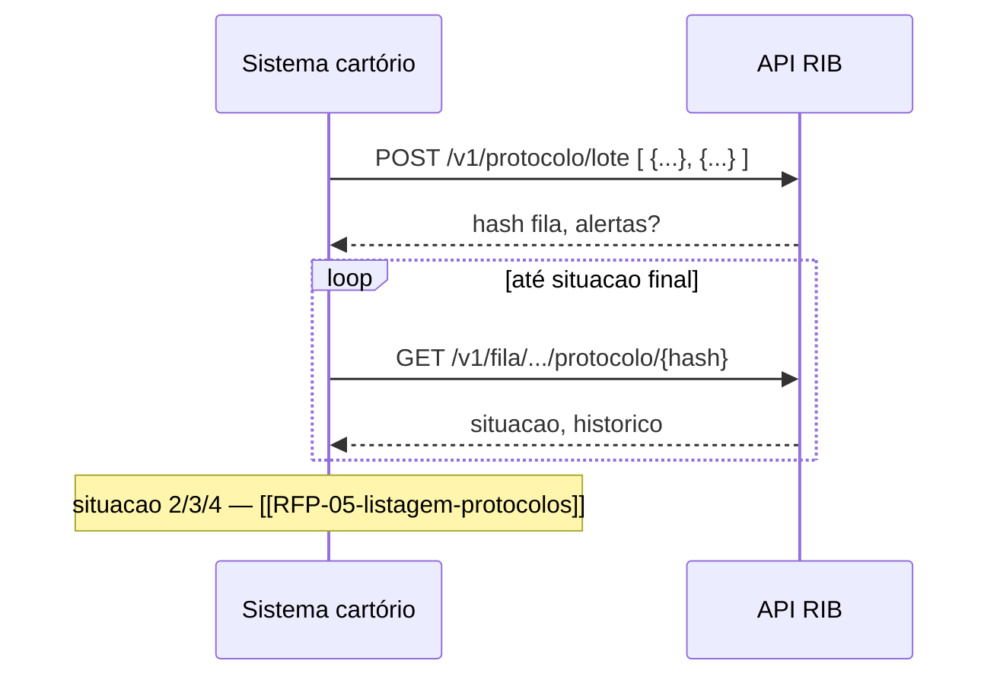

> **Índice:** [[Orius/integracoes/registro-imoveis/api-registro-imoveis/00-indice]]
> **Visão geral:** [[Orius/integracoes/registro-imoveis/api-registro-imoveis/visao-geral]]
> **Autenticação:** [[Orius/integracoes/registro-imoveis/api-registro-imoveis/RFG-01-autenticacao]]
> **Alternativa sem anexo:** [[Orius/integracoes/registro-imoveis/api-registro-imoveis/RFP-01-envio-online]]

# [RFP-02] — Envio de protocolo em lote

**Uma frase:** cadastrar **um ou vários** protocolos de uma vez, com **anexos por URL**, cobrança opcional e processamento em **fila assíncrona** — o retorno imediato traz o `hash` da **fila**, não o resultado final de cada protocolo.

Diferenças principais em relação ao [[Orius/integracoes/registro-imoveis/api-registro-imoveis/RFP-01-envio-online|RFP-01 (online)]]:

| Aspecto | RFP-01 online | RFP-02 lote |
|---------|---------------|-------------|
| Body | Um objeto JSON | **Array** de objetos |
| Anexos | Não suportado | `arquivos[]` com URL de download |
| Processamento | Imediato | Fila em background |
| Resposta | `hash` do protocolo | `hash` da **fila de processamento** |
| Alertas | Exibidos; cadastro pode falhar | Exibidos; **não impedem** enfileirar o lote |

---

## Endpoints

| Método | Caminho | Descrição |
|--------|---------|-----------|
| `POST` | `/v1/protocolo/lote` | Enfileira lote de protocolos |
| `GET` | `/v1/fila/processamento/protocolo` | Lista filas de processamento |
| `GET` | `/v1/fila/processamento/protocolo/{hashFila}` | Detalhe de uma fila |

**Base:** `https://api.registrodeimoveis.org.br` (homolog: `https://testes-api.registrodeimoveis.org.br`)

---

## Pré-requisitos

- [x] Token JWT — [[Orius/integracoes/registro-imoveis/api-registro-imoveis/RFG-01-autenticacao|RFG-01]]
- [ ] URLs em `arquivos[].url` acessíveis pelo RIB (download HTTP/HTTPS)
- [ ] Mesmas regras de campos que RFP-01 por item do array (`protocolo`, `tipoSolicitacao`, `apresentante.documento`, etc.)
- [ ] Após o POST: guardar `hash` da fila e consultar com os GETs até `situacao` final

---

## 1. POST `/v1/protocolo/lote`

### Headers

| Campo | Obrigatório | Descrição |
|-------|-------------|-----------|
| `Authorization` | Sim | `Bearer {access_token}` |
| `Content-Type` | Sim | `application/json` |

### Body

**Tipo:** array JSON — cada elemento é um protocolo do lote.

Estrutura **igual ao RFP-01** por item, mais o campo **`arquivos`**:

| Campo | Tipo | Tam. | Obrig. | Descrição |
|-------|------|------|--------|-----------|
| `protocolo` | string | 30 | Sim | Número do protocolo no cartório |
| `codigoSecundario` | string | 50 | Não | Código auxiliar |
| `senha` | string | 20 | Não | Código verificador para consulta pública |
| `tipoSolicitacao` | int | 1 | Sim | [[dominio/TBD-02-actipo-solicitacao|ACTipoSolicitacao]] |
| `datas` | object | — | Não | `protocolo`, `previsaoEntrega` (dates) |
| `valores` | object | — | Não | `deposito`, `emolumentos` |
| `apresentante` | object | — | Sim | `documento` obrigatório |
| `interessado` | object | — | Não | Mesma forma do apresentante |
| `status` | object | — | Não | `status`, `data`, `descricao`, `tipoDescricao` |
| `cobranca` | object | — | Não | PIX/BOLETO + pagador + `servicos` (+ `webhook`) |
| **`arquivos`** | **array** | — | **Não** | Anexos por link |

**Objeto `arquivos[]`:**

| Campo | Tipo | Tam. | Obrig. | Descrição |
|-------|------|------|--------|-----------|
| `nome` | string | 150 | Sim | Nome do arquivo |
| `url` | string | — | Sim | URL para o RIB baixar o arquivo |

> Detalhes de `cobranca`, `apresentante`, `status` e domínios: mesma estrutura documentada em [[Orius/integracoes/registro-imoveis/api-registro-imoveis/RFP-01-envio-online#Request|RFP-01 — Request]].

### Exemplo de body

```json
[
  {
    "protocolo": "2024/100001",
    "tipoSolicitacao": 1,
    "apresentante": {
      "nome": "Maria Apresentante",
      "documento": "12345678901"
    },
    "arquivos": [
      {
        "nome": "peticao-inicial.pdf",
        "url": "https://cartorio.exemplo.com/temp/peticao-inicial.pdf"
      },
      {
        "nome": "documento-complementar.zip",
        "url": "https://cartorio.exemplo.com/temp/doc.zip"
      }
    ]
  },
  {
    "protocolo": "2024/100002",
    "tipoSolicitacao": 2,
    "apresentante": { "documento": "98765432100" },
    "cobranca": {
      "tipoCobranca": "PIX",
      "dataVencimento": "2024-09-01",
      "dadosPagador": {
        "nome": "João Pagador",
        "documento": "98765432100",
        "email": "joao@exemplo.com",
        "endereco": {
          "cep": "01310100",
          "tipoLogradouro": "Avenida",
          "logradouro": "Paulista",
          "bairro": "Bela Vista",
          "cidade": "São Paulo",
          "estado": "SP"
        }
      },
      "servicos": [{ "codigo": 1, "valor": 10000 }]
    }
  }
]
```

### Resposta de sucesso

```json
{
  "hash": "3fa85f64-5717-4562-b3fc-2c963f66afa6",
  "dataCadastro": "2024-08-04 10:00:00",
  "alertas": [
    {
      "protocolo": "2024/100001",
      "campo": "string",
      "mensagem": "string"
    }
  ]
}
```

| Campo | Tipo | Tam. | Obrig. | Descrição |
|-------|------|------|--------|-----------|
| `hash` | string | 36 | Sim | UUID da **fila de processamento** (usar nos GET abaixo) |
| `dataCadastro` | datetime | 19 | Sim | Data/hora do enfileiramento |
| `alertas` | array | — | Não | Avisos por protocolo (não cancela o lote) |

**Item de `alertas`:**

| Campo | Obrig. | Descrição |
|-------|--------|-----------|
| `protocolo` | Sim | Protocolo do item com aviso |
| `campo` | Sim | Campo relacionado |
| `mensagem` | Sim | Descrição do aviso |

### Resposta de erro

Padrão RIB: `codigo`, `descricao`, `campos` — [[Orius/integracoes/registro-imoveis/api-registro-imoveis/visao-geral#Formato das respostas]].

---

## 2. GET `/v1/fila/processamento/protocolo`

Lista filas de processamento do cartório (paginado).

### Headers

| Campo | Obrigatório |
|-------|-------------|
| `Authorization` | Sim (`Bearer`) |

### Query

| Parâmetro | Tipo | Tam. | Obrig. | Descrição |
|-----------|------|------|--------|-----------|
| `registrosPorPagina` | int | 3 | Não | Padrão **50**, máximo **100** |
| `numeroPagina` | int | — | Não | Página (base conforme API) |
| `situacao` | int | 1 | Não | Filtro [[dominio/TBD-04-acfila-situacao|ACFilaSituacao]] |
| `dataInicialCadastro` | date | 10 | Não | Filtro início (`YYYY-MM-DD`) |
| `dataFinalCadastro` | date | 10 | Não | Filtro fim |

### Resposta de sucesso

```json
{
  "totalRegistros": 0,
  "totalPaginas": 0,
  "paginaAtual": 0,
  "dados": [
    {
      "hash": "3fa85f64-5717-4562-b3fc-2c963f66afa6",
      "dataCadastro": "2024-08-04 10:00:00",
      "situacao": 0,
      "dataSituacao": "2024-08-04 10:00:00",
      "tentativasProcessamento": 0
    }
  ]
}
```

| Campo (raiz) | Obrig. | Descrição |
|--------------|--------|-----------|
| `totalRegistros` | Sim | Total encontrado |
| `totalPaginas` | Sim | Total de páginas |
| `paginaAtual` | Sim | Página retornada |
| `dados` | Sim | Lista de filas |

**Item de `dados[]`:**

| Campo | Tipo | Tam. | Descrição |
|-------|------|------|-----------|
| `hash` | string | 40 | Hash da fila |
| `dataCadastro` | datetime | 19 | Cadastro da fila |
| `situacao` | int | 1 | `ACFilaSituacao` |
| `dataSituacao` | datetime | 19 | Data da situação atual |
| `tentativasProcessamento` | int | 1 | Tentativas de processamento |

---

## 3. GET `/v1/fila/processamento/protocolo/{hashFila}`

Detalhe de uma fila, com histórico de situações.

### Path

| Parâmetro | Tipo | Tam. | Obrig. | Descrição |
|-----------|------|------|--------|-----------|
| `hashFila` | string | 40 | Sim | `hash` retornado no POST do lote |

### Resposta de sucesso

```json
{
  "hash": "3fa85f64-5717-4562-b3fc-2c963f66afa6",
  "dataCadastro": "2024-08-04 10:00:00",
  "dataAtualizacao": "2024-08-04 10:05:00",
  "situacao": 2,
  "dataSituacao": "2024-08-04 10:05:00",
  "tentativasProcessamento": 1,
  "nomeUsuario": "string",
  "historico": [
    {
      "id": 0,
      "dataCadastro": "2024-08-04 10:00:00",
      "dataAtualizacao": "2024-08-04 10:05:00",
      "situacao": 2,
      "descricao": "string",
      "tipoDescricao": "string"
    }
  ]
}
```

| Campo | Tam. | Obrig. | Descrição |
|-------|------|--------|-----------|
| `hash` | 40 | Sim | Hash da fila |
| `dataCadastro` | 19 | Sim | Início |
| `dataAtualizacao` | 19 | Sim | Última atualização (v2.2) |
| `situacao` | 1 | Sim | Situação atual (`ACFilaSituacao`) |
| `dataSituacao` | 19 | Sim | Data da situação |
| `tentativasProcessamento` | 1 | Sim | Tentativas |
| `nomeUsuario` | 220 | Não | Usuário que solicitou a importação |
| `historico` | — | Sim | Linha do tempo |

**Item de `historico[]`:**

| Campo | Obrig. | Descrição |
|-------|--------|-----------|
| `id` | Sim | Id do registro de histórico |
| `dataCadastro` | Sim | Criação do evento |
| `dataAtualizacao` | Sim | Atualização do evento |
| `situacao` | Sim | Código `ACFilaSituacao` naquele momento |
| `descricao` | Sim | Texto do histórico |
| `tipoDescricao` | — | Presente no JSON de exemplo do manual |

---

## Tabelas de domínio (neste endpoint)

| Contexto | Tabela |
|----------|--------|
| `situacao` da fila (GET) | [[dominio/TBD-04-acfila-situacao]] |
| `tipoSolicitacao`, `status.status` no body | [[dominio/TBD-02-actipo-solicitacao]], [[dominio/TBD-03-accodigo-status]] |

Índice: [[dominio/00-indice-dominio]].

---

## Fluxo recomendado



1. Hospedar anexos em URL temporária acessível ao RIB (ou storage com link público/autenticado conforme combinado).
2. `POST /v1/protocolo/lote` → guardar `hash`.
3. Polling em `GET .../{hashFila}` até `situacao` ∈ {2, 3, 4}.
4. Tratar `alertas` do POST e situação **3** (alertas) ou **4** (erros) no detalhe da fila.
5. Localizar protocolos via [[RFP-05-listagem-protocolos]] e detalhe [[RFP-07-detalhe-protocolo-v2]].

Fluxos conceituais do manual: [[FFP-01-fluxo-envio-protocolo]] · [[FFP-02-fluxo-processamento-protocolo]].

---

## Regras de negócio

| Regra | Detalhe |
|-------|---------|
| **Anexos por URL** | RIB faz download a partir de `arquivos[].url`; garantir disponibilidade até o processamento |
| **Lote ≠ transação única** | Vários protocolos no mesmo POST compartilham uma fila |
| **Alertas não bloqueiam fila** | Validações com aviso ainda enfileiram; revisar `alertas` e depois `situacao` |
| **Cobrança no lote** | Mesma estrutura RFP-01; fluxo dedicado pós-cadastro: [[RFP-03-cobranca-automatizada]] |
| **Sem lote para 1 protocolo simples** | Se não há anexo, preferir [[RFP-01-envio-online]] (resposta imediata com `hash` do protocolo) |

---

## Relacionado

| Código | Relação |
|--------|---------|
| [[RFP-01-envio-online]] | Envio instantâneo sem anexo |
| [[RFP-03-cobranca-automatizada]] | Cobrança automatizada pós-protocolo |
| [[RFP-04-exclusao-protocolo]] | Exclusão (cobrança não cancela sozinha) |
| RFP-05 / 06 / 07 | Consultar protocolos após processamento (pendente) |
| [[Orius/integracoes/registro-imoveis/api-registro-imoveis/00-indice]] | Hub |

**Manual bruto (repo):** `api-registro-imoveis/manual-api-api-registro-imoveis-pagamentos-v2.2.md` — `[RFP-02]` (págs. 17–26 do PDF v2.2)

---

## Histórico desta nota

| Data | Alteração |
|------|-----------|
| 2026-06-01 | Extraído do manual v2.2 (POST lote + GET fila) |
