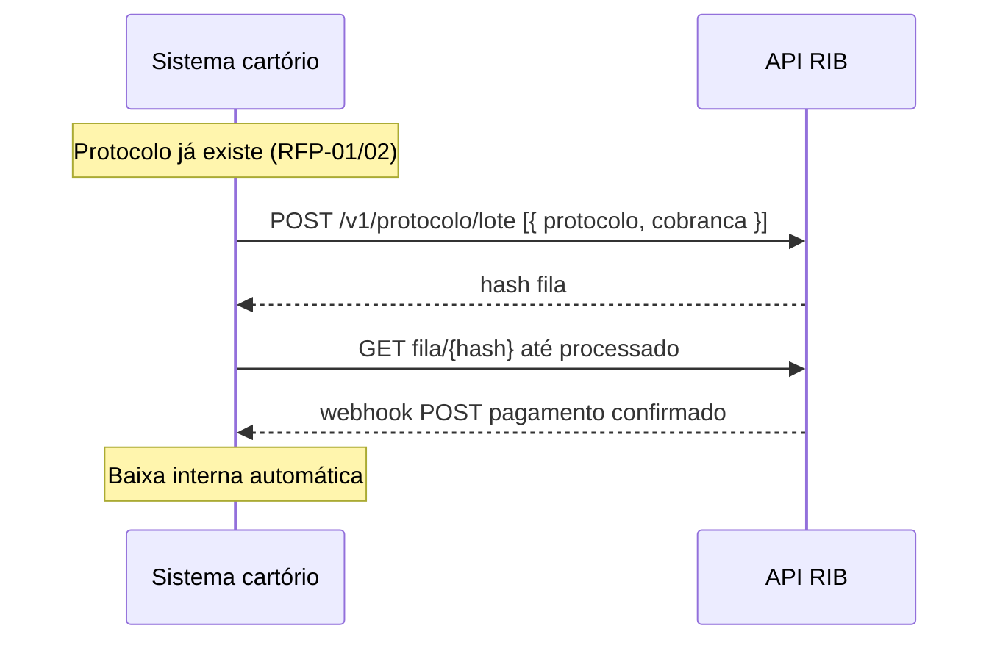

> **Índice:** [[Orius/integracoes/registro-imoveis/api-registro-imoveis/00-indice]]
> **Mesmos endpoints que:** [[Orius/integracoes/registro-imoveis/api-registro-imoveis/RFP-02-envio-lote|RFP-02 — lote / fila]]
> **Cobrança no cadastro online:** [[Orius/integracoes/registro-imoveis/api-registro-imoveis/RFP-01-envio-online#Objeto cobrança (opcional no raiz; se enviado, preencher obrigatórios)|RFP-01 — cobranca]]

# [RFP-03] — Geração de cobrança automatizada no protocolo

**Uma frase:** gerar **cobrança (PIX/BOLETO)** para protocolo **já integrado** no RIB, enfileirando a operação via **`POST /v1/protocolo/lote`** e acompanhando pela **fila de processamento**, com **webhook** opcional para baixa automática no sistema do cartório.

Não há endpoint exclusivo para RFP-03: o manual reutiliza as rotas do [[RFP-02-envio-lote|RFP-02]]. A diferença é o **caso de uso** (cobrança sobre protocolo existente) e regras de **obrigatoriedade** de campos no body.

---

## Endpoints (iguais ao RFP-02)

| Método | Caminho | Uso nesta funcionalidade |
|--------|---------|---------------------------|
| `POST` | `/v1/protocolo/lote` | Enfileira geração de cobrança |
| `GET` | `/v1/fila/processamento/protocolo` | Lista filas |
| `GET` | `/v1/fila/processamento/protocolo/{hashFila}` | Acompanha processamento |

**Base:** `https://api.registrodeimoveis.org.br` (homolog: `https://testes-api.registrodeimoveis.org.br`)

---

## Pré-requisitos operacionais

| Requisito | Detalhe |
|-----------|---------|
| **Módulo de pagamentos** | Cartório deve **ativar serviços de cobrança** na intranet RIB |
| Manual intranet | [manual-modulo-pagamentos](https://www.registrodeimoveis.org.br/manual-modulo-pagamentos) |
| **Autenticação** | [[RFG-01-autenticacao]] |
| **Protocolo no RIB** | `protocolo` (número do cartório) já cadastrado via RFP-01 ou RFP-02 |
| **Webhook (recomendado)** | URL do cartório para notificação de pagamento/cancelamento |

---

## Webhook de pagamento

Quando informado em `cobranca.webhook`, o RIB chama a URL do cartório nas **atualizações de situação do pagamento** (ex.: pagamento confirmado, cancelamento).

| Regra | Valor |
|-------|--------|
| Tentativas | **3** chamadas em caso de falha |
| Após 3 falhas | **Não** haverá novas notificações para aquele evento |
| Uso no cartório | Baixa automática no sistema interno |

Estrutura de `webhook` (dentro de `cobranca`):

| Campo | Obrig. | Descrição |
|-------|--------|-----------|
| `url` | Sim | Endpoint do cartório |
| `metodo` | Sim | `GET` ou `POST` |
| `token` | Não | Enviado na chamada ao webhook |
| `tipoToken` | Não | `Bearer` ou `Basic` |

---

## POST `/v1/protocolo/lote` — body para cobrança automatizada

**Formato:** array JSON (um ou mais itens).

### Campos raiz — diferenças em relação ao RFP-02

| Campo | RFP-02 (lote geral) | RFP-03 (cobrança automatizada) |
|-------|---------------------|--------------------------------|
| `protocolo` | Sim | **Sim** — protocolo já existente no RIB |
| `tipoSolicitacao` | Sim | **Sim** |
| `apresentante` | **Sim** (`documento` obrigatório) | **Não** obrigatório no manual |
| `cobranca` | Opcional | **Esperado** — objeto completo da cobrança |
| `arquivos` | Opcional (anexos) | Opcional — em geral omitido neste fluxo |
| Demais (`datas`, `valores`, `status`, …) | Opcionais | Opcionais |

### Objeto `cobranca` (obrigatório neste fluxo)

Quando presente, o manual exige:

| Campo | Obrig. | Descrição |
|-------|--------|-----------|
| `tipoCobranca` | Sim | `PIX` ou `BOLETO` |
| `dataVencimento` | Sim | `YYYY-MM-DD` |
| `observacao` | Não | Até 30 caracteres |
| `dadosPagador` | Sim | Nome, documento, e-mail, endereço |
| `servicos` | Sim | `[{ "codigo": int, "valor": number }]` |
| `webhook` | Não | Fortemente recomendado para RFP-03 |

Detalhes de `dadosPagador`, endereço e `servicos`: [[RFP-01-envio-online#Objeto `cobranca` (opcional no raiz; se enviado, preencher obrigatórios)|RFP-01 — cobranca]].

### Exemplo mínimo (foco em cobrança)

```json
[
  {
    "protocolo": "2024/123456",
    "tipoSolicitacao": 1,
    "cobranca": {
      "tipoCobranca": "PIX",
      "dataVencimento": "2024-09-15",
      "observacao": "Emolumentos registro",
      "dadosPagador": {
        "nome": "João Pagador",
        "documento": "98765432100",
        "email": "joao@exemplo.com",
        "endereco": {
          "cep": "01310100",
          "tipoLogradouro": "Avenida",
          "logradouro": "Paulista",
          "bairro": "Bela Vista",
          "cidade": "São Paulo",
          "estado": "SP"
        }
      },
      "servicos": [
        { "codigo": 1, "valor": 15000 }
      ],
      "webhook": {
        "url": "https://cartorio.exemplo.com/rib/webhook-pagamento",
        "metodo": "POST",
        "token": "segredo-interno",
        "tipoToken": "Bearer"
      }
    }
  }
]
```

### Resposta do POST

Igual ao RFP-02:

```json
{
  "hash": "uuid-da-fila",
  "dataCadastro": "2024-08-04 10:00:00",
  "alertas": [
    {
      "protocolo": "2024/123456",
      "campo": "string",
      "mensagem": "string"
    }
  ]
}
```

| Campo | Descrição |
|-------|-----------|
| `hash` | Fila de processamento — consultar com GET da fila |
| `alertas` | Não impedem enfileiramento |

---

## Acompanhamento da fila

Mesma documentação técnica do [[RFP-02-envio-lote#2. GET `/v1/fila/processamento/protocolo`|RFP-02 — GET fila]]:

- Listar: `GET /v1/fila/processamento/protocolo`
- Detalhe: `GET /v1/fila/processamento/protocolo/{hashFila}`
- Situação: [[dominio/TBD-04-acfila-situacao|ACFilaSituacao]] — aguardar `2` (sucesso), `3` (alertas) ou `4` (erros)

Após sucesso, consultar cobrança via [[RFC-02-listagem-cobrancas]] / [[RFC-03-detalhe-cobranca]] ou [[RFP-06-detalhe-protocolo-v1]] (`hashCobranca`).

---

## Fluxo



---

## Regras de negócio

| Regra | Detalhe |
|-------|---------|
| **Background** | Processamento assíncrono — não esperar cobrança no response do POST |
| **vs cobrança no RFP-01** | RFP-01 pode enviar `cobranca` no cadastro **online**; RFP-03 é para protocolo **já cadastrado** |
| **vs RFC-01** | RFC-01 gera cobrança avulsa; RFP-03 vincula ao **protocolo** via lote |
| **Ativação intranet** | Sem módulo de pagamentos ativo, operação pode falhar no processamento |
| **Cancelar cobrança** | Exclusão de protocolo (**RFP-04**) **não** cancela cobrança automaticamente |

---

## Relacionado

| Código | Relação |
|--------|---------|
| [[RFP-02-envio-lote]] | Endpoints e fila (referência técnica completa) |
| [[RFP-01-envio-online]] | Cobrança no mesmo POST do cadastro |
| [[RFP-04-exclusao-protocolo]] | Excluir protocolo (cobrança permanece) |
| [[RFC-01-geracao-cobranca]] / [[RFC-02-listagem-cobrancas]] | Cobrança avulsa (sem protocolo) |
| [[Orius/integracoes/registro-imoveis/rib-cobranca]] | Nota legada RIB |

**Manual bruto:** `api-registro-imoveis/manual-api-acompanhamento-registral-pagamentos-v2.2.md` — `[RFP-03]` (págs. 27–36 do PDF v2.2)

---

## Histórico desta nota

| Data | Alteração |
|------|-----------|
| 2026-06-01 | Extraído do manual v2.2 (fluxo lote + cobrança + webhook) |
