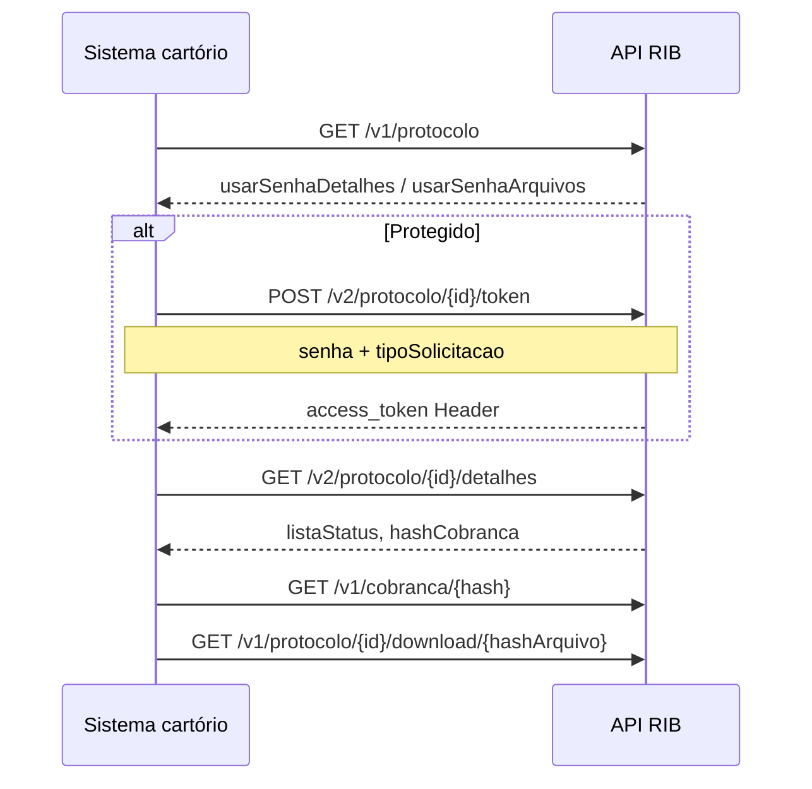

> **Índice:** [[Orius/integracoes/registro-imoveis/api-registro-imoveis/00-indice]]
> **Listagem:** [[RFP-05-listagem-protocolos]]
> **Versão anterior:** [[RFP-06-detalhe-protocolo-v1]]
> **Autenticação API:** [[RFG-01-autenticacao]]

# [RFP-07] — Detalhamento do protocolo (V2)

**Uma frase:** mesma finalidade da [[RFP-06-detalhe-protocolo-v1|V1]], com **`listaStatus`** (histórico de situações, cada uma com seus anexos) e rotas em **`/v2/protocolo/...`** — **preferir V2** em integrações novas (manual v1.5+).

Proteção de acesso: token extra quando o protocolo exige **senha** e/ou, conforme texto do manual, **documento (CPF/CNPJ) do apresentante** — o body documentado do `POST .../token` traz apenas `senha` + `tipoSolicitacao`; validar no Swagger/homologação se há parâmetro adicional para documento.

---

## Endpoints

| Método | Caminho | Versão | Descrição |
|--------|---------|--------|-----------|
| `POST` | `/v2/protocolo/{numeroProtocolo}/token` | **v2** | Token para detalhe/download |
| `GET` | `/v2/protocolo/{numeroProtocolo}/detalhes` | **v2** | Detalhamento completo |
| `GET` | `/v2/protocolo/{numeroProtocolo}/token/validacao` | **v2** | Valida token de visualização |
| `GET` | `/v1/protocolo/{numeroProtocolo}/download/{hashArquivo}` | **v1** | Download do anexo |
| `GET` | `/v1/cobranca/{hashCobranca}` | **v1** | Detalhe da cobrança |

**Base:** `https://api.registrodeimoveis.org.br`

> Download e cobrança permanecem em **v1** mesmo no fluxo RFP-07 (conforme tabela do manual).

---

## RFP-07 vs RFP-06

| Aspecto | V1 (RFP-06) | V2 (RFP-07) |
|---------|-------------|-------------|
| Detalhe | `GET /v1/.../detalhes` | `GET /v2/.../detalhes` |
| Token | `POST /v1/.../token` | `POST /v2/.../token` |
| Situação | Objeto único `status` | Array **`listaStatus`** (histórico) |
| Anexos | `arquivos[]` na raiz | `arquivos[]` **dentro de cada** item de `listaStatus` |
| Contagem | — | `totalStatus` no JSON de exemplo |
| Auth extra | Senha | Senha (+ documento apresentante no texto introdutório) |

---

## Identificador `{numeroProtocolo}`

| Endpoint | Tam. manual | Observação |
|----------|-------------|------------|
| `POST /v2/.../token` | 30 | Texto: “hash do protocolo” |
| `GET /v2/.../detalhes` | 40 | Texto: “hash do protocolo” |
| `GET /v2/.../token/validacao` | 40 | Idem |
| `GET /v1/.../download/...` | 40 | Protocolo dono do arquivo |

Usar `protocolo` ou `hash` de [[RFP-05-listagem-protocolos]] / cadastro (RFP-01/02) — **confirmar em homologação**.

---

## Fluxo de autenticação



---

## 1. POST `/v2/protocolo/{numeroProtocolo}/token`

### Headers

| Campo | Obrigatório |
|-------|-------------|
| `Authorization` | Sim — `Bearer` JWT ([[RFG-01-autenticacao]]) |

### Body

```json
{
  "senha": "string",
  "tipoSolicitacao": 1
}
```

| Campo | Obrig. | Descrição |
|-------|--------|-----------|
| `senha` | Sim | Senha do protocolo (cadastro RFP-01/02) |
| `tipoSolicitacao` | Sim | `1` Registro · `2` Exame e cálculo ([[dominio/TBD-02-actipo-solicitacao]]) |

### Resposta de sucesso

```json
{
  "access_token": "string",
  "expires_in": 0,
  "token_type": "Header"
}
```

Igual à V1: usar token no header conforme Swagger (tipo **`Header`**, não o `Bearer` global).

---

## 2. GET `/v2/protocolo/{numeroProtocolo}/detalhes`

### Headers

| Campo | Obrigatório |
|-------|-------------|
| `Authorization` | Sim — JWT + token de protocolo se aplicável |

### Resposta de sucesso (estrutura)

```json
{
  "hash": "uuid-protocolo",
  "protocolo": "2024/123456",
  "codigoSecundario": "string",
  "senha": "string",
  "tipoSolicitacao": 1,
  "dataCadastro": "2024-08-04 10:00:00",
  "dataAtualizacao": "2024-08-04 11:00:00",
  "datas": {
    "protocolo": "2024-08-04",
    "previsaoEntrega": "2024-08-20"
  },
  "valores": { "deposito": 0, "emolumentos": 1500.50 },
  "apresentante": { "nome": "…", "documento": "…", "email": "…", "telefone": {} },
  "interessado": { },
  "listaStatus": [
    {
      "id": 0,
      "status": 4,
      "data": "2024-08-04 10:00:00",
      "descricao": "Título prenotado",
      "tipoDescricao": "texto",
      "arquivos": [
        { "hash": "uuid-arquivo", "nome": "peticao.pdf" }
      ]
    }
  ],
  "hashCobranca": "uuid-cobranca",
  "totalStatus": 1,
  "dataUltimaAtualizacaoSistema": "2024-08-04 10:00:00"
}
```

### Campos principais (raiz)

| Campo | Obrig. | Descrição |
|-------|--------|-----------|
| `hash` | Sim | UUID do protocolo no RIB |
| `protocolo` | Sim | Número no cartório |
| `codigoSecundario` | Não | Código auxiliar |
| `senha` | Sim* | Verificador de consulta |
| `tipoSolicitacao` | Sim | TBD-02 |
| `dataCadastro` / `dataAtualizacao` | Sim | Timestamps |
| `datas`, `valores` | Sim | Igual RFP-06 |
| `apresentante`, `interessado` | Sim | Dados completos |
| **`listaStatus`** | **Sim** | **Histórico** de andamentos (ver abaixo) |
| `hashCobranca` | Sim | UUID → `GET /v1/cobranca/{hash}` |
| `totalStatus` | — | Presente no JSON de exemplo do manual |
| `dataUltimaAtualizacaoSistema` | Sim | Última atualização vinda do cartório (v2.2) |

### Item `listaStatus[]`

| Campo | Obrig. | Descrição |
|-------|--------|-----------|
| `id` | — | Id do registro (JSON de exemplo; não na tabela do PDF) |
| `status` | Não | [[dominio/TBD-03-accodigo-status]] |
| `data` | Não | Data/hora da situação |
| `descricao` | Não | Texto da situação |
| `tipoDescricao` | Não | [[dominio/TBD-06-actipo-descricao|ACTipoDescricao]] |
| `arquivos` | Sim | Anexos **daquele** andamento |

**`listaStatus[].arquivos[]`:**

| Campo | Descrição |
|-------|-----------|
| `hash` | Download via `GET /v1/protocolo/.../download/{hashArquivo}` |
| `nome` | Nome do arquivo |

> Na V1, `arquivos[]` ficava na raiz; na V2 os anexos estão **por situação** — importante para exibir timeline no sistema do cartório.

---

## 3. GET `/v2/protocolo/{numeroProtocolo}/token/validacao`

| Sucesso | HTTP **200** (sem body no manual) |
| Erro | `codigo`, `descricao`, `campos` |
| Path | `numeroProtocolo` tam. 40 |

---

## 4. GET `/v1/protocolo/{numeroProtocolo}/download/{hashArquivo}`

Mesma especificação da [[RFP-06-detalhe-protocolo-v1#4. GET `/v1/protocolo/{numeroProtocolo}/download/{hashArquivo}`|V1]]:

- Path: protocolo (40) + `hashArquivo` do item em `listaStatus[].arquivos[]`
- Sucesso: **200** + binário do arquivo
- JWT + token de protocolo se `usarSenhaArquivos`

---

## 5. GET `/v1/cobranca/{hashCobranca}`

Detalhe da cobrança: [[RFC-03-detalhe-cobranca]] (`GET /v1/cobranca/{hashCobranca}` — mesmo endpoint citado em [[RFP-06-detalhe-protocolo-v1#5. GET `/v1/cobranca/{hashCobranca}`]]).

---

## Regras de negócio

| Regra | Detalhe |
|-------|---------|
| **Preferir V2** | Histórico completo em `listaStatus` |
| **Anexos por status** | Um arquivo pode estar ligado a um andamento específico |
| **Rotas mistas v1/v2** | Implementar cliente HTTP com base path correto por recurso |
| **Listagem antes** | [[RFP-05-listagem-protocolos]] → flags de senha → token v2 → detalhe v2 |

---

## Relacionado

| Código | Relação |
|--------|---------|
| [[RFP-06-detalhe-protocolo-v1]] | Versão legada |
| [[RFP-05-listagem-protocolos]] | Entrada do fluxo |
| [[RFC-02-listagem-cobrancas]] / [[RFC-03-detalhe-cobranca]] | Cobrança pelo `hash` |

**Manual bruto:** `[RFP-07]` (págs. 51–62 do PDF v2.2)

---

## Histórico desta nota

| Data | Alteração |
|------|-----------|
| 2026-06-01 | Extraído do manual v2.2 |
