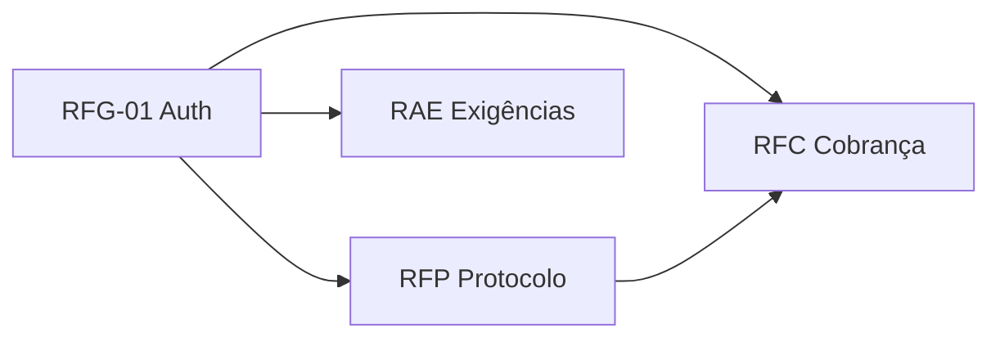

> **Índice desta API:** [[Orius/integracoes/registro-imoveis/api-registro-imoveis/00-indice]]
> **Produto:** [[Orius/empresa/produtos/registro-imoveis]]

# Visão geral — API Registro de Imóveis (RIB)

API REST documentada no [Swagger RIB](https://www.registrodeimoveis.org.br/swagger/index.html). Manual oficial **v2.2** (10/dez/2025), operador **Registro de Imóveis do Brasil (CORI-BR)**. Este hub cobre **protocolo de acompanhamento registral**, **cobrança/pagamentos** e **atendimento eletrônico** (respostas de exigência); outras rotas do mesmo Swagger (ex.: edital) têm notas separadas no vault.

---

## Para que serve (em uma frase)

O cartório envia e consulta **protocolos** de serviços registrais na plataforma RIB, pode **gerar e acompanhar cobranças** (incluindo PIX), e tratar **exigências** com interações — tudo via REST + JSON, com autenticação OAuth2/JWT.

---

## Ambientes e base URL

| Ambiente | Base URL |
|----------|----------|
| **Produção** | `https://api.registrodeimoveis.org.br` |
| **Homologação** | `https://testes-api.registrodeimoveis.org.br` |

Todos os endpoints documentados no manual são relativos a essa base (ex.: `POST /v1/auth/token` → `{base}/v1/auth/token`).

---

## Swagger

Documentação interativa (mesmo ecossistema de outras APIs RIB):

- [https://www.registrodeimoveis.org.br/swagger/index.html](https://www.registrodeimoveis.org.br/swagger/index.html)

**Relacionado no vault (notas legadas / parciais):**

- [[Orius/integracoes/registro-imoveis/rib-cobranca]] — foco em cobrança (`GET /v1/cobranca`, etc.)
- [[Orius/integracoes/registro-imoveis/rib-edital]] — edital eletrônico (outro fluxo, mesmo portal)

---

## Autenticação (resumo)

Quase todas as rotas exigem header:

```http
Authorization: Bearer {access_token}
```

O token é obtido em **[[Orius/integracoes/registro-imoveis/api-registro-imoveis/RFG-01-autenticacao|RFG-01 — Autenticação]]** (`POST /v1/auth/token`). Opcionalmente use `GET /v1/auth/validacao` para checar se o JWT ainda é aceito.

| `grant_type` | Uso típico |
|--------------|------------|
| `client_credentials` | Integração servidor-a-servidor (`client_id` + `client_secret`) |
| `password` | Requer também `username` e `password` |

Credenciais do cartório: guardar em [[env]] (não repetir segredos nestas notas).

---

## Blocos funcionais (mapa mental)



| Bloco | Códigos | Tema |
|-------|---------|------|
| Geral | RFG-01 | JWT |
| Protocolo | RFP-01 … RFP-07, [[FFP-01-fluxo-envio-protocolo\|FFP-01]], [[FFP-02-fluxo-processamento-protocolo\|FFP-02]] | Cadastro online/lote, fila RabbitMQ, listagem, detalhe |
| Cobrança | RFC-01 … RFC-07 | Gerar, listar, detalhar, cancelar, tipos de pagamento, PIX, vínculo protocolo |
| Atendimento eletrônico | RAE-01 … RAE-03 | Listar/detalhar exigência, cadastrar interação |
| Domínio | TBD-01 … TBD-14 | [[Orius/integracoes/registro-imoveis/api-registro-imoveis/dominio/00-indice-dominio|Tabelas de domínio]] |

Índice completo com status de cada nota: [[Orius/integracoes/registro-imoveis/api-registro-imoveis/00-indice]].

---

## Formato das respostas

- **Sucesso:** em geral JSON específico por endpoint (ver nota de cada código).
- **Erro:** padrão recorrente no manual:

```json
{
  "codigo": 0,
  "descricao": "string",
  "campos": {}
}
```

| Campo | Obrigatório | Descrição |
|-------|-------------|-----------|
| `codigo` | Não | Código interno |
| `descricao` | Sim | Mensagem referente ao erro |
| `campos` | Não | Detalhe de validação por campo |

---

## Diferenças importantes (evitar confusão)

| API | Base / auth | Assunto |
|-----|-------------|---------|
| **Esta API** (acompanhamento + pagamentos) | `api.registrodeimoveis.org.br` · OAuth `client_id`/`secret` | Protocolo RIB, cobrança RIB, exigências |
| **Mapa ONR** | `mapa.onr.org.br` · CNS+CPF+chave intranet+hash | DOI / estatísticas |
| **Mapa polígonos** | `mapa.onr.org.br` · Bearer JWT | Shapefile / SIG-RI |
| **WSOficio ONR** | SOAP | Pedidos, certidões, etc. |

---

## Como documentamos (convenção Orius)

1. Uma nota por **código** (`RFP-01`, `RFC-02`, …) usando o [[Orius/integracoes/registro-imoveis/api-registro-imoveis/_template-funcionalidade|template]].
2. Manual convertido no repo = **fonte bruta**; as notas do vault = resumo operacional + links cruzados.
3. Tabelas de domínio em [[Orius/integracoes/registro-imoveis/api-registro-imoveis/dominio/00-indice-dominio|dominio/]], referenciadas pelas notas de endpoint.

---

## Fonte

- Manual: *Manual de integração da API do Acompanhamento Registral + Pagamentos* **v2.2**
- Repo: `api-registro-imoveis/manual-api-api-registro-imoveis-pagamentos-v2.2.md`
