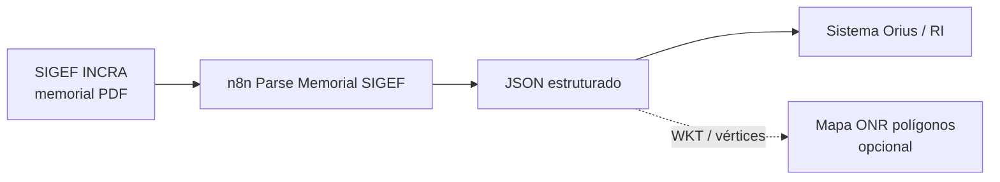

> **Produto:** [[Orius/empresa/produtos/registro-imoveis|Registro de Imóveis]] · **Índice:** [[Orius/integracoes/registro-imoveis/00-indice|Integrações RI]]
> **Contexto SIGEF / Mapa:** [[Orius/integracoes/registro-imoveis/onr-mapa-api-poligonos|Mapa — polígonos / SIG-RI]] (importação de certificação INCRA)
> **Central (referência fundiária):** [[Orius/integracoes/centrais/onr|ONR]] — o memorial é documento **INCRA/SIGEF**, não API ONR

---

# Memorial descritivo SIGEF — PDF → JSON (n8n)

Automação **interna** (workflow n8n) que recebe o **PDF do Memorial Descritivo** gerado pelo **SIGEF** (INCRA), extrai o texto, interpreta cabeçalho, tabela de vértices/limites e certificação, e devolve **JSON estruturado** pronto para uso no produto (conferência, montagem de shapefile, integração com Mapa, etc.).

Não chama API externa do INCRA: o parsing roda **dentro do n8n** (nó Read PDF + Code JavaScript).

## Para que serve no Registro de Imóveis

| Cenário | Uso do JSON |
|---------|-------------|
| Conferência de matrícula / ato rural | Validar área, perímetro, vértices e confrontantes contra o título |
| Montagem de dados geográficos | `geometria_wkt`, `vertices`, `bbox` para shapefile ou envio ao [[Orius/integracoes/registro-imoveis/onr-mapa-api-poligonos|Mapa — API polígonos]] |
| Vínculo com certificação INCRA | Campo `qrcode` (UUID da certificação no memorial) ↔ atributo `SIGEF` no shapefile |
| Automação de protocolo / pré-qualificação | Enriquecer payload antes de registrador ou integrações RIB |

Fluxo típico no ecossistema RI:

## Workflow n8n

| Item | Valor |
|------|--------|
| Nome | **Parse Memorial SIGEF** |
| ID | `drRULxhBQUk10wbw` |
| Instância | `https://api-n8n.gbrqne.easypanel.host` |
| Editor | [Abrir workflow](https://api-n8n.gbrqne.easypanel.host/workflow/drRULxhBQUk10wbw) |
| Código (n8n-as-code) | `c:\Users\kenio\automacoes e testes\workflows\n8n\extensao-n8n-teste\Parse Memorial SIGEF.workflow.ts` |
| Status inicial | Inativo — ativar para URL de produção |

### Nós (resumo)

1. **Webhook** — `POST`, Basic Auth, `responseMode: responseNode`
2. **validar-pdf-entrada** — exige binário PDF (campo `memorial`)
3. **read-memorial-pdf** — extração de texto
4. **parse-memorial-sigef** — parser (port de `memorial_pdf_parser.py` + `sigef_parser.py`)
5. **Respond to Webhook** — JSON + HTTP status dinâmico

## Contrato HTTP (webhook)

### Autenticação

**HTTP Basic Auth** — credenciais em [[env#n8n — Easypanel (API + webhooks Basic Auth)]] (`orius` / senha no vault). API REST do n8n (CLI `n8nac`): `N8N_API_KEY` na mesma seção.

### Request

| Item | Valor |
|------|--------|
| Método | `POST` |
| Content-Type | `multipart/form-data` |
| Campo arquivo | **`memorial`** (PDF do memorial descritivo SIGEF) |
| Limite | 25 MB (validação no workflow) |

| Modo | URL |
|------|-----|
| Teste (editor + *Execute workflow*) | `https://api-n8n.gbrqne.easypanel.host/webhook-test/sigef/memorial/parse` |
| Produção (workflow **ativo**) | `https://api-n8n.gbrqne.easypanel.host/webhook/sigef/memorial/parse` |

### Response — sucesso (`200`)

Corpo JSON com `sucesso: true` e estrutura alinhada ao antigo `SIGEFParseResponse` da API Python:

| Grupo | Campos principais |
|-------|-------------------|
| Identificação | `qrcode` (UUID certificação), `nome`, `codigo_incra_sncr`, `matricula_imovel`, `proprietario`, `municipio_uf` |
| Métricas | `area_ha`, `perimetro_m`, `datum` |
| Geometria | `geometria_wkt`, `bbox`, `utm_zone`, `utm_epsg` |
| Tabelas | `vertices[]`, `limites[]`, `descricao_parcela[]`, `descricao_area_encravada[]` |
| Meta | `cabecalho`, `certificacao`, `validacoes` (`datum_valido`, `warnings[]`) |

### Response — erro

| HTTP | `code` | Situação |
|------|--------|----------|
| 422 | `arquivo_invalido` | Sem PDF, não-PDF ou texto vazio |
| 422 | `arquivo_muito_grande` | Acima de 25 MB |
| 422 | `memorial_invalido` | PDF sem linhas da tabela “Descrição da Parcela” |
| 400 | `datum_invalido`, `geometria_invalida`, `coordenada_invalida`, `tipo_vertice_invalido` | Validação bloqueante |
| 500 | `erro_interno` | Falha inesperada no parser |

Corpo: `{ "sucesso": false, "code": "...", "detail": "...", "status_http": <n> }`

## Postman

| Arquivo | Descrição |
|---------|-----------|
| `c:\Users\kenio\automacoes e testes\postman\Parse-Memorial-SIGEF-n8n.postman_collection.json` | Coleção (PDF, sem arquivo, campo errado) |
| `c:\Users\kenio\automacoes e testes\postman\Parse-Memorial-SIGEF-n8n.postman_environment.template.json` | Ambiente: `N8N_BASIC_AUTH_*`, `MEMORIAL_PDF_PATH`, `n8n_webhook_mode` |

Variáveis: `n8n_base_url`, `n8n_webhook_mode` (`webhook-test` | `webhook`), `n8n_webhook_path` = `sigef/memorial/parse`.

## Implementação e origem da lógica

A regra de negócio foi portada do projeto Python (referência, **não** usada em runtime pelo n8n):

| Componente | Caminho |
|------------|---------|
| API FastAPI (referência) | `c:\Users\kenio\api-extracao-memorial-descritivo\sigef-api\` |
| Parser PDF/texto | `app\parsers\memorial_pdf_parser.py` |
| Orquestração + geometria | `app\services\sigef_parser.py` (`parse_sigef_from_memorial_pdf`) |

**Diferenças em relação à API Python:**

- Extração de PDF: nó **Read PDF** do n8n (não `pdfplumber`) — validar com PDFs reais do SIGEF.
- Geometria: UTM e WKT reimplementados em JavaScript no Code node; pequenas divergências numéricas são possíveis.

## Histórico de IDs (instância)

| Instância | Workflow ID | Observação |
|-----------|-------------|------------|
| Easypanel (atual) | `drRULxhBQUk10wbw` | Canônico após deduplicação 2026-06-01 |
| Anterior | `zFridVBOT4YlSDVG`, `8EkzwmAjIxkPNrcm` | Removidos do servidor na limpeza pós-migração |

## Relacionado

- [[Orius/integracoes/registro-imoveis/onr-mapa-api-poligonos]] — SIGEF, shapefile, campo `SIGEF` no `.dbf`
- [[Orius/empresa/produtos/imoveis/onr-ri-digital-negocio]] — contexto ONR / RI Digital
- Hub ONR: [[Orius/integracoes/registro-imoveis/onr/00-indice-onr]]
- Repositório automações: `c:\Users\kenio\automacoes e testes\` · pasta `postman/`

## Tags

`#sigef` `#memorial` `#n8n` `#parser` `#georreferenciamento` `#imoveis`
