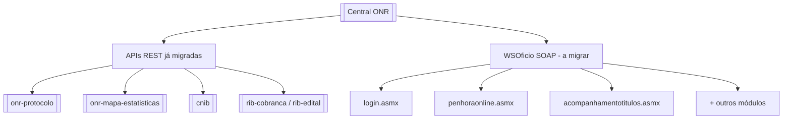
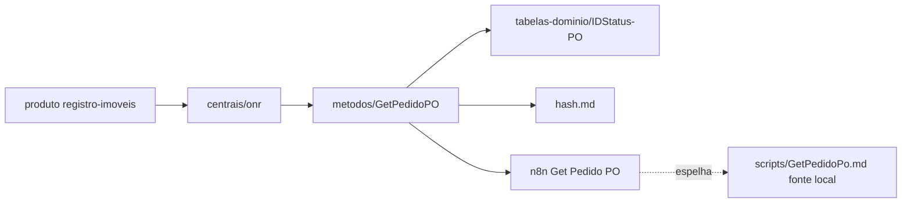

# Briefing — WebService ONR (WSOficio) → Obsidian

> Plano de migração. **Não substitui** a documentação em `C:\Users\kenio\soap-ui test\` — define como espelhar e linkar no vault.

## 1. O que é o WebService ONR

| Aspecto | Descrição |
|---------|-----------|
| **Nome técnico** | **WSOficio** (Web Service Ofício Eletrônico) |
| **Central** | [[Orius/integracoes/centrais/onr|ONR]] — Organização Nacional do Registro |
| **Produto Orius** | [[Orius/empresa/produtos/registro-imoveis|Registro de Imóveis]] |
| **Protocolo** | **SOAP/XML** (`.asmx`), distinto das APIs **REST/JSON** já no vault |
| **Homologação típica** | `https://hml3-wsoficio.onr.org.br/` |
| **Autenticação** | `LoginUsuarioCertificado` → tokens → parâmetro **`Hash`** (SHA-1 chave+token) em todas as outras operações |

### ONR no vault hoje: duas “camadas”



As notas em [[Orius/integracoes/registro-imoveis/00-indice]] (protocolo, mapa, RIB, CNIB) **não cobrem** o WSOficio — este briefing fecha essa lacuna.

Índice ONR (a criar na Fase 1): `onr/00-indice-onr.md`.

---

## 2. Inventário da documentação local (fonte)

### 2.1 Especificação SOAP — `webservice-onr/`

| Pasta / arquivo | Conteúdo | Qtd. aprox. |
|-----------------|----------|-------------|
| `list-metodos.md` | Índice dos **81 métodos** em **10 módulos** | 1 |
| `hash.md` | Cálculo do Hash, erros 45–47, IP cadastrado | 1 |
| `metodos/*.md` | Uma nota por operação SOAP (template padronizado) | ~81 |
| `metodos/README.md` | Índice por módulo (3.1 Login … 3.11 Intimações) | 1 |
| `tabelas-dominio/*.md` | Enums (IDStatus-PO, IDTipoPedido-PO, …) | 6 |
| `AUDIT-metodos-implementados.md` | Scripts `.js` × doc × enriquecimento | 1 |

**Módulos WSOficio (siglas nos nomes dos métodos):**

| Sigla | Módulo | Exemplos de operações |
|-------|--------|------------------------|
| — | Login | `LoginUsuarioCertificado` |
| **AT** | Acompanhamento de Títulos | `ListTitulosAT`, `InsertTituloAT` |
| **PO** | Penhora Online | `ListPedidosPO`, `GetPedidoPO`, `SetPrenotacaoPO` |
| **OE** | Ofícios eletrônicos | `GetPedidoOE`, `SetPedidoRespondidoOE` |
| **BDL** | BD Light | `ImportarArquivoBDL`, `ListArquivosXMLBDL` |
| — | Certidões | `ObterXMLSolicitacoes_v6`, `DevolverCertidao` |
| **AC** | E-Protocolo / exame e cálculo | `GetPedidoAC_V3`, `SetPrenotacaoAC` |
| **IN** | Intimações | `ListPedidosIN`, `ImportarPrenotacaoIN` |
| — | Matrícula online | `ObterXMLSolicitacoes`, `ObterXMLSolicitacoesV2` |
| — | CTP / prefeituras | `ImportacaoArquivos`, `AtualizarStatusProcesso` |

### 2.2 Automação n8n — `workflows/n8n/gentle-juniper-bb6f8f0940a3/`

| Workflow (`.workflow.ts`) | Operação SOAP | Módulo |
|---------------------------|---------------|--------|
| `Auth ONR.workflow.ts` | `LoginUsuarioCertificado` | Login |
| `List Titulos AT` | `ListTitulosAT` | AT |
| `Get Titulo AT` | `GetTituloAT` | AT |
| `Insert Titulo AT` | `InsertTituloAT` | AT |
| `Update Titulo AT` | `UpdateTituloAT` | AT |
| `List Status AT` | `ListStatusAT` | AT |
| `Get Status AT` | `GetStatusAT` | AT |
| `Insert Status AT` | *(implícito no fluxo)* | AT |

**Total hoje:** 8 workflows TypeScript (1 auth + 7 AT). PO/OE/BDL têm scripts e doc em `scripts/`, mas ainda **sem** workflow n8n exportado nesta pasta.

### 2.3 Documentação dos fluxos — `scripts/`

| Tipo | Onde | Uso no Obsidian |
|------|------|-----------------|
| `* WebService ONR.md` | Uma pasta por operação (~33 arquivos) | Nota **“Implementação n8n/proxy”** linkada ao método |
| `.js` / `.py` | Mesma pasta | **Não copiar** para o vault — referenciar caminho local ou resumo |
| `login/Auth WebService ONR.md` | Auth central | Nota hub **Automação → Auth** |

Padrão do markdown de script: webhook, JSON entrada/saída, ordem SOAP, link para `webservice-onr/metodos/<Op>.md`.

---

## 3. Princípios para o Obsidian (Jarvis)

1. **Uma fonte canônica por operação SOAP** → `metodos/<Operacao>.md` no vault.  
2. **Não duplicar** tabelas de domínio — linkar `tabelas-dominio/`.  
3. **Camada de automação separada** — métodos SOAP ≠ workflows n8n; ligar com wikilinks bidirecionais.  
4. **Frontmatter** para IA: `central: onr`, `protocolo: soap`, `modulo: PO|AT|OE|…`, `operacao: GetPedidoPO`, `tem-n8n: true/false`.  
5. **Código fica fora do vault** (`.js`, `.workflow.ts`, WSDL) — vault guarda **conhecimento**, não repositório de código.  
6. **Homologação vs produção** — sempre em nota de visão geral; nunca chaves/tokens no vault.

---

## 4. Árvore proposta no vault

```
Orius/integracoes/registro-imoveis/
├── 00-indice.md                          ← atualizar: link “ONR WebService”
├── onr/
│   ├── 00-indice-onr.md                  ← hub REST + SOAP
│   ├── 00-briefing-webservice-wsoficio.md  ← este arquivo
│   └── webservice-wsoficio/
│       ├── 00-indice-wsoficio.md         ← 81 métodos por módulo
│       ├── visao-geral.md                ← hash, IP, ambientes, fluxo auth
│       ├── hash.md                       ← migrado
│       ├── auditoria-implementacao.md    ← AUDIT migrado
│       ├── metodos/
│       │   ├── LoginUsuarioCertificado.md
│       │   ├── GetPedidoPO.md
│       │   └── … (~81)
│       ├── tabelas-dominio/
│       │   └── …
│       └── automacao/
│           ├── 00-indice-automacao.md
│           ├── auth-n8n.md               ← de scripts/login/
│           ├── n8n-gentle-juniper.md     ← índice dos 8 workflows .ts
│           └── por-metodo/               ← resumos ou links
│               └── GetPedidoPO-n8n.md    ← opcional; ou seção no método
```

**Links existentes mantidos:** `../cnib.md`, `../onr-protocolo.md`, etc. — o hub `onr/00-indice-onr.md` agrupa tudo.

---

## 5. Relacionamentos entre notas



Em cada `metodos/<Op>.md`, bloco fixo no topo:

```markdown
> **ONR · WSOficio · PO** · [[../00-indice-wsoficio]] · [[../../00-indice-onr]]
> **Implementação:** [[../automacao/...]] ou _pendente n8n_
```

---

## 6. Plano de migração (fases)

| Fase | Entrega | Esforço |
|------|---------|---------|
| **0** | Este briefing + `00-indice-onr.md` + atualizar índices | ✅ briefing |
| **1** | Hub: `visao-geral`, `hash`, `00-indice-wsoficio`, `tabelas-dominio/`, `auditoria-implementacao` | Baixo |
| **2** | Copiar **81 × `metodos/`** com script (frontmatter + ajuste links `../hash` → vault) | Médio |
| **3** | **Automação:** `auth-n8n.md` + índice n8n + tabela método ↔ workflow ↔ script | Médio |
| **4** | Para cada método com `* WebService ONR.md`: seção “Proxy n8n” no método OU nota em `automacao/por-metodo/` | Alto (33 docs) |
| **5** | Atualizar [[Orius/integracoes/centrais/onr]], skill `obsidian-vault`, `palavras-chave-orius` (WSOficio, Hash, Penhora Online, …) | Baixo |

**Não migrar no vault:** WSDL, `.env`, chaves, binários Postman — só URLs.

---

## 7. Palavras-chave (skill / busca)

`ONR`, `WSOficio`, `wsoficio`, `SOAP`, `Hash`, `LoginUsuarioCertificado`, `hml3-wsoficio`, `Penhora Online`, `PO`, `AT`, `OE`, `AC`, `IN`, `BDL`, `GetPedidoPO`, `ListPedidosPO`, `acompanhamento de títulos`, `ofício eletrônico`, `n8n`, `webhook`

---

## 8. Decisões (confirmadas)

1. Pasta: `registro-imoveis/onr/webservice-wsoficio/` ✅  
2. Citar `C:\Users\kenio\soap-ui test\` — só markdown no vault ✅  
3. Automação: seção dentro de cada `metodos/X.md` ✅  
4. Fonte da verdade: **somente Obsidian** ✅  

**Migração executada:** 82 métodos + hash + domínios + auditoria + índices.

---

## 9. Entrada no vault

- [[webservice-wsoficio/visao-geral]]
- [[webservice-wsoficio/00-indice-wsoficio]]
- [[00-indice-onr]]

Voltar: [[Orius/integracoes/registro-imoveis/00-indice]] · [[Orius/integracoes/centrais/onr]]
