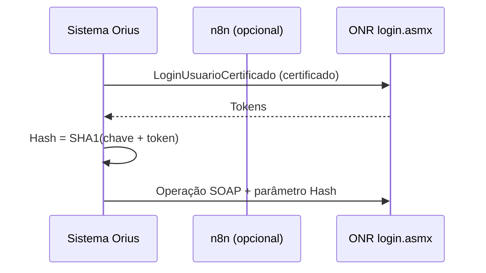

# WSOficio — visão geral

Web Service SOAP da **ONR** para o **Registro de Imóveis** (e fluxos correlatos: penhora, ofícios, certidões, e-protocolo, etc.).

## Fonte da verdade

**Obsidian** — pasta [[../00-indice-wsoficio|webservice-wsoficio]].  
Código, WSDL e scripts permanecem em:

`C:\Users\kenio\soap-ui test`

## Protocolo vs REST

| Camada | Onde no vault | Protocolo |
|--------|---------------|-----------|
| WSOficio (este doc) | `onr/webservice-wsoficio/` | SOAP + `Hash` |
| CNIB, protocolo, mapa | [[../../cnib]], [[../../onr-protocolo]], … | REST/JSON |

Central: [[Orius/integracoes/centrais/onr]]

## Fluxo de autenticação

Detalhes: [[hash]] · método [[metodos/login/LoginUsuarioCertificado]]

## Ambiente de homologação

Base típica: `https://hml3-wsoficio.onr.org.br/`

| Serviço | ASMX |
|---------|------|
| Login | `/login.asmx` |
| Penhora online | `/penhoraonline.asmx` |
| Acompanhamento títulos | `/acompanhamentotitulos.asmx` |
| Ofícios | `/oficios.asmx` |
| Certidões | `/Certidoes.asmx` |
| E-protocolo | `/eprotocolo.asmx` |
| Intimações | `/intimacoes.asmx` |

Lista completa: [[00-indice-wsoficio]]

## Automação n8n

Workflows TypeScript exportados:

`C:\Users\kenio\soap-ui test\workflows\n8n\gentle-juniper-bb6f8f0940a3\`

Hoje com workflow documentado na nota do método: **Auth** + módulo **AT** (7 operações). Demais módulos: proxy documentado em `scripts/*` — seção **Automação** em cada [[metodos/README|método]].

## Documentos relacionados

- [[00-indice-wsoficio]] — 81 métodos
- [[tabelas-dominio/00-indice-dominios]] — enums
- [[auditoria-implementacao]] — scripts implementados
- [[../00-briefing-webservice-wsoficio]] — plano de migração (histórico)
