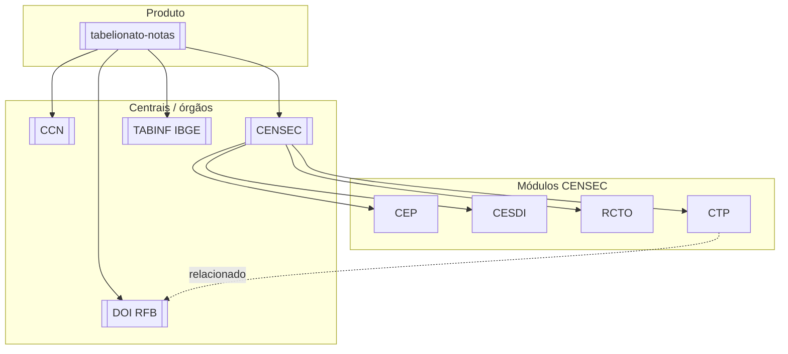

# Integrações — Tabelionato de Notas

**Domínio de negócio (o que é Notas):** [[Orius/empresa/produtos/notas/00-indice-notas-negocio]] · **Integrações em linguagem de negócio:** [[Orius/empresa/produtos/notas/integracoes-centrais-notas]]

Documentação técnica migrada do Desktop (`integracoes/tabelionato-notas`). Cada nota linka ao produto e à central correspondente.

## Mapa rápido

## Por integração

| Integração | Palavras-chave | Documentação | Central (resumo) |
|------------|----------------|--------------|----------------|
| **Homologação API** | api-key, hml, CNS 995936 | [[Orius/integracoes/tabelionato-notas/ambiente-homologacao-api]] | — |
| **CCN** | CCN, e-notariado, pessoas, CPF | [[Orius/integracoes/tabelionato-notas/ccn/00-indice-ccn]] | [[Orius/integracoes/centrais/ccn]] |
| **CENSEC** | CENSEC, quinzena, x-api-key, upload-json, n8n | [[Orius/integracoes/tabelionato-notas/censec/00-indice-censec]] | [[Orius/integracoes/centrais/censec]] |
| **Assinaturas** | e-notariado, assinatura | [[Orius/integracoes/tabelionato-notas/fluxo-assinaturas]] | e-notariado |
| ↳ CEP | escritura, procuração, MNE | [[Orius/integracoes/tabelionato-notas/censec/cep]] | — |
| ↳ CESDI | separação, divórcio, inventário | [[Orius/integracoes/tabelionato-notas/censec/cesdi]] | — |
| ↳ RCTO | testamento | [[Orius/integracoes/tabelionato-notas/censec/rcto]] | — |
| ↳ CTP | prefeitura, ITBI | [[Orius/integracoes/tabelionato-notas/censec/ctp]] | — |
| **TABINF** | TABINF, IBGE, TABINF07 | [[Orius/integracoes/tabelionato-notas/tabinf-ibge]] | [[Orius/integracoes/centrais/tabinf-ibge]] |
| **DOI** | DOI, Receita Federal, declaração imóvel, DOI-Web | [[Orius/integracoes/tabelionato-notas/doi/00-indice-doi]] (compartilhado com [[Orius/integracoes/registro-imoveis/00-indice\|RI]]) | RFB · [[Orius/integracoes/centrais/onr\|ONR]] (MNE/CNM) |

Índice CENSEC: [[Orius/integracoes/tabelionato-notas/censec/00-indice-censec]]

## Palavras-chave globais

[[Orius/integracoes/palavras-chave-orius]]

## Produto

[[Orius/empresa/produtos/tabelionato-notas]]

Voltar: [[Orius/integracoes/00-indice-integracoes]] · [[Orius/00-indice]]
