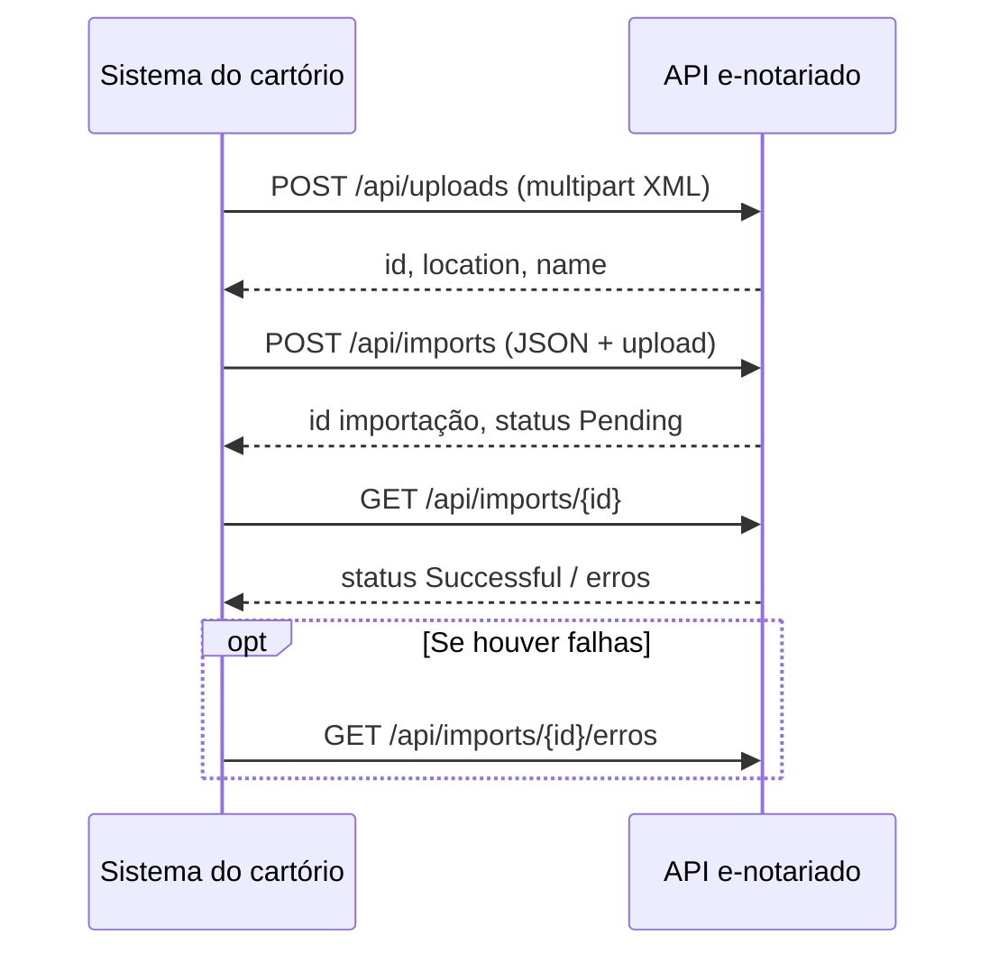

> **Produto:** [[Orius/empresa/produtos/tabelionato-notas|Tabelionato de Notas]] · **Índice:** [[Orius/integracoes/tabelionato-notas/00-indice|Integrações Notas]]
> **Central:** [[Orius/integracoes/centrais/ccn|CCN]]

---

# CCN — Cadastro de pessoas (e-notariado)

Central de Cadastro de Notários — importação de cadastros de pessoas físicas via **XML** e API REST do e-notariado.

> A documentação da API de identificação de pessoas está no [Swagger (homologação)](https://pessoas-hml.e-notariado.org.br/swagger/index.html). A parte referente à importação está na seção **Imports**.

## Referências rápidas

| Recurso | Link |
|---------|------|
| Swagger (HML) | https://pessoas-hml.e-notariado.org.br/swagger/index.html |
| Coleção Postman | [CCN.postman_collection.json](https://orius-tools.s3.sa-east-1.amazonaws.com/community/1779686959070-CCN.postman_collection.json) |
| Exemplo XML | [CCN20251123-1.xml](https://orius-tools.s3.sa-east-1.amazonaws.com/community/1777905117317-CCN20251123-1.xml) |
| Pacote de exemplo | [CcnExample (1).zip](https://orius-tools.s3.sa-east-1.amazonaws.com/community/1777905121285-CcnExample%20(1).zip) |

## Ambientes

As URLs de homologação e produção são **diferentes** — a aplicação deve tratar cada ambiente explicitamente.

| Ambiente | Base URL |
|----------|----------|
| Homologação | `https://pessoas-hml.e-notariado.org.br` |
| Produção | `https://pessoas.e-notariado.org.br` |

**Chaves e ids de homologação (Orius):** [[Orius/integracoes/tabelionato-notas/ambiente-homologacao-api#CCN — Cadastro de pessoas]]

## Geração da chave de API

Se for o caso de importação manual do XML no CCN, consulte o procedimento no portal CNB Online.

1. Acesse o módulo **CCN** no menu CNB Online.


2. Efetue o aceite do termo de adesão antes de gerar as chaves de integração; caso contrário, o sistema pode exibir erro.

3. Clique no nome do usuário e selecione **Admin**.


4. O sistema exibirá a tela de criação de chave de API.

**Ações disponíveis:**

| Ação | Uso |
|------|-----|
| **Importar** | Importar cadastros de pessoas do sistema do cartório para o CCN |
| **Exportar** | Consultar CPFs diretamente do sistema do cartório |


5. Para a chave de importação: selecione **Importar** → **Criar Chave**.


6. Copie a **chave de acesso** e o **id do cartório** e configure nos parâmetros do sistema.

---

## Fluxo da API de integração



### Headers usados no fluxo

| Header | Quando |
|--------|--------|
| `X-Api-Key` | Upload e criação da importação — formato `your-app\|(ID-DO-CARTORIO)` |
| `X-Subscription` | Criação da importação — id do cartório (subscription) |

---

## 1. Upload do arquivo XML

| | |
|---|---|
| **Método** | `POST` |
| **Path** | `/api/uploads` |
| **Content-Type** | `multipart/form-data` (não enviar como `application/xml` no body único) |

```bash
curl --location --request POST 'https://pessoas-hml.e-notariado.org.br/api/uploads' \
  --header 'X-Api-Key: your-app|(ID-DO-CARTORIO)' \
  --form 'file=@/C:/CCN27052020-10.xml' \
  --form 'name=CCN27052020-10.xml' \
  --form 'contentType=text/xml'
```

### Resposta (upload)

```json
{
  "location": "/api/uploads/6ba5fc64-a747-41d0-86f5-ed9d6f046fad?access_ticket=...",
  "id": "6ba5fc64-a747-41d0-86f5-ed9d6f046fad",
  "name": "CCN27052020-10.xml",
  "contentType": "text/xml"
}
```

Guarde `id` e `location` — serão usados no passo seguinte.

---

## 2. Criar a importação

| | |
|---|---|
| **Método** | `POST` |
| **Path** | `/api/imports` |
| **Body** | JSON com `type` e objeto `upload` da resposta anterior |

```bash
curl --location --request POST 'https://pessoas-hml.e-notariado.org.br/api/imports' \
  --header 'X-Subscription: adb07367-c4f2-4f79-b388-156a071b8af2' \
  --header 'X-Api-Key: your-app|(ID-DO-CARTORIO)' \
  --header 'Content-Type: application/json' \
  --data-raw '{
  "type": "CcnPessoaFisica",
  "upload": {
    "location": "/api/uploads/6ba5fc64-a747-41d0-86f5-ed9d6f046fad?access_ticket=...",
    "id": "6ba5fc64-a747-41d0-86f5-ed9d6f046fad",
    "name": "CCN27052020-10.xml",
    "contentType": "text/xml"
  }
}'
```

> O `id` em `upload` é o retornado na requisição de upload.

### Resposta (importação criada)

```json
{
  "id": "e99065b2-77e7-4a7b-9f51-776f0e78b063",
  "agentId": "b1f1a709-6299-446b-b72f-8d347467a0ad",
  "subscriptionId": "adb07367-c4f2-4f79-b388-156a071b8af2",
  "dateCreated": "2020-06-04T00:33:44.285868+00:00",
  "type": "CcnPessoaFisica",
  "status": "Pending",
  "processedRecords": 0,
  "failedRecords": 0,
  "totalRecords": 0,
  "fileName": "CCN27052020-10.xml",
  "uploadId": "6ba5fc64-a747-41d0-86f5-ed9d6f046fad",
  "errorCode": null,
  "duplicateRecords": null
}
```

---

## 3. Acompanhar a importação

| | |
|---|---|
| **Método** | `GET` |
| **Path** | `/api/imports/{id}` |

Use o `id` retornado na criação da importação.

**URL (HML):** `https://pessoas-hml.e-notariado.org.br/api/imports/{id}`

### Resposta (processamento concluído)

```json
{
  "id": "e99065b2-77e7-4a7b-9f51-776f0e78b063",
  "status": "Successful",
  "processedRecords": 8,
  "failedRecords": 0,
  "totalRecords": 8,
  "fileName": "CCN27052020-10.xml",
  "uploadId": "6ba5fc64-a747-41d0-86f5-ed9d6f046fad"
}
```

---

## 4. Consultar erros da importação

| | |
|---|---|
| **Método** | `GET` |
| **Path** | `/api/imports/{id}/erros` |

**URL (HML):** `https://pessoas-hml.e-notariado.org.br/api/imports/{id}/erros`

Retorna somente os registros com erro da importação.

---

## Estrutura do arquivo XML CCN

### Elemento raiz

| Elemento | Tipo | Multiplicidade | Descrição |
|----------|------|----------------|-----------|
| `pessoas` | Pessoas | 1..1 | Raiz do XML; encapsula uma ou mais `pessoa` |

### Tipo complexo `Pessoas`

- Composto por uma lista de elementos `pessoa`
- `pessoa`: tipo `xmlPessoa`, `maxOccurs="unbounded"` — várias pessoas no mesmo arquivo

---

## Entidade principal: `xmlPessoa`

A entidade `pessoa` agrega dados identificadores, biográficos, documentais, profissionais, relacionais, anexos e complementares.

### Elementos obrigatórios

| Campo | Tipo |
|-------|------|
| `cpf` | string |
| `nome` | string |

Os demais campos são opcionais (`minOccurs="0"`).

### Principais grupos de informação

| Grupo | Elementos destacados |
|-------|----------------------|
| Filiação | `mae`, `pai` |
| Contato | `telefone`, `celular`, `email` |
| Endereço | `endereco`, `enderecoTrabalho` (`xmlEndereco`) |
| Documentação | `documento` (`xmlDocumento`), `carteiraHabilitacao` (`xmlCarteiraHabilitacao`) |
| Biometria | `biometria` (lista, `maxOccurs="unbounded"`) |
| Imagem | `imagemFoto`, `fotoVerificada` |
| Ficha cadastral | `ficha`, `fichaBloqueada` |
| Documentos adicionais | `anexo`, `termoTitularidade`, `certidaoCasamento` |
| Relações pessoais | `conjuge` (`xmlConjuge`) |
| Verificações legais | `politicamenteExposta`, `investigadaAcusadaTerrorismo` |
| Cartório vinculado | `cartorio` |

---

## Tipos complexos detalhados

### `xmlEndereco`

Dados de localização residencial ou profissional.

- Principais: `cep`, `bairro`, `cidade`, `uf`, `endereco`, `numero`
- Suporta múltiplas imagens de comprovante em Base64

### `xmlDocumento`

Documento de identidade.

- Obrigatórios: `docIdentidade`, `orgaoEmissor`, `dataEmissao`
- `tipo`: RG, Carteira Profissional, Passaporte, Carteira de Reservista, RNE
- Anexo da imagem do documento (Base64)

### `xmlCarteiraHabilitacao`

CNH — datas e categoria.

### `xmlBiometria`

- `dedo` (inteiro positivo), `imagemBiometria` (Base64)
- Múltiplas ocorrências permitidas

### `xmlConjuge`

CPF, nome e regime de bens do cônjuge.

### `xmlFicha`, `xmlCartorio`, `xmlTermoTitularidade`, `xmlCertidaoCasamento`, `xmlAnexo`

Anexos e informações complementares; imagens via `base64Binary`.

---

## Enumerações (tipos simples restritivos)

### `xmlTipoDocumento`

RG · Carteira Profissional · Passaporte · Carteira de Reservista · RNE

### `xmlTipoNacionalidade`

Brasileiro Nato · Brasileiro Naturalizado · Estrangeiro · Brasileiro Nascido no Exterior

### `xmlRegimeBem`

Comunhao Parcial · Comunhao Universal · Participacao Final nos Aquestos · Separacao Total

---

## Validações e restrições

### Cardinalidade

- Maioria dos elementos opcionais (`minOccurs="0"`)
- Apenas `cpf` e `nome` obrigatórios em `pessoa`

### Tipagem

| Tipo XSD | Uso |
|----------|-----|
| `xs:string` | Textos |
| `xs:base64Binary` | Imagens e anexos |
| `xs:boolean` | Flags (`politicamenteExposta`, etc.) |
| `xs:positiveInteger` | Ex.: dedo biométrico |

### Imagens

Todas as imagens (documentos, fotos, comprovantes) devem estar em **Base64** dentro do XML.

---

## Exemplo de XML (trecho)

```xml
<?xml version="1.0" encoding="ISO8859-1"?>
<pessoas>
  <pessoa>
    <chaveRegistro>123e4567-e89b-12d3-a456-426614174000</chaveRegistro>
    <dataRegistro>2025-09-15</dataRegistro>
    <estadoCivil>Casado</estadoCivil>
    <ibgeCidadeNaturalidade>3550308</ibgeCidadeNaturalidade>
    <nacionalidade>Brasileira</nacionalidade>
    <nacionalidadeTipo>Brasileiro Nato</nacionalidadeTipo>
    <ufNaturalidade>SP</ufNaturalidade>
    <cidadeNaturalidade>São Paulo</cidadeNaturalidade>
    <cpf>12345678901</cpf>
    <nome>João da Silva</nome>
    <sexo>Masculino</sexo>
    <mae>Maria da Silva</mae>
    <pai>José da Silva</pai>
    <telefone>1130000000</telefone>
    <celular>11990000000</celular>
    <profissao>Engenheiro Civil</profissao>
    <dataNascimento>1985-06-20</dataNascimento>
    <email>joao.silva@email.com</email>

    <endereco>
      <ibgeCidade>3550308</ibgeCidade>
      <cep>01001000</cep>
      <bairro>Centro</bairro>
      <cidade>São Paulo</cidade>
      <uf>SP</uf>
      <complemento>Apto 101</complemento>
      <endereco>Rua da Consolação</endereco>
      <numero>123</numero>
      <imagemComprovanteResidencia>iVBORw0KGgoAAAANSUhEUgAAAAUA</imagemComprovanteResidencia>
    </endereco>

    <documento>
      <tipo>RG</tipo>
      <docIdentidade>12345678-9</docIdentidade>
      <orgaoEmissor>SSP</orgaoEmissor>
      <ufOrgaoEmissor>SP</ufOrgaoEmissor>
      <dataEmissao>2003-08-15</dataEmissao>
      <imagemDocumento>iVBORw0KGgoAAAANSUhEUgAAAAUA</imagemDocumento>
    </documento>

    <carteiraHabilitacao>
      <numeroCarteiraHabilitacao>98765432100</numeroCarteiraHabilitacao>
      <categoriaCarteiraHabilitacao>B</categoriaCarteiraHabilitacao>
      <dataPrimeiraHabilitacao>2005-01-10</dataPrimeiraHabilitacao>
      <dataExpiracaoHabilitacao>2030-01-10</dataExpiracaoHabilitacao>
      <imagemDocumento>iVBORw0KGgoAAAANSUhEUgAAAAUA</imagemDocumento>
    </carteiraHabilitacao>

    <biometria>
      <dedo>1</dedo>
      <imagemBiometria>iVBORw0KGgoAAAANSUhEUgAAAAUA</imagemBiometria>
    </biometria>

    <ficha>
      <dataFicha>2025-01-01</dataFicha>
      <numeroFicha>FCH123456</numeroFicha>
      <imagensFicha>iVBORw0KGgoAAAANSUhEUgAAAAUA</imagensFicha>
    </ficha>

    <imagemFoto>iVBORw0KGgoAAAANSUhEUgAAAAUA</imagemFoto>

    <cartorio>
      <cdCnj>123456789</cdCnj>
      <nome>Cartório do 1º Ofício de Notas</nome>
      <cidade>São Paulo</cidade>
    </cartorio>

    <termoTitularidade>
      <imagemTermoTitularidade>iVBORw0KGgoAAAANSUhEUgAAAAUA</imagemTermoTitularidade>
    </termoTitularidade>

    <certidaoCasamento>
      <imagemCertidaoCasamento>iVBORw0KGgoAAAANSUhEUgAAAAUA</imagemCertidaoCasamento>
    </certidaoCasamento>

    <anexo>
      <imagemAnexo>iVBORw0KGgoAAAANSUhEUgAAAAUA</imagemAnexo>
    </anexo>

    <enderecoTrabalho>
      <ibgeCidade>3550308</ibgeCidade>
      <cep>04567000</cep>
      <bairro>Brooklin</bairro>
      <cidade>São Paulo</cidade>
      <uf>SP</uf>
      <complemento>Conj. 203</complemento>
      <endereco>Av. Berrini</endereco>
      <numero>789</numero>
    </enderecoTrabalho>

    <politicamenteExposta>false</politicamenteExposta>
    <investigadaAcusadaTerrorismo>false</investigadaAcusadaTerrorismo>

    <conjuge>
      <cpf>98765432100</cpf>
      <nome>Maria de Souza Silva</nome>
      <regimeBem>Comunhao Parcial</regimeBem>
    </conjuge>

    <fichaBloqueada>false</fichaBloqueada>
    <fotoVerificada>true</fotoVerificada>
  </pessoa>
</pessoas>
```

Arquivo completo para download: [CCN20251123-1.xml](https://orius-tools.s3.sa-east-1.amazonaws.com/community/1777905117317-CCN20251123-1.xml)
