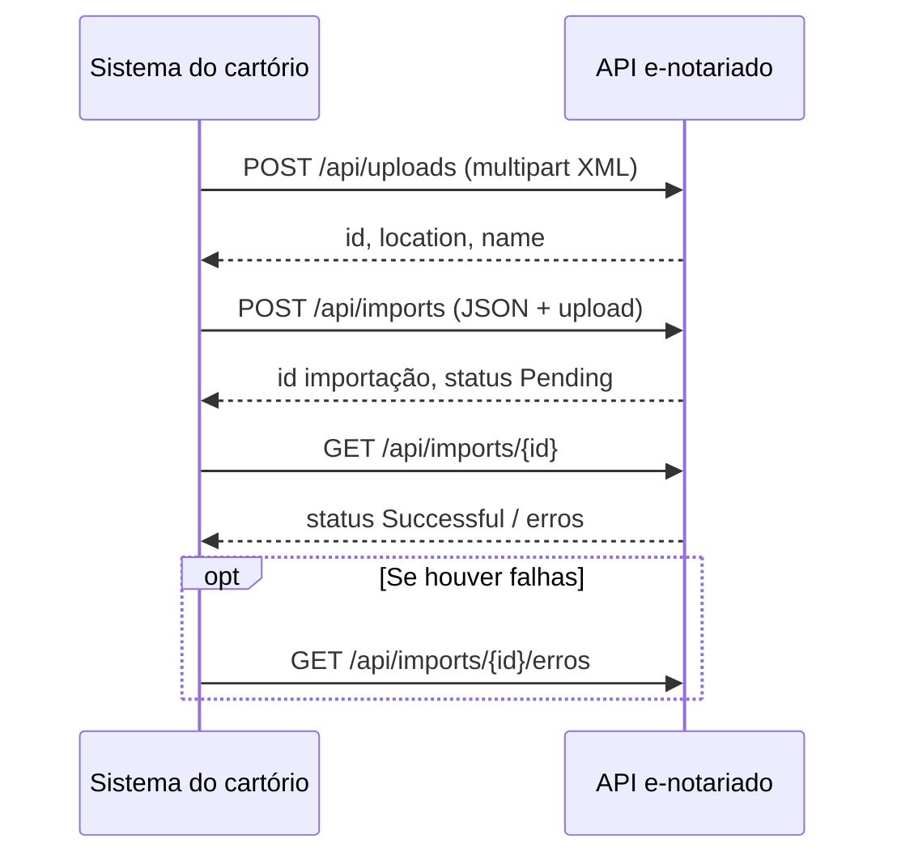

> **Índice endpoints:** [[Orius/integracoes/tabelionato-notas/ccn/api/00-indice-endpoints]] · **XML:** [[Orius/integracoes/tabelionato-notas/ccn/xml/00-indice-xml]]

# CCN — fluxo da API de importação

## Headers usados no fluxo

| Header | Quando |
|--------|--------|
| `X-Api-Key` | Upload e criação da importação — formato `your-app\|(ID-DO-CARTORIO)` |
| `X-Subscription` | Criação da importação — id do cartório (subscription) |

Ver [[Orius/integracoes/tabelionato-notas/ccn/visao-geral-e-autenticacao#Headers de integração]].

## Etapas

| Etapa | Endpoint | Documentação |
|-------|----------|----------------|
| 1. Enviar XML | `POST /api/uploads` | [[Orius/integracoes/tabelionato-notas/ccn/api/endpoint-uploads]] |
| 2. Registrar importação | `POST /api/imports` | [[Orius/integracoes/tabelionato-notas/ccn/api/endpoint-imports-post]] |
| 3. Acompanhar processamento | `GET /api/imports/{id}` | [[Orius/integracoes/tabelionato-notas/ccn/api/endpoint-imports-get]] |
| 4. Listar erros (opcional) | `GET /api/imports/{id}/erros` | [[Orius/integracoes/tabelionato-notas/ccn/api/endpoint-imports-erros]] |

## Tipo de importação

No passo 2, o campo `type` deve ser **`CcnPessoaFisica`** para cadastro de pessoas físicas via XML CCN.
