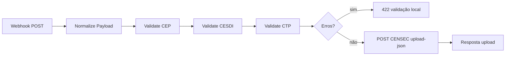

## Plane (gestão)

| Campo | Valor |
|-------|-------|
| Card | **AUTONR-13** |
| Work item ID | `d89dd33c-66b0-49e1-a85b-871ac2cfd7b4` |
| URL | http://192.168.1.100:8090/saas/projects/1c5d97b3-edfc-49e1-b0ba-da037b09bb84/issues/13 |
| Automação | `done` |

# Automação n8n — CENSEC Upload JSON Gateway

Gateway que **valida localmente** o payload (CEP, CESDI, CTP) e, se aprovado, envia para a API oficial da CENSEC.

> **Visão geral API:** [[Orius/integracoes/tabelionato-notas/censec/visao-geral-e-api]] · **Índice CENSEC:** [[Orius/integracoes/tabelionato-notas/censec/00-indice-censec]]

## Artefatos (código fora do vault)

| Artefato | Caminho local |
|----------|----------------|
| Workflow TypeScript (fonte) | `C:\Users\kenio\soap-ui test\workflows\n8n-censec\censec-upload-json.workflow.ts` |
| Export JSON n8n | `C:\Users\kenio\soap-ui test\censec\CENSEC Upload JSON Gateway.json` |
| Regras de validação (espelho vault) | `C:\Users\kenio\soap-ui test\censec\regras-validacao-*.md` |

## Fluxo

## Entrada (webhook n8n)

| | |
|---|---|
| **Método** | `POST` |
| **Path** | `censec/cargas/upload-json` |
| **Auth** | Basic Auth (credencial no n8n) |
| **Body** | JSON único com blocos `atosCep`, `atosCesdi`, `declaracoes`, `testamentos`, `cns`, `quinzena` |

Header obrigatório no encaminhamento à CENSEC (repassado pelo workflow):

| Header | Uso |
|--------|-----|
| `X-Api-Key` | Chave do cartório na CENSEC |

## Saída para a API CENSEC

| | |
|---|---|
| **URL** | `https://censec.org.br/api/cargas/upload-json` |
| **Método** | `POST` |
| **Body** | Payload normalizado (mesmo JSON recebido no webhook) |

Homologação: trocar base para `https://hml.censec.org.br` no nó HTTP quando testar. Chaves HML: [[Orius/integracoes/tabelionato-notas/ambiente-homologacao-api#CENSEC — transmissão JSON]].

## Validação local (por central)

| Central | Bloco JSON | Implementado no n8n | Regras (vault) |
|---------|------------|---------------------|----------------|
| CEP | `atosCep` | Sim | [[Orius/integracoes/tabelionato-notas/censec/regras-validacao/cep]] |
| CESDI | `atosCesdi` | Sim | [[Orius/integracoes/tabelionato-notas/censec/regras-validacao/cesdi]] |
| CTP | `declaracoes` | Sim | [[Orius/integracoes/tabelionato-notas/censec/regras-validacao/ctp]] |
| RCTO | `testamentos` | **Não** (envio direto se presente no payload) | — |

Se o bloco de uma central **não existir** no payload (`undefined`), o validador correspondente é ignorado.

### Exemplos do que o gateway valida

- Campos obrigatórios por ato (livro, folha, data `YYYY-MM-DD`, partes)
- CPF/CNPJ quando `tipoDocumento` / `documentoTipo` indicar
- `referentes` obrigatório em revogação, substabelecimento, rerratificação
- CTP: soma de `participacao` entre 99–100; CEP/IBGE; regras de pagamento a prazo; apenas `tipoDeclaracao` **Original** em lote

Resposta de erro local (antes da CENSEC): `success: false`, lista `errors[]` com `central`, `path`, `code`, `message`.

## Tabelas de domínio usadas na montagem do JSON

- [[Orius/integracoes/tabelionato-notas/censec/tabelas-dominio/cep]]
- [[Orius/integracoes/tabelionato-notas/censec/tabelas-dominio/cesdi]]
- [[Orius/integracoes/tabelionato-notas/censec/tabelas-dominio/ctp]]

## Módulos de carga (especificação de campos)

| Módulo | Nota |
|--------|------|
| CEP | [[Orius/integracoes/tabelionato-notas/censec/cep]] |
| CESDI | [[Orius/integracoes/tabelionato-notas/censec/cesdi]] |
| RCTO | [[Orius/integracoes/tabelionato-notas/censec/rcto]] |
| CTP | [[Orius/integracoes/tabelionato-notas/censec/ctp]] |

## Relacionado

- [[Orius/integracoes/tabelionato-notas/censec/artefatos/00-indice-artefatos|Postman e exemplos JSON]]
- [[Orius/integracoes/tabelionato-notas/censec/00-briefing-documentacao-automacao|Briefing documentação + automação]]
