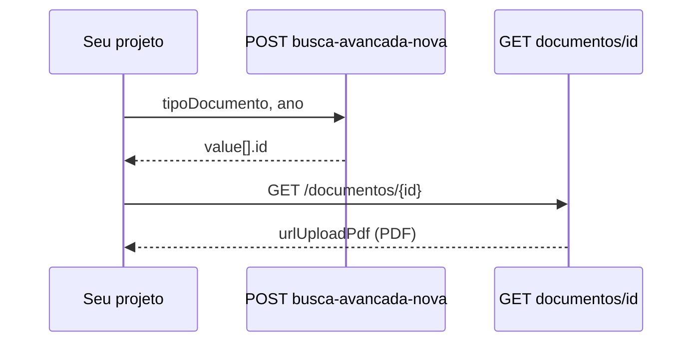

# GET /documentos/{id}

Detalhes de um **documento** publicado, incluindo metadados e **URL do PDF** para visualização/download.

> **Produto:** [[Pessoal/projetos/tjdocs/00-indice|TJDocs]] · **Obter `id`:** [[Pessoal/projetos/tjdocs/api/endpoints/consulta-busca-avancada-nova]]

## Fluxo no projeto



## Requisição

| | |
|---|---|
| **URL** | `https://tjdocs-backend.tjgo.jus.br/documentos/{id}` |
| **Método** | `GET` |
| **Auth** | Não |
| **Path param** | `id` — id numérico do documento (campo `id` na busca avançada) |

Também responde em `https://tjdocs-backend.tjgo.jus.br/v1/documentos/{id}` (testado — mesmo conteúdo).

### Exemplo

```
GET https://tjdocs-backend.tjgo.jus.br/documentos/922437
```

## cURL

```bash
curl -s "https://tjdocs-backend.tjgo.jus.br/documentos/922437"
```

PowerShell:

```powershell
$id = 922437  # vindo de busca-avancada-nova → value[].id
Invoke-RestMethod -Uri "https://tjdocs-backend.tjgo.jus.br/documentos/$id" -Method GET
```

## Resposta

| | |
|---|---|
| **HTTP** | `200` |
| **Formato** | JSON (objeto único, não array) |

### Campo principal para o consumidor

| Campo | Uso |
|-------|-----|
| **`urlUploadPdf`** | URL pré-assinada (S3) do **PDF** — usar para baixar ou exibir o conteúdo do documento |

Alternativas equivalentes na prática (mesmo arquivo, quando `temPdf: true`):

| Campo | Notas |
|-------|-------|
| `urlUpload` | Mesma família de URL assinada |
| `infoVisualizacao.urlRenderizacao` | URL para renderização inline |
| `infoVisualizacao.urlOriginal` | URL do original |

> URLs são **temporárias** (query `Expires=...` na URL S3). Tratar como link de curta duração; buscar de novo com GET se expirar.

> **Não versionar** URLs completas no vault — contêm assinatura AWS; sempre obter via API.

### Outros campos úteis

| Campo | Descrição |
|-------|-----------|
| `id` | Id do documento |
| `nome` | Título — ex. `"Provimento nº 193-2026"` |
| `descricaoDocumento` | Descrição / ementa curta |
| `temPdf` | `true` se há PDF |
| `contentType` / `extensao` | `application/pdf`, `pdf` |
| `tamanho` | Tamanho em bytes |
| `ano`, `numDecreto`, `numLei` | Metadados numéricos |
| `identificadorTipoDocumento` | Slug — ex. `"provimento"` |
| `nomeTipoDocumento` | Rótulo — ex. `"Provimento"` |
| `idPasta`, `caminhos` | Localização na árvore de pastas |
| `vinculos` | Array de vínculos com outros documentos |
| `vinculadores` | Array (pode vir vazio) |
| `nomeVisibilidade` | ex. `"Público"` |
| `dataCadastro`, `dataAlteracao` | Datas legíveis |
| `qtdVisualizacoes`, `qtdDownloads` | Contadores |
| `usuarioNome`, `usuarioEmail` | Quem publicou |

### Estrutura `vinculos[]`

| Campo | Descrição |
|-------|-----------|
| `id` | Id do vínculo |
| `tipo` | ex. `"Altera e Revoga"` |
| `documentoVinculadoId` | Id do documento relacionado |
| `documentoVinculadoNome` | Nome do documento relacionado |
| `documentoVinculadoAno` | Ano |
| `documentoVinculadoDescricaoDocumento` | Texto descritivo |

### Estrutura `caminhos`

Objeto HAL-like com `_embedded.path[]` — breadcrumb da pasta (ex.: Corregedoria → Provimentos → 2026).

### Exemplo de resposta (estrutura — URLs redigidas)

```json
{
  "id": 922437,
  "nome": "Provimento nº 193-2026",
  "descricao": null,
  "tamanho": 780782,
  "contentType": "application/pdf",
  "extensao": "pdf",
  "bucket": "tjdocs2-2026-prd",
  "chave": "2026/c1/09/.../000000922437.pdf",
  "ano": "2026",
  "dataAlteracao": "12/05/2026 14:41:33",
  "dataCadastro": "12/05/2026 14:39:11",
  "vinculos": [
    {
      "id": 26728,
      "tipo": "Altera e Revoga",
      "documentoVinculadoId": 895411,
      "documentoVinculadoNome": "Provimento nº 183-2026"
    }
  ],
  "vinculadores": [],
  "idPasta": 19311,
  "nomeVisibilidade": "Público",
  "urlUploadPdf": "https://tjdocs2-2026-prd.s3.tjgo.jus.br/.../000000922437.pdf?...&Expires=...&Signature=...",
  "temPdf": true,
  "numDecreto": "193",
  "descricaoDocumento": "Altera do Código de Normas e Procedimentos do Foro Judicial – CNPF.",
  "identificadorTipoDocumento": "provimento",
  "nomeTipoDocumento": "Provimento",
  "infoVisualizacao": {
    "renderizar": true,
    "urlRenderizacao": "https://.../000000922437.pdf?...",
    "contentTypeRenderizacao": "application/pdf"
  },
  "tipo": "DOCUMENTO"
}
```

## Uso típico no código

```text
1. POST /v1/consulta/busca-avancada-nova  →  lista em value[]
2. Para cada item.id desejado:
     GET /documentos/{id}  →  urlUploadPdf
3. GET urlUploadPdf  →  bytes do PDF (application/pdf)
```

## Relacionado

- [[Pessoal/projetos/tjdocs/api/endpoints/consulta-busca-avancada-nova]]
- [[Pessoal/projetos/tjdocs/api/recursos/documentos]]
