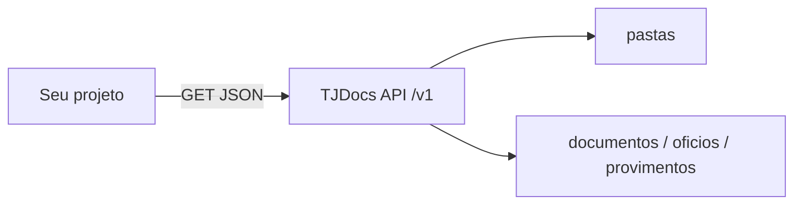

# Arquitetura — consumidor TJDocs

## Objetivo do software

Consumir `https://tjdocs-backend.tjgo.jus.br/v1` para:

- documentos
- ofícios
- ofícios eletrônicos
- provimentos

Sem autenticação nos endpoints escolhidos.

## Stack (a definir)

| Camada | Escolha | Notas |
|--------|---------|-------|
| Runtime | | Node / Python / n8n / outro |
| HTTP client | | |
| Persistência | | Se vai cachear local |
| UI | | Se houver frontend |

## Fluxo alto nível

## Decisões em aberto

- [ ] Nome do repositório / pasta de código
- [ ] Sincronização periódica vs consulta sob demanda
- [ ] Tratamento de paginação `_links`
- [ ] Normalizar `http` → `https` nos hrefs

API: [[Pessoal/projetos/tjdocs/api/00-indice-api]]
